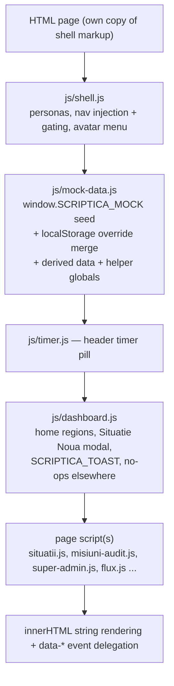
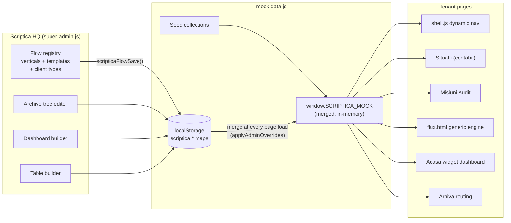

# Architecture

Based on direct inspection of the source (2026-07-16, branch `audit-vertical`, commit `e1061a1`). Nothing here is aspirational — this documents what the code actually does.

## Repository structure

```
Scriptica Build/
├── *.html                  ~20 pages; each carries its own full shell markup (no templating)
│   ├── index.html          0s meta-refresh → acasa.html
│   ├── acasa.html          Home dashboard (static regions OR configurable widget dashboard)
│   ├── situatii.html / situatie-detaliu.html       contabil vertical (list + workspace)
│   ├── arhiva.html         document archive tree
│   ├── time-tracking.html  personal time tracking
│   ├── misiuni-audit.html / misiune-audit-workspace.html / planificare-audit.html   audit vertical
│   ├── administrare.html / constructor-anexe.html  tenant back-office + form builder
│   ├── flux.html / flux-detaliu.html               generic flow engine (custom verticals)
│   ├── super-admin*.html   7 Scriptica-HQ pages (one shared controller)
│   ├── prezentare.html     7-slide sales deck
│   ├── caz-utilizare-constructii.html  internal use-case document (no JS)
│   └── design-system.html  Phase-1 component showcase (stale; primitives only)
├── css/                    tokens.css → base.css → components.css → page-scoped files
├── js/                     one IIFE module per concern (see module map)
├── assets/                 logo + presentation slide PNGs
├── docs/                   this documentation
├── DESIGN_SYSTEM.md        written design reference (slightly stale vs tokens.css)
├── export-*.md             FROZEN context dumps @ commit beaa2de — historical, do not update
└── .claude/launch.json     dev-server config (python3 http.server :5173)
```

There is **no `package.json`, no build, no bundler, no test runner, no CI**. Files are served and deployed exactly as written.

## Runtime architecture

Multi-page static site. Every page independently boots the same stack:



**This load order is a hard contract.** Page scripts capture `var MOCK = window.SCRIPTICA_MOCK` at script-evaluation time; every cross-module call is `typeof`-guarded and degrades silently (missing dependency ⇒ feature disappears, no error).

## Module map

| Module | Owns | Exposes (window.*) |
|---|---|---|
| `js/shell.js` | persona/view model, body classes, nav injection (audit, planificare, custom verticals, admin) + domain gating, sidebar/messaging chrome, avatar dropdown | `getCurrentView`, `setCurrentView`, `getViewScope`, `viewInScope`, `scripticaCurrentUser`, `renderAvatar`, `scripticaInitials`, `scripticaAvatarColor` |
| `js/mock-data.js` | ALL data (seed + merge + derivation), flow-registry persistence API, vertical-owned document vocabulary, visibility/scoping helpers | `SCRIPTICA_MOCK`, `scripticaFlowSave/Delete`, `scripticaFlowVerticals/CustomVerticals/VerticalById/TemplatesForVertical/ClientTypes/ClientTypeById/FlowItemsForVertical`, `scripticaDocumentCategoriesForVertical/DocumentTypesForVertical/DocumentCategoryForType/SystemDocumentCategory`, `scripticaDocumentTypes/DocTypeById/ArchiveTreeFor/DefaultArchiveTree/TenantClientTypeId`, `getVisibleSituations/Clients/Documents/Messages/Anexe`, `scripticaVerticalAccentClass`, `scripticaIsClientView`, `SCRIPTICA_CANVAS_CLIENT_ID`, label helpers |
| `js/timer.js` | cross-page active timer (only persisted timer state) | `ScripticaTimer`; events `scriptica:timer-started/-stopped` |
| `js/dashboard.js` | static home regions, client/audit home routing, Situație Nouă modal, toasts | `SCRIPTICA_TOAST` |
| `js/dashboard-widgets.js` | 10-widget library; swaps `#main` on acasa.html with the client type's configured layout | `SCRIPTICA_WIDGETS {render, cardHtml, paletteFor}` |
| `js/situatii.js` / `js/situatie-detaliu.js` / `js/documents.js` | contabil list, workspace (tasks/chat/anexe gating), AI-document modals & upload simulation | `SCRIPTICA_SITUATII_RESET`, `SCRIPTICA_OPEN_DOC_AI_MODAL`, `SCRIPTICA_DOC_TIP_PREFIX`, `SCRIPTICA_DOCS_REFRESH` |
| `js/arhiva.js` | archive tree (Container→An→Lună→Folder); legacy folders come from HQ archiveTree, custom-flow folders follow the included templates and are independent from classification categories | — |
| `js/time-tracking.js` | month view, bar chart, session table/edit | — |
| `js/misiuni-audit.js` / `js/misiune-audit-workspace.js` / `js/planificare-audit.js` / `js/rapoarte-audit.js` | audit list+tabs+creation, workspace (objectives, Dosar Permanent, Etapa IV, decision bar), plans, reports table+modals | `SCRIPTICA_MISIUNI_RESET`, `SCRIPTICA_RAPOARTE.render` |
| `js/administrare.js` | hash-routed admin tabs; situation/mission type builder (steps, anexe attach, cross-anexă formulas with DFS cycle validation) | — |
| `js/constructor-anexe.js` | drag-and-drop form builder, 22 field types (FIELD_TYPES), `ref` codes on numeric fields, anexă categories | — |
| `js/anexa-fill.js` | fill modal for all field types, completion %, safe formula evaluator (`evalExpr`, recursive descent, **no eval**), computed-field states (auto/override/manual/pending), derivation modal | `SCRIPTICA_ANEXE {renderCards, allComplete, getStepAnexe}`; event `scriptica:anexa-saved` |
| `js/list-columns.js` | per-vertical table-column engine ("expresia în tabel") | `SCRIPTICA_LISTVIEW {availableFor, defaultsFor, effectiveFor, colById, headerHtml, cellsHtml, colCount, normalizeSituation/Mission/FlowItem, sampleItems}` |
| `js/flux.js` | generic list+detail for custom verticals; builtin verticals redirect to dedicated pages | — |
| `js/super-admin.js` | HQ ops dashboard, clients, client detail, legacy client types, dashboard builder and table builder | — |
| `js/super-admin-fluxuri-v2.js` | canonical HQ flow constructor: per-template steps/tasks/anexe, local drafts, validation/preview, guarded publish into the shared registry | — |
| `js/super-admin-tipuri-clienti-v2.js` | client-type package editor: verticals/templates, archive routing and links into the Acasă builder | — |
| `js/prezentare.js` | slide deck (exposes nothing) | — |

## Component boundaries and data flow



The one-way cycle to understand: **HQ writes configuration → localStorage → every page-load merge → tenant pages read the merged MOCK**. Tenant runtime actions (task ticks, chat, uploads, step advances) mutate MOCK **in memory only** and vanish on reload — the demo depends on this being understood. The exceptions that persist are listed below.

## State ownership and persistence

Three layers, lowest priority first:

1. **Seed** — hard-coded in `mock-data.js` ("today" pinned to 2026-04-20; verified counts: 10 tenant clients, 6 employees, 28 situations (13 of them generated archival), 7 audit missions + entities/plans/reports, 119 documents, 27 anexe, 6 HQ clients, 4 flow verticals, 5 client types, 9 flow items — incl. the seeded Consultanță + Construcții showcases).
2. **localStorage overrides** — `scriptica.*` keys, each a JSON map `id → full record`, `{deleted:true}` = tombstone. Merge REPLACES whole records (no field-level merge) — stale persisted records normally shadow new seed fields until cleared. The vertical document-vocabulary migration is an explicit exception: missing `documentCategories`, filters and template category selections are backfilled from the canonical seed.
3. **In-memory mutations** — everything else; lost on reload.

Full localStorage inventory (all owned keys):

| Key | Contents | Written by |
|---|---|---|
| `scriptica.view` | persona id | shell.js (also force-set to `admin` by administrare.js/constructor-anexe.js, sparing `complet` on administrare only) |
| `scriptica.anexe` | anexă templates | constructor-anexe.js, administrare.js |
| `scriptica.situationTypes` | situation/mission types (steps, formulas) | administrare.js |
| `scriptica.flowVerticals` / `.flowTemplates` / `.clientTypes` / `.saClients` / `.flowItems` | HQ flow registry + instances | super-admin.js, flux.js — always via `scripticaFlowSave` |
| `scriptica.prototype.fluxuriV2` | Fluxuri constructor drafts + migration metadata; published eligible templates are copied into `scriptica.flowTemplates` | super-admin-fluxuri-v2.js |
| `scriptica.anexaResponses` | anexă fill values, key `sitId::anexaId`, values keyed by **field index**; `__fxman__<idx>` marks manual overrides | anexa-fill.js |
| `scriptica.auditMissionStatus` | missionId → status (the Authority's decision) | misiune-audit-workspace.js |
| `scriptica.arhiva.selection` | archive tree selection | arhiva.js |
| `scriptica.activeTimer` | the running timer only | timer.js |
| `scriptica.sidebarExpanded` / `.messagingPanelCollapsed` | chrome state | shell.js |

Flow configuration has two distinct owners: a `flowVertical` groups templates and owns `documentCategories[]` (each with its nested, uniquely assigned `documentTypes[]`), while a `flowTemplate` owns `steps[]` and `documentCategoryIds[]`. The permanent system category `Necategorisit` is always added to the template selection. `clientTypes[].archiveTree` is deliberately independent from that taxonomy; custom-flow archive folders are derived from the flow templates included in the client type.

## Authentication and permissions

**There is no authentication.** "Login" is simulated by the persona switcher: `scriptica.view` ∈ {complet (default), contabilitate, audit_stat, client, admin, autoritate, superadmin} (+ legacy alias `accountant` → complet). URL `?view=` overrides per-load without persisting.

Authorization = **domain scoping**, enforced in three cooperating layers (all client-side, all cosmetic — this is a prototype):
1. `getViewScope()` maps persona → domains (`contabil`, `audit`, + custom vertical domains for complet/admin/superadmin).
2. Nav gating: `gateNavByScope()` hides out-of-scope nav items; injectors skip out-of-scope items entirely.
3. Page guards + data filters: situatii.js requires `contabil`, misiuni-audit.js requires `audit` (rendering a `.scope-block` otherwise); `getVisibleSituations/Documents/Messages/Anexe` return domain-filtered data (defense in depth added after a real leak — see handoff doc). The `client` persona is additionally hard-scoped to one tenant (`SCRIPTICA_CANVAS_CLIENT_ID = 1`) plus CSS-level hiding under `body--client`.

## Background jobs, APIs, external services

- **No background jobs, no service workers, no timers beyond the UI timer pill.**
- **No network APIs.** The only fetch-like behavior is simulated (document upload = `setTimeout` + seeded confidence values). The "API boundary" inside the app is the set of `window.*` globals + 3 CustomEvents (`scriptica:anexa-saved`, `scriptica:timer-started/-stopped`).
- **External runtime dependencies (both non-critical):** Google Fonts (Lato + Material Symbols Outlined — icons render as raw ligature text offline) and `i.pravatar.cc` (avatar photos, with initials fallback). Everything else is self-contained.
- Third-party tooling (not runtime): `wrangler` via npx for deploys; `gh` for GitHub.

## CSS architecture

Load order per page: Google Fonts → `tokens.css` (single source of truth: surfaces/text/semantic/vertical-identity colors, 8pt spacing, radii, purple-tinted shadows, z-scale, layout dims — sidebar 225/72px, header 64px, messaging 340px) → `base.css` (reset, 14px Lato baseline, `:focus-visible` ring) → `components.css` (~5.5k lines, organized chronologically in "PHASE" sections; later phases + page CSS override by source order; Phase-7 client-view gating uses `body--client` + `!important`) → page-scoped prefixed files. Light theme only; desktop-first (no shell responsiveness below ~960px; content breakpoints 1100/960/760px).

## Architectural risks and constraints

1. **Everything is stringly-typed and silently-degrading** — statuses→CSS classes, `'step'+N` keys, `deadlineStepN` props, `'{anexaId}.{REF}'` formula refs, doc-type-*name* archive routing, typeof-guarded globals. Renames and missing scripts fail invisibly. Grep first; verify features are present after changes.
2. **Whole-record localStorage merge** — data-shape evolution can be shadowed by stale user state; there is no migration layer. Changing seed shapes needs stale-state testing.
3. **Field-index-keyed anexă responses** — schema edits corrupt existing responses; known, accepted for the prototype.
4. **Duplicate render paths** (list engine vs legacy fallback) and duplicated constants (pinned date ×9 files, status labels with actual drift between flux.js and list-columns.js).
5. **Manual `?v=` cache-busting across ~20 HTML files** — already drifted; any shared-asset change touches many files.
6. **N copies of the shell markup** — a header/sidebar change means editing every page; shell.js patches some of it at runtime (e.g. replaces the static user menu).
7. **Task-id determinism**: `augmentTasks` assigns task ids sequentially; seeded time sessions depend on those ids — editing a type's steps mis-attributes time data.
8. **Two clocks**: pinned 2026-04-20 for rendering vs real `new Date()` in some modal validations (dashboard.js) — date-validation UX can look inconsistent relative to demo data.
9. Prototype-only security posture: all "permissions" are cosmetic client-side gating. Nothing here should ever hold real data.
