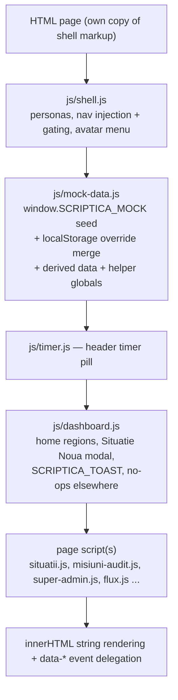
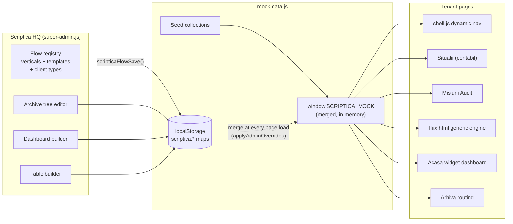

# Architecture

Based on direct inspection of the source (2026-07-16, branch `audit-vertical`, commit `e1061a1`, rechecked against the working tree on 2026-08-04). Except for sections explicitly labeled **approved direction**, this documents what the code actually does rather than an aspirational design.

## Repository structure

```
Scriptica Build/
├── *.html                  ~20 pages; each carries its own full shell markup (no templating)
│   ├── index.html          0s meta-refresh → acasa.html
│   ├── acasa.html          Home dashboard (static regions OR configurable widget dashboard)
│   ├── situatii.html / situatie-detaliu.html       contabil vertical (list + workspace)
│   ├── arhiva.html         document archive tree
│   ├── time-tracking.html  personal time tracking
│   ├── misiuni-audit.html / misiune-audit-workspace.html / planificare-audit.html   audit vertical
│   ├── administrare.html / constructor-anexe.html  tenant back-office + form builder
│   ├── flux.html / flux-detaliu.html               generic flow engine (custom verticals)
│   ├── super-admin*.html   7 Scriptica-HQ pages (one shared controller)
│   ├── prezentare.html     7-slide sales deck
│   ├── caz-utilizare-constructii.html  internal use-case document (no JS)
│   └── design-system.html  Phase-1 component showcase (stale; primitives only)
├── css/                    tokens.css → base.css → components.css → page-scoped files
├── js/                     one IIFE module per concern (see module map)
├── assets/                 logo + presentation slide PNGs
├── docs/                   this documentation
├── DESIGN_SYSTEM.md        written design reference (slightly stale vs tokens.css)
├── export-*.md             FROZEN context dumps @ commit beaa2de — historical, do not update
└── .claude/launch.json     dev-server config (python3 http.server :5173)
```

There is **no `package.json`, no build, no bundler, no test runner, no CI**. Files are served and deployed exactly as written.

## Runtime architecture

Multi-page static site. Every page independently boots the same stack:



**This load order is a hard contract.** Page scripts capture `var MOCK = window.SCRIPTICA_MOCK` at script-evaluation time; every cross-module call is `typeof`-guarded and degrades silently (missing dependency ⇒ feature disappears, no error).

## Module map

| Module | Owns | Exposes (window.*) |
|---|---|---|
| `js/shell.js` | persona/view model, body classes, nav injection (audit, planificare, custom verticals, admin) + domain gating, sidebar/messaging chrome, avatar dropdown | `getCurrentView`, `setCurrentView`, `getViewScope`, `viewInScope`, `scripticaCurrentUser`, `renderAvatar`, `scripticaInitials`, `scripticaAvatarColor` |
| `js/mock-data.js` | ALL data (seed + merge + derivation), flow-registry persistence API, vertical-owned document vocabulary, per-account terminology resolvers, visibility/scoping helpers | `SCRIPTICA_MOCK`, `scripticaFlowSave/Delete`, `scripticaFlowVerticals/CustomVerticals/VerticalById/TemplatesForVertical/ClientTypes/ClientTypeById/FlowItemsForVertical`, `scripticaEffectiveExternalParty/EffectiveVertical/EffectiveVerticalTerminology/EffectiveArchiveFolderName/ArchiveFolderDefinitionsForClient`, `scripticaDocumentCategoriesForVertical/DocumentTypesForVertical/DocumentCategoryForType/SystemDocumentCategory`, `scripticaDocumentTypes/DocTypeById/ArchiveTreeFor/DefaultArchiveTree/TenantClientTypeId`, `getVisibleSituations/Clients/Documents/Messages/Anexe`, `scripticaVerticalAccentClass`, `scripticaIsClientView`, `SCRIPTICA_CANVAS_CLIENT_ID`, label helpers |
| `js/timer.js` | cross-page active timer (only persisted timer state) | `ScripticaTimer`; events `scriptica:timer-started/-stopped` |
| `js/dashboard.js` | static home regions, client/audit home routing, Situație Nouă modal, toasts | `SCRIPTICA_TOAST` |
| `js/dashboard-widgets.js` | 10-widget library; builds the final onboarding step and swaps `#main` on acasa.html with the selected client's configured layout | `SCRIPTICA_WIDGETS {render, cardHtml, paletteFor}` |
| `js/situatii.js` / `js/situatie-detaliu.js` / `js/documents.js` | contabil/custom-flow workspace (tasks/chat/anexe gating), required document-upload tasks, AI-document modals & upload simulation | `SCRIPTICA_SITUATII_RESET`, `SCRIPTICA_OPEN_DOC_AI_MODAL`, `SCRIPTICA_DOC_TIP_PREFIX`, `SCRIPTICA_DOCS_REFRESH` |
| `js/arhiva.js` | archive tree (Container→An→Lună→Folder); legacy folders come from HQ archiveTree, custom-flow folders follow the included templates and are independent from classification categories | — |
| `js/time-tracking.js` | month view, bar chart, session table/edit | — |
| `js/misiuni-audit.js` / `js/misiune-audit-workspace.js` / `js/planificare-audit.js` / `js/rapoarte-audit.js` | audit list+tabs+creation, workspace (objectives, Dosar Permanent, Etapa IV, decision bar), plans, reports table+modals | `SCRIPTICA_MISIUNI_RESET`, `SCRIPTICA_RAPOARTE.render` |
| `js/administrare.js` | hash-routed admin tabs; situation/mission type builder (normal/upload tasks, anexe attach, cross-anexă formulas with DFS cycle validation); multi-vertical annex library with usage/relationship impact and safe retirement | — |
| `js/constructor-anexe.js` | drag-and-drop form builder, 22 field types (FIELD_TYPES), `ref` codes on numeric fields, multi-vertical annex availability | — |
| `js/beneficiary-profile.js` | shared beneficiary-profile schema renderer for HQ/internal editing and external-form preview; validation, address/file/repeater controls and table formatting | `SCRIPTICA_BENEFICIARY_PROFILE` |
| `js/anexa-fill.js` | fill modal for all field types, completion %, safe formula evaluator (`evalExpr`, recursive descent, **no eval**), computed-field states (auto/override/manual/pending), derivation modal | `SCRIPTICA_ANEXE {renderCards, allComplete, getStepAnexe}`; event `scriptica:anexa-saved` |
| `js/list-columns.js` | per-vertical table-column engine ("expresia în tabel") | `SCRIPTICA_LISTVIEW {availableFor, defaultsFor, effectiveFor, colById, headerHtml, cellsHtml, colCount, normalizeSituation/Mission/FlowItem, sampleItems}` |
| `js/flux.js` | generic list+detail for custom verticals; builtin verticals redirect to dedicated pages | — |
| `js/super-admin.js` | HQ ops dashboard, clients, client detail, legacy client types, dashboard builder and table builder | — |
| `js/super-admin-fluxuri-v2.js` | canonical HQ flow constructor: per-template steps/tasks/anexe, local drafts, validation/preview, guarded publish into the shared registry | — |
| `js/super-admin-tipuri-clienti-v2.js` | client-category editor and its base archive routing; Acasă is deliberately absent because its owner is the individual client | — |
| `js/asistent-ai.js` | Asistentul AI Scriptica: on situatie-detaliu for flow items of the `assistant` vertical, replaces the Mesagerie panel with the chat (reasoning, sources, context shift, chips); deterministic search engine over persona-accessible flow items/documents/people; persists `aiMessages`/`aiContext` on the flow item | — |
| `js/prezentare.js` | slide deck (exposes nothing) | — |

## Component boundaries and data flow



The one-way cycle to understand: **HQ writes configuration → localStorage → every page-load merge → tenant pages read the merged MOCK**. Legacy situation runtime actions still mostly mutate MOCK **in memory only** and vanish on reload. Generic custom-flow workspaces are the exception: task completion, required uploads, embedded documents and step progress are saved back into `scriptica.flowItems`.

## State ownership and persistence

Three layers, lowest priority first:

1. **Seed** — hard-coded in `mock-data.js` ("today" pinned to 2026-04-20; verified counts: 10 tenant clients, 6 employees, 28 situations (13 of them generated archival), 7 audit missions + entities/plans/reports, 119 documents, 31 anexe, 6 HQ clients, 4 flow verticals, 5 client types, 10 flow items — incl. the seeded Consultanță + Construcții showcases).
2. **localStorage overrides** — `scriptica.*` keys, each a JSON map `id → full record`, `{deleted:true}` = tombstone. Merge REPLACES whole records (no field-level merge) — stale persisted records normally shadow new seed fields until cleared. The vertical document-vocabulary migration is an explicit exception: missing `documentCategories`, filters and template category selections are backfilled from the canonical seed.
3. **In-memory mutations** — everything else; lost on reload.

Full localStorage inventory (all owned keys):

| Key | Contents | Written by |
|---|---|---|
| `scriptica.view` | persona id | shell.js (also force-set to `admin` by administrare.js/constructor-anexe.js, sparing `complet` on administrare only) |
| `scriptica.tenantAccountId` | HQ client selected for tenant preview; its active vertical assignments scope tenant navigation and work surfaces | super-admin.js via `scripticaSetTenantAccountId()` |
| `scriptica.anexe` | anexă templates | constructor-anexe.js, administrare.js |
| `scriptica.situationTypes` | situation/mission types (steps, formulas) | administrare.js |
| `scriptica.flowVerticals` / `.flowTemplates` / `.clientTypes` / `.saClients` / `.flowItems` | HQ flow registry + instances | super-admin.js, flux.js — always via `scripticaFlowSave` |
| `scriptica.prototype.fluxuriV2` | Fluxuri constructor drafts + migration metadata; published eligible templates are copied into `scriptica.flowTemplates` | super-admin-fluxuri-v2.js |
| `scriptica.anexaResponses` | anexă fill values, key `sitId::anexaId`, values keyed by **field index**; `__fxman__<idx>` marks manual overrides | anexa-fill.js |
| `scriptica.auditMissionStatus` | missionId → status (the Authority's decision) | misiune-audit-workspace.js |
| `scriptica.arhiva.selection` | archive tree selection | arhiva.js |
| `scriptica.activeTimer` | the running timer only | timer.js |
| `scriptica.sidebarExpanded` / `.messagingPanelCollapsed` | chrome state | shell.js |

Flow configuration has two distinct owners: a `flowVertical` groups templates and owns `documentCategories[]` (each with its nested, uniquely assigned `documentTypes[]`), while a `flowTemplate` owns `steps[]` and `documentCategoryIds[]`. A step task may be `standard` or `document_upload`; upload tasks also store a document-type id, single/multiple-file behavior and a minimum file count. The permanent system category `Necategorisit` is always added to the template selection. `clientTypes[].archiveTree` is deliberately independent from that taxonomy; custom-flow archive folders are derived from the flow templates included in the client type.

Annex templates remain independent records. `verticalIds[]` controls where one annex is available without duplicating it; an empty array means deliberately shared. The library derives each annex's workflow/step usages and its relationships from same-step reuse, formulas and stable references. Used or related annexes are retired, never hard-deleted; historical responses keep the same annex id and field indexes.

## Client categories and vertical assignments

### Per-client verticals (implemented in the prototype)

`clientTypes[]` acts as the stable business category. Client onboarding has five steps: business identity/category, the client's enrollment form, an optional selection of contracted verticals, per-account terminology/archive labels, and the client's individual Acasă layout. Acasă is always the final step. A client can therefore be created in `superAdmin.clients[]` with that category and zero verticals; in that case its final step clearly records an empty dashboard. Category changes and vertical changes are separate operations. Each HQ client stores its vertical assignments in `moduleAssignments[]`, with stable vertical/template ids, status and activation/deactivation timestamps, plus its own `dashboardLayout[]` and `dashboardLayoutVersion`. The `moduleAssignments` property keeps its legacy name to remain compatible with existing localStorage and seeded data; it must not be presented as “modules” in the UI. Older `scriptica.saClients` records are migrated in memory from the former category package (`verticalIds[]` / `defaultTemplateIds[]`) and the former client-type dashboard defaults so stale localStorage continues to render.

Per-account naming is additive and optional. `terminologyOverrides` stores only values that differ from the client-type/vertical/archive defaults (`externalParty`, `verticals[verticalId]`, `archiveFolders[stableFolderKey]`), and `terminologyVersion` is currently `1`. The effective display order is account override → shared definition → safe Romanian fallback. Renaming is presentation-only: vertical ids, template ids, archive folder ids, folder hierarchy, the `system` flag and document routing remain unchanged. Existing client records without these fields retain their former labels.

Beneficiary-profile configuration follows the same inheritance model. `clientTypes[].clientProfileSchema` is the category default, `clients[].clientProfileSchema` is an optional account override, and operational beneficiary records keep values in `profileValues` keyed by stable field id. The shared `SCRIPTICA_BENEFICIARY_PROFILE` renderer is used for internal forms and the external preview. Table columns may point to supported profile fields or annex fields through stable `sourceKey` values; `clients[].verticalTableOverrides[verticalId]` overrides the vertical's `listViewConfig` without mutating the global definition.

The Fluxuri V2 surface is a global catalog: publishing a vertical or template makes it available for later activation, but does not attach it to a category or existing client. The HQ client detail has a vertical manager and a tenant preview. `scriptica.tenantAccountId` selects that preview account; `shell.js`, `dashboard-widgets.js`, `flux.js` and `arhiva.js` then resolve visibility from its assignments. Without a selected preview account, the seeded persona/category behavior remains as a compatibility fallback for the established demos.

Vertical removal is non-destructive. An assignment must move from active to inactive/retired rather than be deleted. Operational records, documents, conversations, anexă responses, archive entries and the client's saved Acasă layout created while the vertical was active remain stored; ordinary work surfaces and the vertical's widgets may be hidden while inactive, but the archive and historical integrity remain intact. Reactivating the same vertical must restore access to the same history and saved layout.

Client types with `archiveRouting: 'nomenclator'` (public institutions) get no per-template flow folders: their `archiveTree` holds nomenclator indicatives (`group` = vertical name, rendered as headings), documents route by document type and the level-1 container is `flowItem.archiveContainer` (the direcție). Verticals may carry `externalParty {singular, plural}` — `scripticaEffectiveExternalParty(client, verticalId)` prefers it over the account label. Verticals with `assistant: true` are served by js/asistent-ai.js.

Archive folders are resolved from active **and inactive** assignments, while normal navigation, creation actions and dashboard vertical cards use active assignments only. Used verticals/templates are archived (`status: inactiv`) instead of tombstoned. One prototype limitation remains: most pre-seeded operational records are shared demo data rather than fully owned by an HQ client; newly created generic flow records receive `tenantAccountId`, but a production data model would enforce tenant ownership on every operational record.

Vertical deactivation is non-destructive. It hides the vertical, its dashboard widgets and current working surfaces for that account, but never deletes its flow records, documents, archive contents or terminology overrides. Inactive assignments stay in `moduleAssignments[]`, remain editable in the account terminology editor and become visible again when reactivated.

## Authentication and permissions

**There is no authentication.** "Login" is simulated by the persona switcher: `scriptica.view` ∈ {complet (default), contabilitate, audit_stat, client, admin, autoritate, superadmin, pmb_intern} (+ legacy alias `accountant` → complet). `pmb_intern` is the internal user of the HQ client `cli_pmb` (`clients[].tenantPersona`): `scripticaTenantAccountId()` always resolves that account for its persona and never for other personas; `MOCK.employees`/`currentUserId` are swapped to the PMB staff at load. URL `?view=` overrides per-load without persisting.

Authorization = **domain scoping**, enforced in three cooperating layers (all client-side, all cosmetic — this is a prototype):
1. `getViewScope()` maps persona → domains (`contabil`, `audit`, + custom vertical domains for complet/admin/superadmin).
2. Nav gating: `gateNavByScope()` hides out-of-scope nav items; injectors skip out-of-scope items entirely.
3. Page guards + data filters: situatii.js requires `contabil`, misiuni-audit.js requires `audit` (rendering a `.scope-block` otherwise); `getVisibleSituations/Documents/Messages/Anexe` return domain-filtered data (defense in depth added after a real leak — see handoff doc). The `client` persona is additionally hard-scoped to one tenant (`SCRIPTICA_CANVAS_CLIENT_ID = 1`) plus CSS-level hiding under `body--client`.

## Background jobs, APIs, external services

- **No background jobs, no service workers, no timers beyond the UI timer pill.**
- **No network APIs.** The only fetch-like behavior is simulated (document upload = `setTimeout` + seeded confidence values). The "API boundary" inside the app is the set of `window.*` globals + 3 CustomEvents (`scriptica:anexa-saved`, `scriptica:timer-started/-stopped`).
- **External runtime dependencies (both non-critical):** Google Fonts (Lato + Material Symbols Outlined — icons render as raw ligature text offline) and `i.pravatar.cc` (avatar photos, with initials fallback). Everything else is self-contained.
- Third-party tooling (not runtime): `wrangler` via npx for deploys; `gh` for GitHub.

## CSS architecture

Load order per page: Google Fonts → `tokens.css` (single source of truth: surfaces/text/semantic/vertical-identity colors, 8pt spacing, radii, purple-tinted shadows, z-scale, layout dims — sidebar 225/72px, header 64px, messaging 340px) → `base.css` (reset, 14px Lato baseline, `:focus-visible` ring) → `components.css` (~5.5k lines, organized chronologically in "PHASE" sections; later phases + page CSS override by source order; Phase-7 client-view gating uses `body--client` + `!important`) → page-scoped prefixed files. Light theme only; desktop-first (no shell responsiveness below ~960px; content breakpoints 1100/960/760px).

## Architectural risks and constraints

1. **Everything is stringly-typed and silently-degrading** — statuses→CSS classes, `'step'+N` keys, `deadlineStepN` props, `'{anexaId}.{REF}'` formula refs, doc-type-*name* archive routing, typeof-guarded globals. Renames and missing scripts fail invisibly. Grep first; verify features are present after changes.
2. **Whole-record localStorage merge** — data-shape evolution can be shadowed by stale user state; there is no migration layer. Changing seed shapes needs stale-state testing.
3. **Field-index-keyed anexă responses** — schema edits corrupt existing responses; known, accepted for the prototype.
4. **Duplicate render paths** (list engine vs legacy fallback) and duplicated constants (pinned date ×9 files, status labels with actual drift between flux.js and list-columns.js).
5. **Manual `?v=` cache-busting across ~20 HTML files** — already drifted; any shared-asset change touches many files.
6. **N copies of the shell markup** — a header/sidebar change means editing every page; shell.js patches some of it at runtime (e.g. replaces the static user menu).
7. **Task-id determinism**: `augmentTasks` assigns task ids sequentially; seeded time sessions depend on those ids — editing a type's steps mis-attributes time data.
8. **Two clocks**: pinned 2026-04-20 for rendering vs real `new Date()` in some modal validations (dashboard.js) — date-validation UX can look inconsistent relative to demo data.
9. Prototype-only security posture: all "permissions" are cosmetic client-side gating. Nothing here should ever hold real data.
10. **Operational ownership is only partially modeled** — per-client vertical assignment is implemented, but most seeded flow instances still have no HQ-account owner. The selected-tenant preview therefore validates vertical visibility, not hard multi-tenant data isolation.
