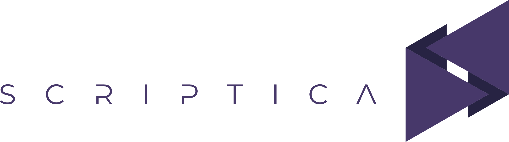

# Export context de design — Scriptica

> Extragere verbatim din codebase-ul curent (branch `main`, working tree curat la commit `beaa2de`). Niciun fișier sursă nu a fost modificat. Acest document este singurul output creat.

Ordine: (1) tokens, (2) tipografie, (3) componente din pagina de detaliu situație, (4) markup `situatie-detaliu.html`, (5) DOM randat real, (6) diferențe.

---

## 1. Tokens complete (verbatim)

Fișier: `css/tokens.css` — conținut integral.

```css
/* ============================================================
   Scriptica — Design Tokens
   Single source of truth. No hardcoded values elsewhere.
   ============================================================ */

:root {
  /* --- Colors — Surfaces --- */
  --color-surface-1: #ECECF6;
  --color-surface-2: #F5F5FD;
  --color-surface-white: #FFFFFF;

  /* --- Colors — Interactive & Typography --- */
  --color-default: #B4AEC4;
  --color-default-highlight: #47386A;
  --color-content: #000000;
  --color-important: #FFBF14;
  --color-important-highlight: #FFDF89;

  /* --- Colors — Semantic --- */
  --color-critical: #FF3C80;
  --color-pending: #F9A956;
  --color-success: #38BA31;

  /* Surface tint for pending/warning banners (pending la 15% pe alb) */
  --color-pending-surface: #FEF2E6;

  /* --- Colors — Derived / Supporting --- */
  --color-text-primary: #1A1433;
  --color-text-secondary: #4B4560;
  --color-text-muted: #918D9C;
  --color-border: #D4CFDA;
  --color-border-strong: #B4AEC4;

  /* Chat bubble tints */
  --color-chat-left: #F7F7F7;
  --color-chat-right: #F4F0FF;

  /* Button hover states */
  --color-important-hover: #E5A800;
  --color-purple-hover: #3C2F59;

  /* --- Typography --- */
  --font-family-base: 'Lato', -apple-system, BlinkMacSystemFont, 'Segoe UI', sans-serif;

  --font-size-headline-1: 36px;
  --font-size-headline-2: 24px;
  --font-size-subtitle: 18px;
  --font-size-headline-3: 16px;
  --font-size-body: 14px;
  --font-size-small: 12px;
  --font-size-tiny: 10px;

  --font-weight-regular: 400;
  --font-weight-bold: 700;
  --font-weight-black: 900;

  --line-height-tight: 1.2;
  --line-height-normal: 1.5;
  --line-height-relaxed: 1.7;

  /* --- Spacing — 8pt grid --- */
  --space-1: 4px;
  --space-2: 8px;
  --space-3: 12px;
  --space-4: 16px;
  --space-5: 24px;
  --space-6: 32px;
  --space-7: 48px;
  --space-8: 64px;

  /* --- Radius --- */
  --radius-sm: 6px;
  --radius-md: 10px;
  --radius-lg: 16px;
  --radius-pill: 999px;

  /* --- Shadows --- */
  --shadow-sm: 0 1px 2px rgba(39, 35, 67, 0.06);
  --shadow-md: 0 4px 12px rgba(39, 35, 67, 0.08);
  --shadow-lg: 0 12px 32px rgba(39, 35, 67, 0.12);

  /* --- Z-index scale --- */
  --z-base: 1;
  --z-sticky: 100;
  --z-dropdown: 200;
  --z-modal: 300;
  --z-toast: 400;

  /* --- Transitions --- */
  --transition-fast: 150ms ease;
  --transition-base: 200ms ease;
  --transition-slow: 300ms ease;

  /* --- Layout dimensions --- */
  --sidebar-width-expanded: 225px;
  --sidebar-width-collapsed: 72px;
  --header-height: 64px;
  --messaging-panel-width: 340px;
}

```

---

## 2. Tipografie reală

### Fonturi efectiv încărcate

Încărcate prin `<link>` Google Fonts în `<head>`-ul fiecărei pagini (ex. `situatie-detaliu.html`):

```html
<link rel="preconnect" href="https://fonts.googleapis.com">
<link rel="preconnect" href="https://fonts.gstatic.com" crossorigin>
<link href="https://fonts.googleapis.com/css2?family=Lato:wght@400;700;900&display=swap" rel="stylesheet">
<link href="https://fonts.googleapis.com/css2?family=Material+Symbols+Outlined:opsz,wght,FILL,GRAD@20..48,100..700,0..1,-50..200&display=block" rel="stylesheet">

```

- **Font de text:** `Lato`, greutăți **400, 700, 900** (singurele importate). Fallback stack (din token `--font-family-base`): `-apple-system, BlinkMacSystemFont, "Segoe UI", sans-serif`.
- **Font de iconițe:** `Material Symbols Outlined` (variable font; axe `opsz 20..48`, `wght 100..700`, `FILL 0..1`, `GRAD -50..200`), `display=block`.

### Aplicare la nivel de `:root` / `html` și headings (din `css/base.css`)

```css
/* --- Root typography --- */
html {
  font-size: var(--font-size-body);
  font-family: var(--font-family-base);
  color: var(--color-text-primary);
  line-height: var(--line-height-normal);
  background: var(--color-surface-2);
  -webkit-font-smoothing: antialiased;
  -moz-osx-font-smoothing: grayscale;
  text-rendering: optimizeLegibility;
}

body {
  min-height: 100vh;
  background: var(--color-surface-2);
  color: var(--color-text-primary);
}

/* --- Headings --- */
h1 {
  font-size: var(--font-size-headline-1);
  font-weight: var(--font-weight-bold);
  line-height: var(--line-height-tight);
  color: var(--color-text-primary);
}

h2 {
  font-size: var(--font-size-headline-2);
  font-weight: var(--font-weight-bold);
  line-height: var(--line-height-tight);
  color: var(--color-text-primary);
}

h3 {
  font-size: var(--font-size-headline-3);
  font-weight: var(--font-weight-bold);
  line-height: var(--line-height-tight);
  color: var(--color-text-primary);
}

p {
  line-height: var(--line-height-normal);
}

```

### Clasă de bază pentru iconițe Material Symbols (din `css/components.css`)

```css
/* ------------------------------------------------------------
   Material Symbols base
   ------------------------------------------------------------ */
.material-symbols-outlined {
  font-family: 'Material Symbols Outlined';
  font-weight: normal;
  font-style: normal;
  font-size: 24px;
  line-height: 1;
  letter-spacing: normal;
  text-transform: none;
  display: inline-block;
  white-space: nowrap;
  word-wrap: normal;
  direction: ltr;
  -webkit-font-feature-settings: 'liga';
  -webkit-font-smoothing: antialiased;
  user-select: none;
  font-variation-settings: 'FILL' 0, 'wght' 400, 'GRAD' 0, 'opsz' 24;
}

.material-symbols-outlined.filled {
  font-variation-settings: 'FILL' 1, 'wght' 400, 'GRAD' 0, 'opsz' 24;
}

```

### Scala de dimensiuni efectivă

Dimensiunile vin din tokens (secțiunea 1); greutatea și `line-height` se aplică în `base.css`. Root-ul (`html`) randează la **14px / Lato / line-height 1.5**. Nu există token de `letter-spacing` — valoarea implicită este `normal`; singurele excepții sunt etichetele uppercase locale (ex. `.anexa-card__eyebrow`, `.anexa-cards__label`) care folosesc `letter-spacing: 0.06em`.

| Nivel (token) | font-size | font-weight aplicat | line-height aplicat | unde se aplică |
|---|---|---|---|---|
| `--font-size-headline-1` (h1) | 36px | 700 (bold) | 1.2 (tight) | `base.css` `h1` |
| `--font-size-headline-2` (h2) | 24px | 700 (bold) | 1.2 (tight) | `base.css` `h2` |
| `--font-size-subtitle` | 18px | — (doar token) | — | folosit punctual |
| `--font-size-headline-3` (h3) | 16px | 700 (bold) | 1.2 (tight) | `base.css` `h3` |
| `--font-size-body` | 14px | 400 (regular) | 1.5 (normal) | `html` root + `p` |
| `--font-size-small` | 12px | — | — | `.text-small` |
| `--font-size-tiny` | 10px | — | — | `.text-tiny` |

Greutăți disponibile (tokens): `--font-weight-regular: 400`, `--font-weight-bold: 700`, `--font-weight-black: 900`. Line-heights (tokens): `--line-height-tight: 1.2`, `--line-height-normal: 1.5`, `--line-height-relaxed: 1.7`.

Utilitare tipografice (din `css/base.css`):

```css
/* --- Utilities --- */
.text-muted {
  color: var(--color-text-muted);
}

.text-secondary {
  color: var(--color-text-secondary);
}

.text-critical {
  color: var(--color-critical);
}

.text-success {
  color: var(--color-success);
}

.text-pending {
  color: var(--color-pending);
}

.text-small {
  font-size: var(--font-size-small);
}

.text-tiny {
  font-size: var(--font-size-tiny);
}

.text-bold {
  font-weight: var(--font-weight-bold);
}


```

---
## 3. Componente folosite în pagina de detaliu situație

Toate regulile sunt copiate verbatim, cu toate stările (normal / hover / focus / disabled / selected) și variantele `--modifier` așa cum apar în fișiere. Sursa e indicată la fiecare bloc.

### 3.1 App shell: header (logo, search, timer, welcome, icon-buttons, badge), sidebar, nav, main, messaging shell

Sursă: `css/components.css` (shell + header + sidebar + nav + main + messaging shell).

```css
/* ------------------------------------------------------------
   Shell layout grid
   ------------------------------------------------------------ */
.shell {
  min-height: 100vh;
}

/* ------------------------------------------------------------
   Header
   ------------------------------------------------------------ */
.header {
  position: fixed;
  top: 0;
  left: var(--sidebar-width-collapsed);
  right: 0;
  height: var(--header-height);
  background: var(--color-surface-2);
  display: flex;
  align-items: center;
  padding: 0 var(--space-5);
  gap: var(--space-5);
  z-index: var(--z-sticky);
  transition: left var(--transition-base);
}

.shell--sidebar-expanded .header {
  left: var(--sidebar-width-expanded);
}

.header__left {
  display: flex;
  align-items: center;
  gap: var(--space-3);
  flex-shrink: 0;
}

.header__wordmark {
  font-family: var(--font-family-base);
  font-weight: var(--font-weight-black);
  font-size: 20px;
  letter-spacing: 0.15em;
  color: var(--color-default-highlight);
  text-decoration: none;
  line-height: 1;
}

.header__wordmark:hover {
  text-decoration: none;
}

.header__logo-link {
  position: fixed;
  top: 0;
  left: var(--space-4);
  height: var(--header-height);
  display: inline-flex;
  align-items: center;
  text-decoration: none;
  z-index: calc(var(--z-sticky) + 1);
}

.header__logo-link:hover {
  text-decoration: none;
  opacity: 0.85;
}

.header__logo {
  height: 48px;
  width: auto;
  display: block;
  flex-shrink: 0;
}

.header__center {
  flex: 1;
  display: flex;
  justify-content: center;
}

.header__search {
  position: relative;
  width: 100%;
  max-width: 400px;
}

.header__search-input {
  width: 100%;
  height: 40px;
  padding: 0 var(--space-5) 0 var(--space-4);
  background: var(--color-surface-white);
  border: 1px solid var(--color-border);
  border-radius: var(--radius-pill);
  color: var(--color-text-primary);
  font-size: var(--font-size-body);
  transition: border-color var(--transition-fast), box-shadow var(--transition-fast);
}

.header__search-input::placeholder {
  color: var(--color-text-muted);
}

.header__search-input:focus-visible {
  outline: none;
  border-color: var(--color-default-highlight);
  box-shadow: 0 0 0 2px rgba(71, 56, 106, 0.18);
}

.header__search-icon {
  position: absolute;
  right: var(--space-3);
  top: 50%;
  transform: translateY(-50%);
  color: var(--color-text-muted);
  pointer-events: none;
  font-size: 20px;
}

.header__right {
  display: flex;
  align-items: center;
  gap: var(--space-4);
  margin-left: auto;
  flex-shrink: 0;
  white-space: nowrap;
}

.header__right > * {
  flex-shrink: 0;
}

.header__welcome {
  font-size: var(--font-size-body);
  color: var(--color-text-primary);
}

.header__welcome strong {
  font-weight: var(--font-weight-bold);
}

.header__icon-btn {
  width: 40px;
  height: 40px;
  display: inline-flex;
  align-items: center;
  justify-content: center;
  border-radius: var(--radius-pill);
  color: var(--color-text-secondary);
  background: transparent;
  transition: background var(--transition-fast), color var(--transition-fast);
  position: relative;
}

.header__icon-btn:hover {
  background: var(--color-surface-1);
  color: var(--color-default-highlight);
}

.header__notification {
  position: relative;
}

.header__badge {
  position: absolute;
  top: 2px;
  right: 2px;
  min-width: 18px;
  height: 18px;
  padding: 0 5px;
  border-radius: var(--radius-pill);
  background: var(--color-critical);
  color: var(--color-surface-white);
  font-size: var(--font-size-tiny);
  font-weight: var(--font-weight-bold);
  display: inline-flex;
  align-items: center;
  justify-content: center;
  line-height: 1;
}

/* ------------------------------------------------------------
   Left rail (sidebar)
   ------------------------------------------------------------ */
.sidebar {
  position: fixed;
  top: 0;
  left: 0;
  bottom: 0;
  width: var(--sidebar-width-collapsed);
  background: var(--color-surface-1);
  padding-top: var(--header-height);
  transition: width var(--transition-base);
  z-index: calc(var(--z-sticky) - 1);
  overflow: hidden;
  display: flex;
  flex-direction: column;
}

.sidebar.sidebar--expanded {
  width: var(--sidebar-width-expanded);
}

.sidebar__burger {
  margin: var(--space-4);
  width: 40px;
  height: 40px;
  display: inline-flex;
  align-items: center;
  justify-content: center;
  border-radius: var(--radius-md);
  color: var(--color-text-secondary);
  transition: color var(--transition-fast);
  flex-shrink: 0;
}

.sidebar__burger:hover {
  color: var(--color-default-highlight);
}

.sidebar__nav {
  display: flex;
  flex-direction: column;
  padding: var(--space-2) var(--space-2);
  gap: var(--space-1);
}

.nav-item {
  display: flex;
  align-items: center;
  gap: var(--space-3);
  padding: var(--space-3);
  margin: var(--space-1) 0;
  border-radius: var(--radius-md);
  color: var(--color-text-primary);
  text-decoration: none;
  transition: background var(--transition-fast), color var(--transition-fast), padding var(--transition-base);
  white-space: nowrap;
  overflow: hidden;
}

.nav-item:hover {
  text-decoration: none;
}

.nav-item__icon {
  flex-shrink: 0;
  color: var(--color-text-secondary);
  transition: color var(--transition-fast);
}

.nav-item__label {
  font-size: var(--font-size-body);
  font-weight: var(--font-weight-regular);
  color: var(--color-text-primary);
  opacity: 0;
  width: 0;
  overflow: hidden;
  transition: opacity var(--transition-base), width var(--transition-base);
}

.sidebar--expanded .nav-item {
  padding-left: var(--space-4);
  padding-right: var(--space-4);
}

.sidebar--expanded .nav-item__label {
  opacity: 1;
  width: auto;
}

.nav-item:hover:not(.nav-item--active) {
  color: var(--color-default-highlight);
}

.nav-item:hover:not(.nav-item--active) .nav-item__icon {
  color: var(--color-default-highlight);
}

.nav-item--active {
  background: transparent;
  color: var(--color-default-highlight);
}

.nav-item--active .nav-item__icon,
.nav-item--active .nav-item__label {
  color: var(--color-default-highlight);
}

/* ------------------------------------------------------------
   Main content area
   ------------------------------------------------------------ */
.main {
  margin-left: var(--sidebar-width-collapsed);
  margin-right: var(--messaging-panel-width);
  padding:
    calc(var(--header-height) + var(--space-5))
    var(--space-5)
    var(--space-5)
    var(--space-5);
  min-height: 100vh;
  transition: margin-left var(--transition-base), margin-right var(--transition-base);
}

.shell--sidebar-expanded .main {
  margin-left: var(--sidebar-width-expanded);
}

.shell--messaging-closed .main {
  margin-right: 0;
}

/* ------------------------------------------------------------
   Messaging panel (Phase 1 shell only)
   ------------------------------------------------------------ */
.messaging {
  position: fixed;
  top: var(--header-height);
  right: 0;
  bottom: 0;
  width: var(--messaging-panel-width);
  background: var(--color-surface-2);
  padding: var(--space-4);
  z-index: calc(var(--z-sticky) - 2);
  overflow-y: auto;
  display: flex;
  flex-direction: column;
}

.messaging__header {
  display: flex;
  justify-content: space-between;
  align-items: center;
  gap: var(--space-2);
  padding-bottom: var(--space-3);
  margin-bottom: var(--space-2);
}

.messaging__title-group {
  display: inline-flex;
  align-items: center;
  gap: var(--space-2);
}

.messaging__title {
  font-size: var(--font-size-headline-3);
  font-weight: var(--font-weight-bold);
  color: var(--color-text-primary);
}

.messaging__toggle {
  width: 28px;
  height: 28px;
  display: inline-flex;
  align-items: center;
  justify-content: center;
  border-radius: var(--radius-sm);
  color: var(--color-text-secondary);
  background: transparent;
  border: none;
  cursor: pointer;
  padding: var(--space-1);
  transition: background var(--transition-fast), color var(--transition-fast);
}

.messaging__toggle:hover {
  background: var(--color-surface-1);
  color: var(--color-default-highlight);
}

.messaging__toggle .material-symbols-outlined {
  font-size: 20px;
}

.messaging.is-collapsed .messaging__list,
.messaging.is-collapsed .composer,
.messaging.is-collapsed .messaging__placeholder {
  display: none;
}

.messaging__placeholder {
  font-size: var(--font-size-small);
  color: var(--color-text-muted);
  padding: var(--space-5) 0;
  text-align: center;
}

```

### 3.2 Timer pill din header (`.header__timer`, `.timer-pill`, toate stările)

Sursă: `css/components.css`.

```css
/* ============================================================
   PHASE 4c — Time Tracking
   ============================================================ */

/* ===== Header timer pill ===== */
.header__timer {
  display: inline-flex;
  align-items: center;
  gap: var(--space-2);
  height: 40px;
}

.header__timer[hidden] { display: none; }

.timer-pill {
  display: inline-flex;
  align-items: center;
  gap: var(--space-2);
  padding: var(--space-1) var(--space-3);
  background: var(--color-surface-white);
  border: 1px solid var(--color-border);
  border-radius: var(--radius-pill);
  text-decoration: none;
  transition: border-color var(--transition-fast), box-shadow var(--transition-fast);
}

.timer-pill:hover {
  border-color: var(--color-default-highlight);
  box-shadow: var(--shadow-sm);
  text-decoration: none;
}

.timer-pill__dot {
  width: 8px;
  height: 8px;
  border-radius: 50%;
  background: var(--color-critical);
  animation: timer-pulse 1.5s ease-in-out infinite;
  flex-shrink: 0;
}

@keyframes timer-pulse {
  0%, 100% { opacity: 1; }
  50%      { opacity: 0.4; }
}

.timer-pill__time {
  font-family: ui-monospace, SFMono-Regular, Consolas, Menlo, monospace;
  font-size: var(--font-size-body);
  font-weight: var(--font-weight-bold);
  color: var(--color-text-primary);
  min-width: 64px;
  text-align: center;
}

.timer-pill__meta {
  display: flex;
  flex-direction: column;
  font-size: var(--font-size-small);
  line-height: 1.2;
  min-width: 0;
}

.timer-pill__task {
  color: var(--color-text-primary);
  font-weight: var(--font-weight-bold);
  white-space: nowrap;
  overflow: hidden;
  text-overflow: ellipsis;
  max-width: 180px;
}

.timer-pill__client {
  color: var(--color-text-secondary);
  white-space: nowrap;
  overflow: hidden;
  text-overflow: ellipsis;
  max-width: 180px;
}

.timer-pill__stop {
  width: 36px;
  height: 36px;
  border-radius: 50%;
  border: none;
  background: var(--color-critical);
  color: var(--color-surface-white);
  cursor: pointer;
  display: inline-flex;
  align-items: center;
  justify-content: center;
  transition: background var(--transition-fast), transform var(--transition-fast);
  flex-shrink: 0;
}

.timer-pill__stop:hover {
  background: #D93060;
  transform: scale(1.05);
}

.timer-pill__stop .material-symbols-outlined {
  font-size: 20px;
  font-variation-settings: 'FILL' 1;
}


```

### 3.3 Butoane — `.btn` și toate variantele

Sursă: `css/components.css`. Variante: `--primary`, `--secondary`, `--ghost`, `--critical`, `--pending`; stări `:hover`, `:disabled` / `.is-disabled`.

```css
/* ------------------------------------------------------------
   Buttons
   ------------------------------------------------------------ */
.btn {
  display: inline-flex;
  align-items: center;
  justify-content: center;
  gap: var(--space-2);
  padding: var(--space-2) var(--space-4);
  height: 40px;
  border-radius: var(--radius-sm);
  font-family: var(--font-family-base);
  font-size: var(--font-size-body);
  font-weight: var(--font-weight-bold);
  line-height: 1;
  border: none;
  cursor: pointer;
  transition:
    background var(--transition-fast),
    color var(--transition-fast),
    border-color var(--transition-fast);
  white-space: nowrap;
  text-decoration: none;
}

.btn .material-symbols-outlined {
  font-size: 20px;
}

.btn:disabled,
.btn.is-disabled {
  background: #D4CFDA;
  color: var(--color-text-muted);
  cursor: not-allowed;
  border-color: transparent;
}

.btn--primary {
  background: var(--color-important);
  color: var(--color-default-highlight);
}

.btn--primary:hover:not(:disabled):not(.is-disabled) {
  background: var(--color-important-hover);
}

.btn--secondary {
  background: transparent;
  color: var(--color-default-highlight);
  border: 1px solid var(--color-default-highlight);
}

.btn--secondary:hover:not(:disabled):not(.is-disabled) {
  background: var(--color-default-highlight);
  color: var(--color-surface-white);
}

.btn--ghost {
  background: transparent;
  color: var(--color-default-highlight);
  border: none;
}

.btn--ghost:hover:not(:disabled):not(.is-disabled) {
  background: var(--color-surface-1);
}

.btn--critical {
  background: transparent;
  color: var(--color-critical);
  border: 1px solid var(--color-critical);
}

.btn--critical:hover:not(:disabled):not(.is-disabled) {
  background: var(--color-critical);
  color: var(--color-surface-white);
}

.btn--pending {
  background: var(--color-pending);
  color: var(--color-default-highlight);
  border: none;
}

.btn--pending:hover:not(:disabled):not(.is-disabled) {
  background: #E08E3B;
}

.btn--pending:disabled,
.btn--pending.is-disabled {
  background: #D4CFDA;
  color: var(--color-text-muted);
  cursor: not-allowed;
}

```

### 3.4 Inputs (`.input`) — folosit de search-ul din modale / timer picker

Sursă: `css/components.css`.

```css
/* ------------------------------------------------------------
   Inputs
   ------------------------------------------------------------ */
.input {
  height: 40px;
  padding: 0 var(--space-3);
  border: 1px solid var(--color-border);
  border-radius: var(--radius-sm);
  background: var(--color-surface-white);
  font-family: var(--font-family-base);
  font-size: var(--font-size-body);
  color: var(--color-text-primary);
  transition: border-color var(--transition-fast);
  width: 100%;
}

.input::placeholder {
  color: var(--color-text-muted);
}

.input:focus-visible {
  outline: none;
  border-color: var(--color-default-highlight);
  box-shadow: 0 0 0 2px rgba(71, 56, 106, 0.18);
}

.input:disabled {
  background: var(--color-surface-1);
  color: var(--color-text-muted);
  cursor: not-allowed;
}

```

### 3.5 Pills / badges — `.pill` și toate variantele

Sursă: `css/components.css`. Bloc de bază + variantele Phase 2 (`--count`, `--progress` cu `is-low/is-mid/is-high`) și `.status-dot`.

```css
/* ------------------------------------------------------------
   Pills / Badges
   ------------------------------------------------------------ */
.pill {
  display: inline-flex;
  align-items: center;
  padding: var(--space-1) var(--space-3);
  border-radius: var(--radius-pill);
  font-size: var(--font-size-small);
  font-weight: var(--font-weight-bold);
  line-height: 1.4;
  white-space: nowrap;
}

.pill--neutral {
  background: var(--color-surface-1);
  color: var(--color-text-primary);
}

.pill--critical {
  background: var(--color-critical);
  color: var(--color-surface-white);
}

.pill--pending {
  background: var(--color-pending);
  color: var(--color-surface-white);
}

.pill--success {
  background: var(--color-success);
  color: var(--color-surface-white);
}

.pill--highlight {
  background: var(--color-important);
  color: var(--color-default-highlight);
}

.pill--purple {
  background: var(--color-default-highlight);
  color: var(--color-surface-white);
}

```

```css
/* ===== Pills — Phase 2 additions ===== */
.pill--count {
  background: transparent;
  color: var(--color-critical);
  font-weight: var(--font-weight-bold);
  font-size: var(--font-size-body);
  padding: 0;
  line-height: 1;
}

.pill--progress {
  display: inline-flex;
  align-items: center;
  padding: var(--space-1) var(--space-3);
  border-radius: var(--radius-pill);
  font-size: var(--font-size-small);
  font-weight: var(--font-weight-bold);
  line-height: 1.4;
  white-space: nowrap;
}

.pill--progress.is-low {
  background: var(--color-pending);
  color: var(--color-surface-white);
}

.pill--progress.is-mid {
  background: var(--color-important);
  color: var(--color-default-highlight);
}

.pill--progress.is-high {
  background: var(--color-success);
  color: var(--color-surface-white);
}

/* ===== Status dot (colored circle prefix) ===== */
.status-dot {
  display: inline-block;
  width: 8px;
  height: 8px;
  border-radius: var(--radius-pill);
  margin-right: var(--space-2);
  flex-shrink: 0;
  vertical-align: middle;
}

.status-dot--analiza,
.status-dot--asteapta_documente   { background: var(--color-pending); }
.status-dot--in_verificare        { background: var(--color-default-highlight); }
.status-dot--finalizat,
.status-dot--inchisa              { background: var(--color-success); }
.status-dot--anulata,
.status-dot--intarziere           { background: var(--color-critical); }

```

### 3.6 Step card / step banner / task panel / step actions / banner-e

Sursă: `css/components.css`. Include `.step-card`, `.step-card__header` / `.step-banner` (cu `.is-disabled`), `.task-panel` (+ `.is-readonly`), lista de task-uri și rândurile de task, rândul de acțiuni, banner-ul „anulată" și banner-ul de cerere de asistență.

```css
/* ===== Step card (unified yellow header + white body) ===== */
.step-card {
  background: var(--color-surface-white);
  border-radius: var(--radius-lg);
  box-shadow: var(--shadow-sm);
  margin-bottom: var(--space-5);
  overflow: hidden;
}

.step-card__header {
  background: var(--color-important);
  padding: var(--space-4) var(--space-5);
  display: flex;
  flex-direction: column;
  gap: var(--space-2);
}

.step-card__body {
  padding: var(--space-5);
}

/* ===== Step banner (inner header, styling now handled by .step-card__header) ===== */
.step-banner {
  display: flex;
  flex-direction: column;
  gap: var(--space-2);
}

.step-banner.is-disabled {
  filter: grayscale(0.8);
  opacity: 0.7;
  pointer-events: none;
}

.step-banner__row {
  display: flex;
  align-items: center;
  justify-content: space-between;
  gap: var(--space-3);
  flex-wrap: wrap;
}

.step-banner__left {
  display: inline-flex;
  align-items: center;
  gap: var(--space-3);
  flex-wrap: wrap;
}

.step-banner__pill {
  font-size: var(--font-size-headline-2);
  font-weight: var(--font-weight-bold);
  color: var(--color-text-primary);
  white-space: nowrap;
}

.step-banner__sep {
  font-size: var(--font-size-headline-2);
  color: var(--color-text-primary);
  opacity: 0.4;
  font-weight: var(--font-weight-bold);
}

.step-banner__name {
  font-size: var(--font-size-headline-2);
  font-weight: var(--font-weight-bold);
  color: var(--color-text-primary);
}

.step-banner__right {
  display: inline-flex;
  align-items: center;
  gap: var(--space-3);
}

.step-banner__help-text {
  font-size: var(--font-size-body);
  color: var(--color-text-primary);
}

.timer-btn {
  width: 36px;
  height: 36px;
  border-radius: var(--radius-pill);
  background: var(--color-default-highlight);
  color: var(--color-surface-white);
  display: inline-flex;
  align-items: center;
  justify-content: center;
  transition: transform var(--transition-fast);
}

.timer-btn:hover {
  transform: scale(1.06);
}

.timer-btn .material-symbols-outlined {
  font-size: 22px;
}

/* ===== Task panel (inner body, container styling now on .step-card__body) ===== */
.task-panel.is-readonly .task-detail-row {
  pointer-events: none;
  opacity: 0.8;
}

.task-panel__list {
  display: flex;
  flex-direction: column;
}

.task-detail-row {
  display: flex;
  align-items: center;
  gap: var(--space-3);
  padding: var(--space-3) 0;
  border-bottom: 1px solid var(--color-border);
  cursor: pointer;
}

.task-detail-row:last-child {
  border-bottom: none;
}

.task-detail-row input[type="checkbox"] {
  width: 18px;
  height: 18px;
  accent-color: var(--color-default-highlight);
  cursor: pointer;
  flex-shrink: 0;
  margin: 0;
}

.task-detail-row__label {
  flex: 1;
  font-size: var(--font-size-body);
  color: var(--color-text-primary);
}

.task-detail-row__label.is-done {
  text-decoration: line-through;
  color: var(--color-text-muted);
}

.task-indicators {
  display: inline-flex;
  align-items: center;
  gap: var(--space-2);
  color: var(--color-text-secondary);
}

.task-indicators .material-symbols-outlined {
  font-size: 16px;
}

.task-indicator--senior .material-symbols-outlined {
  color: var(--color-critical);
}

.task-indicator--attach {
  display: inline-flex;
  align-items: center;
  gap: 2px;
}

.task-indicator--attach .count {
  font-size: var(--font-size-tiny);
  color: var(--color-text-secondary);
}

.task-assignee-cluster {
  display: inline-flex;
  align-items: center;
  gap: var(--space-2);
  color: var(--color-text-secondary);
  font-size: var(--font-size-small);
}

.task-assignee-cluster .material-symbols-outlined {
  font-size: 16px;
  color: var(--color-success);
}

/* ===== Step actions row ===== */
.step-actions {
  display: flex;
  justify-content: space-between;
  align-items: center;
  gap: var(--space-3);
  padding-top: var(--space-4);
  margin-top: var(--space-4);
  border-top: 1px solid var(--color-border);
  flex-wrap: wrap;
}

.step-actions__center {
  display: flex;
  justify-content: center;
  flex: 1;
}

/* ===== Anulată banner (top) ===== */
.cancelled-banner {
  background: #FFEBF2;
  border: 1px solid var(--color-critical);
  border-left-width: 4px;
  color: var(--color-critical);
  border-radius: var(--radius-lg);
  padding: var(--space-4) var(--space-5);
  margin-bottom: var(--space-4);
  display: flex;
  align-items: flex-start;
  gap: var(--space-3);
}

.cancelled-banner__icon {
  color: var(--color-critical);
  font-size: 24px;
  flex-shrink: 0;
}

.cancelled-banner__title {
  font-weight: var(--font-weight-bold);
  color: var(--color-critical);
  margin-bottom: var(--space-1);
}

.cancelled-banner__reason {
  color: var(--color-text-primary);
  font-size: var(--font-size-small);
}

/* ===== Helper request banner (accept/decline) ===== */
.helper-request-banner {
  background: var(--color-surface-2);
  border: 1px solid var(--color-default-highlight);
  border-left-width: 4px;
  border-radius: var(--radius-lg);
  padding: var(--space-4) var(--space-5);
  margin-bottom: var(--space-4);
  display: flex;
  align-items: flex-start;
  gap: var(--space-4);
  flex-wrap: wrap;
}

.helper-request-banner__main {
  flex: 1;
  min-width: 240px;
}

.helper-request-banner__title {
  font-weight: var(--font-weight-bold);
  color: var(--color-text-primary);
  margin-bottom: var(--space-1);
}

.helper-request-banner__note {
  font-size: var(--font-size-small);
  font-style: italic;
  color: var(--color-text-secondary);
}

.helper-request-banner__actions {
  display: inline-flex;
  align-items: center;
  gap: var(--space-2);
}

/* ===== Documents placeholder ===== */
.docs-placeholder {
  background: var(--color-surface-white);
  border-radius: var(--radius-lg);
  box-shadow: var(--shadow-sm);
  padding: var(--space-6);
  text-align: center;
  color: var(--color-text-secondary);
}

.docs-placeholder .material-symbols-outlined {
  font-size: 48px;
  color: var(--color-border-strong);
  display: block;
  margin: 0 auto var(--space-2);
}

.docs-placeholder h3 {
  margin-bottom: var(--space-1);
}

```

### 3.7 Messaging — `.messaging__list`, `.message-card` (uman) + `.ai-label`, canale, link-uri

Sursă: `css/components.css`. (Shell-ul `.messaging` / `.messaging__header` / `.messaging__toggle` este în 3.1.)

```css
/* ===== Messaging panel — Phase 2 content ===== */
.messaging__list {
  display: flex;
  flex-direction: column;
  gap: var(--space-3);
}

.message-card {
  position: relative;
  background: var(--color-surface-white);
  border: 1px solid var(--color-border);
  border-radius: var(--radius-md);
  box-shadow: none;
  padding: var(--space-4);
  margin-bottom: var(--space-3);
  transition: box-shadow var(--transition-fast), border-color var(--transition-fast);
  display: flex;
  flex-direction: column;
  gap: var(--space-2);
}

.message-card:hover {
  border-color: var(--color-border-strong);
  box-shadow: var(--shadow-sm);
}

.message-card:last-child {
  margin-bottom: 0;
}

.message-card__header {
  display: flex;
  justify-content: space-between;
  align-items: baseline;
  gap: var(--space-2);
}

.message-card__sender {
  font-size: var(--font-size-body);
  font-weight: var(--font-weight-bold);
  color: var(--color-text-primary);
}

.message-card__date {
  font-size: var(--font-size-small);
  color: var(--color-text-secondary);
  white-space: nowrap;
}

.message-card__contact {
  font-size: var(--font-size-small);
  color: var(--color-text-secondary);
}

.message-card__body {
  font-size: var(--font-size-body);
  color: var(--color-text-primary);
  white-space: pre-wrap;
  line-height: var(--line-height-normal);
}

.message-card__attach {
  display: inline-flex;
  align-items: center;
  gap: var(--space-1);
  font-size: var(--font-size-small);
  color: var(--color-text-secondary);
}

.message-card__attach .material-symbols-outlined {
  font-size: 14px;
}

.message-card__chips {
  display: flex;
  flex-wrap: wrap;
  gap: var(--space-2);
}

.message-card__chips .pill {
  font-size: 11px;
  padding: 2px var(--space-2);
}

.message-card__ai-meta {
  display: flex;
  align-items: center;
  gap: var(--space-2);
  margin-top: var(--space-2);
}

.message-card__ai-meta .ai-label {
  font-size: var(--font-size-small);
  font-weight: var(--font-weight-bold);
  color: var(--color-default-highlight);
}

.ai-channels {
  display: inline-flex;
  gap: var(--space-1);
}

.channel-icon {
  display: inline-flex;
  align-items: center;
  justify-content: center;
  width: 20px;
  height: 20px;
  border-radius: var(--radius-sm);
  color: var(--color-surface-white);
}

.channel-icon .material-symbols-outlined {
  font-size: 14px;
}

.channel-icon--whatsapp { background: #25D366; }
.channel-icon--email    { background: #4285F4; }

.message-link {
  display: inline-block;
  margin-top: var(--space-3);
  color: var(--color-default-highlight);
  font-size: var(--font-size-body);
  font-weight: var(--font-weight-regular);
  text-decoration: underline;
  text-decoration-thickness: 1px;
  text-underline-offset: 3px;
}

.message-link:hover {
  color: var(--color-purple-hover);
  text-decoration-thickness: 2px;
}

.messaging__see-all {
  display: block;
  text-align: center;
  margin-top: var(--space-4);
  padding: var(--space-2) 0;
  color: var(--color-default-highlight);
  font-size: var(--font-size-body);
  text-decoration: underline;
  text-underline-offset: 3px;
}


```

### 3.8 Variante system de `message-card` (din pagina de detaliu situație)

Sursă: `css/components.css`. Include `.chat-header`, varianta system „pas finalizat" (`.message-card--step-completion` + sub-elementele `.step-completion__*`), `--system-helper-req`, `--system-helper-res` (cu iconițele `.accepted` / `.declined`), `--system-cancelled`, și pill-ul inline `.doc-reference`.

> Notă de denumire: clasa pentru mesajul system „pas finalizat" este `message-card--step-completion` (nu există clasă `--system-step`). Eticheta de mesaj automat `.ai-label` „Mesaj Automat Scriptica A.I." este definită în 3.7 (`.message-card__ai-meta .ai-label`) și emisă din `js/situatie-detaliu.js`.

```css
/* ===== Chat panel overrides for situation detail ===== */
.chat-header {
  display: flex;
  flex-direction: column;
  gap: var(--space-1);
  margin-bottom: var(--space-3);
}

.chat-header__title {
  font-size: var(--font-size-headline-3);
  font-weight: var(--font-weight-bold);
  color: var(--color-text-primary);
  line-height: var(--line-height-tight);
}

.chat-header__meta {
  font-size: var(--font-size-small);
  color: var(--color-text-secondary);
}

/* System message cards */
.message-card--step-completion {
  background: #E8F5E7;
  border: 1px solid #C5E6C1;
  border-left: 4px solid var(--color-success);
  border-radius: var(--radius-md);
  padding: var(--space-3) var(--space-4);
  gap: 0;
}

.message-card--step-completion:hover {
  border-color: #C5E6C1;
  box-shadow: none;
}

.step-completion__header {
  display: flex;
  align-items: center;
  gap: var(--space-2);
  margin-bottom: var(--space-1);
}

.step-completion__icon {
  color: var(--color-success);
  font-size: 20px;
}

.step-completion__title {
  font-size: var(--font-size-body);
  font-weight: var(--font-weight-bold);
  color: var(--color-text-primary);
}

.step-completion__summary {
  font-size: var(--font-size-body);
  color: var(--color-text-primary);
  line-height: var(--line-height-normal);
  margin-bottom: var(--space-2);
}

.step-completion__meta {
  display: flex;
  justify-content: space-between;
  align-items: center;
  gap: var(--space-3);
  font-size: var(--font-size-small);
  color: var(--color-text-secondary);
}

.message-card--system-helper-req {
  background: var(--color-surface-1);
  border-left: 4px solid var(--color-default-highlight);
}

.message-card--system-helper-req .message-card__sys-head {
  display: flex;
  align-items: center;
  gap: var(--space-2);
  font-weight: var(--font-weight-bold);
  color: var(--color-text-primary);
}

.message-card--system-helper-req .message-card__sys-head .material-symbols-outlined {
  color: var(--color-default-highlight);
  font-size: 20px;
}

.message-card--system-helper-res {
  background: var(--color-surface-1);
  border-left: 4px solid var(--color-default-highlight);
}

.message-card--system-helper-res .message-card__sys-head {
  display: flex;
  align-items: center;
  gap: var(--space-2);
  font-weight: var(--font-weight-bold);
  color: var(--color-text-primary);
}

.message-card--system-helper-res .material-symbols-outlined.declined {
  color: var(--color-critical);
}

.message-card--system-helper-res .material-symbols-outlined.accepted {
  color: var(--color-success);
}

.message-card--system-cancelled {
  background: #FFEBF2;
  border-left: 4px solid var(--color-critical);
}

.message-card--system-cancelled .message-card__sys-head {
  display: flex;
  align-items: center;
  gap: var(--space-2);
  font-weight: var(--font-weight-bold);
  color: var(--color-critical);
}

.message-card--system-cancelled .message-card__sys-head .material-symbols-outlined {
  color: var(--color-critical);
  font-size: 20px;
}

/* Inline @document pill inside message body */
.doc-reference {
  display: inline-block;
  background: var(--color-surface-1);
  color: var(--color-default-highlight);
  font-weight: var(--font-weight-bold);
  font-size: var(--font-size-small);
  padding: 2px 8px;
  border-radius: var(--radius-pill);
  margin: 0 2px;
}


```

### 3.9 Composer (`.composer`, textarea, popover atașamente) + dropzone generic

Sursă: `css/components.css`.

```css
/* ===== Composer ===== */
.composer {
  position: sticky;
  bottom: 0;
  margin-top: var(--space-3);
  padding-top: var(--space-3);
  border-top: 1px solid var(--color-border);
  background: var(--color-surface-2);
  display: flex;
  flex-direction: column;
  gap: var(--space-2);
}

.composer__textarea {
  width: 100%;
  min-height: 56px;
  max-height: 160px;
  padding: var(--space-2) var(--space-3);
  border: 1px solid var(--color-border);
  border-radius: var(--radius-sm);
  background: var(--color-surface-white);
  font-family: var(--font-family-base);
  font-size: var(--font-size-body);
  color: var(--color-text-primary);
  resize: vertical;
  line-height: var(--line-height-normal);
}

.composer__textarea:focus-visible {
  outline: none;
  border-color: var(--color-default-highlight);
  box-shadow: 0 0 0 2px rgba(71, 56, 106, 0.18);
}

.composer__row {
  display: flex;
  justify-content: space-between;
  align-items: center;
  gap: var(--space-2);
}

.composer__doc-btn {
  display: inline-flex;
  align-items: center;
  justify-content: center;
  width: 36px;
  height: 36px;
  border-radius: var(--radius-sm);
  color: var(--color-default-highlight);
  background: transparent;
  transition: background var(--transition-fast);
}

.composer__doc-btn:hover {
  background: var(--color-surface-1);
}

.composer__send {
  width: 36px;
  height: 36px;
  border-radius: var(--radius-pill);
  background: var(--color-default-highlight);
  color: var(--color-surface-white);
  display: inline-flex;
  align-items: center;
  justify-content: center;
  transition: opacity var(--transition-fast), background var(--transition-fast);
}

.composer__send:hover:not(:disabled) {
  background: var(--color-purple-hover);
}

.composer__send:disabled {
  opacity: 0.45;
  cursor: not-allowed;
}

.composer__send .material-symbols-outlined {
  font-size: 18px;
}

/* Deprecated classes kept for backward compat — popover now uses .chat-attach-popover */
.composer__docpicker { display: none; }

/* ===== Patch 16 — Chat attachment picker popover ===== */
.chat-attach-popover {
  position: absolute;
  bottom: calc(100% + var(--space-2));
  left: 0;
  width: 320px;
  max-height: 400px;
  background: var(--color-surface-white);
  border: 1px solid var(--color-border);
  border-radius: var(--radius-md);
  box-shadow: var(--shadow-md);
  display: none;
  flex-direction: column;
  overflow: hidden;
  z-index: var(--z-dropdown);
}

.chat-attach-popover.is-open {
  display: flex;
}

.chat-attach-popover__search {
  display: flex;
  align-items: center;
  gap: var(--space-2);
  padding: var(--space-3);
  border-bottom: 1px solid var(--color-border);
  flex-shrink: 0;
}

.chat-attach-popover__search .material-symbols-outlined {
  font-size: 18px;
  color: var(--color-text-muted);
}

.chat-attach-popover__search-input {
  flex: 1;
  border: none;
  outline: none;
  background: transparent;
  font-family: var(--font-family-base);
  font-size: var(--font-size-body);
  color: var(--color-text-primary);
  padding: 0;
}

.chat-attach-popover__search-input::placeholder {
  color: var(--color-text-muted);
}

.chat-attach-popover__list {
  flex: 1;
  overflow-y: auto;
  padding: var(--space-2) 0;
  min-height: 0;
}

.chat-attach-popover__item {
  display: flex;
  align-items: center;
  gap: var(--space-2);
  width: 100%;
  padding: var(--space-2) var(--space-3);
  border: none;
  background: transparent;
  cursor: pointer;
  text-align: left;
  font-family: var(--font-family-base);
  font-size: var(--font-size-body);
  color: var(--color-text-primary);
  transition: background var(--transition-fast);
}

.chat-attach-popover__item:hover,
.chat-attach-popover__item--focused {
  background: var(--color-surface-1);
}

.chat-attach-popover__item-icon {
  font-size: 18px;
  color: var(--color-text-muted);
  flex-shrink: 0;
}

.chat-attach-popover__item-name {
  flex: 1;
  overflow: hidden;
  text-overflow: ellipsis;
  white-space: nowrap;
  color: var(--color-default-highlight);
  font-weight: var(--font-weight-regular);
}

.chat-attach-popover__empty {
  padding: var(--space-4);
  text-align: center;
  color: var(--color-text-muted);
  font-size: var(--font-size-small);
}

.chat-attach-popover__upload {
  display: flex;
  align-items: center;
  gap: var(--space-2);
  padding: var(--space-3);
  border: none;
  background: var(--color-surface-1);
  border-top: 1px solid var(--color-border);
  color: var(--color-default-highlight);
  font-family: var(--font-family-base);
  font-size: var(--font-size-body);
  font-weight: var(--font-weight-bold);
  cursor: pointer;
  text-align: left;
  transition: background var(--transition-fast);
  flex-shrink: 0;
  width: 100%;
}

.chat-attach-popover__upload:hover,
.chat-attach-popover__upload--focused {
  background: var(--color-important-highlight);
}

.chat-attach-popover__upload .material-symbols-outlined {
  font-size: 20px;
  color: var(--color-default-highlight);
}

.chat-attach-popover.is-dragover {
  outline: 2px dashed var(--color-default-highlight);
  outline-offset: -4px;
}

.composer__doc-wrap {
  position: relative;
}

/* ===== Textarea (generic) ===== */
.textarea {
  width: 100%;
  min-height: 96px;
  padding: var(--space-2) var(--space-3);
  border: 1px solid var(--color-border);
  border-radius: var(--radius-sm);
  background: var(--color-surface-white);
  font-family: var(--font-family-base);
  font-size: var(--font-size-body);
  color: var(--color-text-primary);
  resize: vertical;
  line-height: var(--line-height-normal);
}

.textarea::placeholder {
  color: var(--color-text-muted);
}

.textarea:focus-visible {
  outline: none;
  border-color: var(--color-default-highlight);
  box-shadow: 0 0 0 2px rgba(71, 56, 106, 0.18);
}

.form-field.has-error .textarea {
  border-color: var(--color-critical);
}

/* ===== File dropzone (task completion modal) ===== */
.dropzone {
  border: 2px dashed var(--color-border-strong);
  border-radius: var(--radius-md);
  padding: var(--space-5);
  text-align: center;
  color: var(--color-text-secondary);
  background: var(--color-surface-2);
  display: flex;
  flex-direction: column;
  align-items: center;
  gap: var(--space-2);
}

.dropzone.is-dragover {
  background: var(--color-surface-1);
  border-color: var(--color-default-highlight);
}

.dropzone .material-symbols-outlined {
  font-size: 32px;
  color: var(--color-default);
}

.file-list {
  margin-top: var(--space-2);
  display: flex;
  flex-direction: column;
  gap: var(--space-1);
}

.file-item {
  display: flex;
  align-items: center;
  gap: var(--space-2);
  padding: var(--space-1) var(--space-3);
  background: var(--color-surface-2);
  border-radius: var(--radius-sm);
  font-size: var(--font-size-small);
}

.file-item__name { flex: 1; color: var(--color-text-primary); }
.file-item__size { color: var(--color-text-muted); }
.file-item__remove {
  color: var(--color-text-secondary);
  background: transparent;
  width: 24px;
  height: 24px;
  display: inline-flex;
  align-items: center;
  justify-content: center;
  border-radius: var(--radius-sm);
}

.file-item__remove:hover {
  background: var(--color-border);
  color: var(--color-critical);
}

.file-item__remove .material-symbols-outlined { font-size: 16px; }

```

### 3.10 Modal (shell de bază) + form fields + combobox + checkboxes + toast

Sursă: `css/components.css`. `.modal` / `.modal__dialog` / `.modal__close` / `.modal__header` / `.modal__body` / `.modal__footer`, plus primitivele de formular folosite în modale și toast-ul.

```css
/* ===== MODAL ===== */
.modal {
  position: fixed;
  inset: 0;
  background: rgba(39, 35, 67, 0.5);
  z-index: var(--z-modal);
  display: none;
  align-items: center;
  justify-content: center;
  padding: var(--space-4);
  animation: modal-fade var(--transition-fast) ease-out;
}

.modal.is-open {
  display: flex;
}

@keyframes modal-fade {
  from { opacity: 0; }
  to   { opacity: 1; }
}

.modal__dialog {
  background: var(--color-surface-white);
  border-radius: var(--radius-lg);
  box-shadow: var(--shadow-lg);
  width: min(560px, 90vw);
  max-height: 90vh;
  overflow-y: auto;
  position: relative;
  animation: modal-pop var(--transition-base) ease-out;
}

@keyframes modal-pop {
  from { transform: translateY(8px); opacity: 0; }
  to   { transform: translateY(0);   opacity: 1; }
}

.modal__close {
  position: absolute;
  top: var(--space-3);
  right: var(--space-3);
  width: 32px;
  height: 32px;
  border-radius: var(--radius-sm);
  color: var(--color-text-secondary);
  display: inline-flex;
  align-items: center;
  justify-content: center;
  transition: background var(--transition-fast), color var(--transition-fast);
}

.modal__close:hover {
  background: var(--color-surface-1);
  color: var(--color-default-highlight);
}

.modal__header {
  padding: var(--space-5) var(--space-5) var(--space-3);
}

.modal__title {
  font-size: var(--font-size-headline-2);
  font-weight: var(--font-weight-bold);
  color: var(--color-text-primary);
  line-height: var(--line-height-tight);
}

.modal__subtitle {
  font-size: var(--font-size-small);
  color: var(--color-text-secondary);
  margin-top: var(--space-2);
}

.modal__body {
  padding: var(--space-3) var(--space-5);
  display: flex;
  flex-direction: column;
  gap: var(--space-4);
}

.modal__footer {
  padding: var(--space-3) var(--space-5) var(--space-5);
  display: flex;
  align-items: center;
  gap: var(--space-3);
}

.modal__footer-helper {
  font-size: var(--font-size-small);
  color: var(--color-text-muted);
  margin-right: auto;
}

/* ===== Form fields ===== */
.form-field {
  display: flex;
  flex-direction: column;
  gap: var(--space-1);
  position: relative;
}

.form-label {
  font-size: var(--font-size-body);
  font-weight: var(--font-weight-bold);
  color: var(--color-text-primary);
}

.form-helper {
  font-size: var(--font-size-small);
  color: var(--color-text-secondary);
  margin-top: var(--space-1);
}

.form-error {
  font-size: var(--font-size-small);
  color: var(--color-critical);
  margin-top: var(--space-1);
  display: none;
}

.form-field.has-error .input,
.form-field.has-error .select,
.form-field.has-error .combo__input {
  border-color: var(--color-critical);
}

.form-field.has-error .form-error {
  display: block;
}

.select {
  height: 40px;
  padding: 0 var(--space-3);
  border: 1px solid var(--color-border);
  border-radius: var(--radius-sm);
  background: var(--color-surface-white);
  font-family: var(--font-family-base);
  font-size: var(--font-size-body);
  color: var(--color-text-primary);
  cursor: pointer;
  width: 100%;
  appearance: none;
  background-image: url("data:image/svg+xml;utf8,<svg xmlns='http://www.w3.org/2000/svg' width='16' height='16' viewBox='0 0 24 24' fill='%234B4560'><path d='M7 10l5 5 5-5z'/></svg>");
  background-repeat: no-repeat;
  background-position: right var(--space-3) center;
  padding-right: calc(var(--space-5) + var(--space-3));
}

.select:focus-visible {
  outline: none;
  border-color: var(--color-default-highlight);
  box-shadow: 0 0 0 2px rgba(71, 56, 106, 0.18);
}

/* ===== Searchable combobox ===== */
.combo {
  position: relative;
}

.combo__input {
  width: 100%;
  height: 40px;
  padding: 0 var(--space-3);
  border: 1px solid var(--color-border);
  border-radius: var(--radius-sm);
  background: var(--color-surface-white);
  font-family: var(--font-family-base);
  font-size: var(--font-size-body);
  color: var(--color-text-primary);
}

.combo__input::placeholder {
  color: var(--color-text-muted);
}

.combo__input:focus-visible {
  outline: none;
  border-color: var(--color-default-highlight);
  box-shadow: 0 0 0 2px rgba(71, 56, 106, 0.18);
}

.combo__list {
  position: absolute;
  top: calc(100% + 4px);
  left: 0;
  right: 0;
  max-height: 220px;
  overflow-y: auto;
  background: var(--color-surface-white);
  border: 1px solid var(--color-border);
  border-radius: var(--radius-sm);
  box-shadow: var(--shadow-md);
  z-index: var(--z-dropdown);
  display: none;
  padding: var(--space-1);
}

.combo__list.is-open {
  display: block;
}

.combo__option {
  padding: var(--space-2) var(--space-3);
  border-radius: var(--radius-sm);
  cursor: pointer;
}

.combo__option:hover,
.combo__option.is-active {
  background: var(--color-surface-1);
}

.combo__option-title {
  font-size: var(--font-size-body);
  font-weight: var(--font-weight-bold);
  color: var(--color-text-primary);
}

.combo__option-meta {
  font-size: var(--font-size-small);
  color: var(--color-text-secondary);
}

.combo__empty {
  padding: var(--space-3);
  font-size: var(--font-size-small);
  color: var(--color-text-muted);
  text-align: center;
}

/* ===== Deadlines preview ===== */
.deadlines {
  display: flex;
  flex-direction: column;
  gap: var(--space-1);
}

.deadlines__row {
  display: flex;
  justify-content: space-between;
  align-items: center;
  padding: var(--space-2) var(--space-3);
  background: var(--color-surface-2);
  border-radius: var(--radius-sm);
  font-size: var(--font-size-body);
}

.deadlines__step {
  color: var(--color-text-primary);
}

.deadlines__date {
  color: var(--color-text-secondary);
  font-variant-numeric: tabular-nums;
}

/* ===== Checkboxes ===== */
.checkbox-group {
  display: flex;
  flex-direction: column;
  gap: var(--space-2);
}

.checkbox {
  display: flex;
  align-items: center;
  gap: var(--space-2);
  cursor: pointer;
  font-size: var(--font-size-body);
  color: var(--color-text-primary);
}

.checkbox input[type="checkbox"] {
  width: 18px;
  height: 18px;
  accent-color: var(--color-default-highlight);
  cursor: pointer;
  margin: 0;
}

/* ===== TOAST ===== */
.toast-stack {
  position: fixed;
  top: calc(var(--header-height) + var(--space-4));
  right: var(--space-5);
  z-index: var(--z-toast);
  display: flex;
  flex-direction: column;
  gap: var(--space-2);
  pointer-events: none;
}

.toast {
  width: min(360px, 90vw);
  padding: var(--space-3) var(--space-4);
  border-radius: var(--radius-md);
  box-shadow: var(--shadow-md);
  display: flex;
  align-items: center;
  gap: var(--space-2);
  color: var(--color-surface-white);
  pointer-events: auto;
  animation: toast-in var(--transition-base) ease-out;
}

.toast.is-leaving {
  animation: toast-out var(--transition-base) ease-in forwards;
}

@keyframes toast-in {
  from { transform: translateX(16px); opacity: 0; }
  to   { transform: translateX(0);    opacity: 1; }
}

@keyframes toast-out {
  from { transform: translateX(0);    opacity: 1; }
  to   { transform: translateX(16px); opacity: 0; }
}

.toast--success { background: var(--color-success); }
.toast--error   { background: var(--color-critical); }
.toast--info    { background: var(--color-default-highlight); }

.toast__icon {
  flex-shrink: 0;
}

.toast__msg {
  font-size: var(--font-size-body);
  font-weight: var(--font-weight-bold);
  line-height: var(--line-height-normal);
}

```

### 3.11 Docs-section — shell, tab-uri, sub-filtre (category chips), toolbar

Sursă: `css/components.css`. Doar shell-ul: `.docs-section`, `.doc-tabs` / `.doc-tab` (cu `.is-active`), `.doc-subfilters` (chips de categorie), toolbar-ul de documente.

```css
/* ============================================================
   PHASE 4b — Documents section
   ============================================================ */

/* ===== Section container (reuses task-panel styling) ===== */
.docs-section {
  background: var(--color-surface-white);
  border-radius: var(--radius-lg);
  box-shadow: var(--shadow-sm);
  padding: var(--space-5);
  margin-bottom: var(--space-5);
}

.docs-section__header {
  display: flex;
  justify-content: space-between;
  align-items: center;
  gap: var(--space-3);
  margin-bottom: var(--space-4);
}

.docs-section__title {
  font-size: var(--font-size-headline-2);
  font-weight: var(--font-weight-bold);
  color: var(--color-text-primary);
  line-height: var(--line-height-tight);
  display: inline-flex;
  align-items: center;
  gap: var(--space-2);
}

/* ===== Tabs row ===== */
.doc-tabs {
  display: flex;
  gap: var(--space-1);
  border-bottom: 1px solid var(--color-border);
  padding-bottom: var(--space-2);
  margin-bottom: var(--space-3);
  flex-wrap: wrap;
}

.doc-tab {
  padding: var(--space-2) var(--space-4);
  border-radius: var(--radius-sm) var(--radius-sm) 0 0;
  font-size: var(--font-size-body);
  font-weight: var(--font-weight-regular);
  color: var(--color-text-secondary);
  background: transparent;
  border: none;
  cursor: pointer;
  display: inline-flex;
  align-items: center;
  gap: var(--space-2);
  transition: background var(--transition-fast), color var(--transition-fast);
}

.doc-tab:hover:not(.is-active) {
  background: var(--color-surface-1);
  color: var(--color-default-highlight);
}

.doc-tab.is-active {
  background: var(--color-default-highlight);
  color: var(--color-surface-white);
  font-weight: var(--font-weight-bold);
}

.doc-tab .pill--critical {
  padding: 2px var(--space-2);
  font-size: 11px;
}

/* ===== Sub-filters ===== */
.doc-subfilters {
  display: flex;
  flex-wrap: wrap;
  align-items: center;
  gap: var(--space-4);
  margin-bottom: var(--space-3);
}

.doc-subfilters__label {
  font-size: var(--font-size-small);
  color: var(--color-text-secondary);
  font-weight: var(--font-weight-bold);
}

/* ===== Documents toolbar (icon cluster + collapsed search pill) ===== */
.documents-toolbar__actions {
  display: inline-flex;
  align-items: center;
  gap: var(--space-2);
}

.icon-btn {
  width: 36px;
  height: 36px;
  border-radius: 50%;
  border: none;
  background: transparent;
  color: var(--color-default-highlight);
  cursor: pointer;
  display: inline-flex;
  align-items: center;
  justify-content: center;
  transition: background var(--transition-fast);
  flex-shrink: 0;
}

.icon-btn:hover {
  background: var(--color-surface-1);
}

.icon-btn .material-symbols-outlined {
  font-size: 22px;
  font-variation-settings: 'FILL' 1;
}

.icon-btn--add {
  background: var(--color-important);
}

.icon-btn--add:hover {
  background: #E8AB12;
}

.documents-toolbar__search {
  margin-top: var(--space-3);
  margin-bottom: var(--space-3);
  display: flex;
  align-items: center;
  gap: var(--space-2);
  padding: 0 var(--space-3);
  background: var(--color-surface-1);
  border-radius: var(--radius-pill);
  height: 40px;
}

.documents-toolbar__search[hidden] { display: none; }

.documents-toolbar__search .material-symbols-outlined {
  color: var(--color-text-muted);
  font-size: 20px;
}

.documents-toolbar__search-input {
  flex: 1;
  border: none;
  background: transparent;
  font-family: var(--font-family-base);
  font-size: var(--font-size-body);
  color: var(--color-text-primary);
  outline: none;
  height: 100%;
  padding: 0;
}

.documents-toolbar__search-input::placeholder {
  color: var(--color-text-muted);
}

/* Deprecated — retained in case old markup reappears but no longer used by renderer */
.doc-search { display: none; }

```

### 3.12 Docs-section — tabelul de documente (rânduri, status / „confidence")

Sursă: `css/components.css`. Rândurile `.doc-row` (cu `.is-selected`, `.is-flash`), `.doc-name`, `.doc-type`, `.doc-desc`, `.doc-status` (`--verificat` / `--pending` / `--low` = reprezentarea de încredere/confidence ca status text), `.doc-actions`, meniul de rând.

```css
/* ===== Documents table (airy layout, no row dividers) ===== */
.docs-table-wrap {
  background: transparent;
  border: none;
  border-radius: 0;
  overflow: visible;
}

.docs-table {
  width: 100%;
  border-collapse: collapse;
  font-size: var(--font-size-body);
  table-layout: fixed;
}

.docs-table thead th {
  background: transparent;
  padding: var(--space-3) var(--space-3) var(--space-2);
  font-weight: var(--font-weight-bold);
  font-size: var(--font-size-body);
  text-transform: none;
  letter-spacing: normal;
  color: var(--color-default-highlight);
  text-align: left;
  border-bottom: 1px solid var(--color-border);
}

.docs-table__header-hint {
  font-size: var(--font-size-small);
  font-weight: var(--font-weight-regular);
  color: var(--color-text-muted);
  margin-left: var(--space-1);
}

.docs-table tbody td {
  padding: var(--space-3);
  vertical-align: middle;
}

.doc-row {
  transition: background var(--transition-fast);
}

.doc-row:hover {
  background: var(--color-surface-2);
}

.doc-row.is-selected {
  background: var(--color-important-highlight);
  box-shadow: inset 3px 0 0 var(--color-default-highlight);
}

.doc-row.is-flash {
  animation: doc-flash 2s ease-out;
}

@keyframes doc-flash {
  0%   { background: var(--color-important); }
  60%  { background: var(--color-important-highlight); }
  100% { background: transparent; }
}

.doc-checkbox {
  width: 44px;
  text-align: center;
}

.doc-checkbox input[type="checkbox"] {
  width: 18px;
  height: 18px;
  accent-color: var(--color-default-highlight);
  cursor: pointer;
  margin: 0;
}

.doc-name {
  display: flex;
  align-items: center;
  gap: var(--space-2);
  cursor: pointer;
  min-width: 0;
}

.doc-name .material-symbols-outlined,
.doc-name__source {
  font-size: 18px;
  color: var(--color-text-muted);
  flex-shrink: 0;
}

.doc-name__filename {
  font-size: var(--font-size-body);
  color: var(--color-text-primary);
  font-weight: var(--font-weight-regular);
  overflow: hidden;
  text-overflow: ellipsis;
  white-space: nowrap;
  min-width: 0;
}

.doc-type {
  color: var(--color-text-primary);
  font-size: var(--font-size-body);
}

.doc-type__multi-warn {
  display: inline-flex;
  align-items: center;
  gap: var(--space-1);
  margin-top: var(--space-1);
  padding: 2px 10px;
  background: var(--color-important-highlight);
  color: var(--color-text-primary);
  font-size: 11px;
  font-weight: var(--font-weight-bold);
  border-radius: var(--radius-pill);
  position: static;
  float: none;
  white-space: nowrap;
  width: fit-content;
  line-height: 1;
}

.doc-type__multi-warn .material-symbols-outlined {
  font-size: 12px;
  color: var(--color-important);
  line-height: 1;
}

.doc-desc {
  display: flex;
  flex-direction: column;
  gap: var(--space-1);
  min-width: 0;
}

.doc-desc__text {
  display: -webkit-box;
  -webkit-line-clamp: 2;
  -webkit-box-orient: vertical;
  overflow: hidden;
  text-overflow: ellipsis;
  color: var(--color-text-primary);
  font-size: var(--font-size-body);
  line-height: 1.4;
}

.doc-row__tip {
  font-weight: var(--font-weight-bold);
  color: var(--color-default-highlight);
  text-transform: uppercase;
  margin-right: var(--space-1);
}

/* Deprecated chip row — kept hidden in case old markup sneaks back. */
.doc-desc__chips { display: none; }

.doc-status {
  display: inline-flex;
  align-items: center;
  gap: var(--space-2);
  font-weight: var(--font-weight-bold);
  white-space: nowrap;
}

.doc-status--verificat { color: var(--color-success); }
.doc-status--pending   { color: var(--color-pending); }
.doc-status--low       { color: var(--color-critical); }

.doc-actions {
  display: inline-flex;
  align-items: center;
  gap: var(--space-2);
  justify-content: flex-end;
  position: relative;
}

.doc-actions__icon {
  color: var(--color-text-secondary);
  background: transparent;
  border-radius: var(--radius-sm);
  padding: var(--space-1);
  display: inline-flex;
  align-items: center;
  justify-content: center;
  transition: background var(--transition-fast), color var(--transition-fast);
}

.doc-actions__icon:hover {
  background: var(--color-surface-1);
  color: var(--color-default-highlight);
}

.doc-actions__icon .material-symbols-outlined {
  font-size: 18px;
}

.doc-actions__icon--split .material-symbols-outlined {
  color: var(--color-pending);
}

.doc-actions__icon--split:hover .material-symbols-outlined {
  color: var(--color-default-highlight);
}

/* Row-level reclasifică inline menu */
.doc-row-menu {
  position: absolute;
  top: calc(100% + 4px);
  right: 0;
  min-width: 220px;
  background: var(--color-surface-white);
  border: 1px solid var(--color-border);
  border-radius: var(--radius-sm);
  box-shadow: var(--shadow-md);
  padding: var(--space-1);
  z-index: var(--z-dropdown);
  display: none;
}

.doc-row-menu.is-open { display: block; }

.doc-row-menu__item {
  padding: var(--space-2) var(--space-3);
  border-radius: var(--radius-sm);
  cursor: pointer;
  font-size: var(--font-size-small);
}

.doc-row-menu__item:hover {
  background: var(--color-surface-1);
  color: var(--color-default-highlight);
}

.doc-row-menu__divider {
  height: 1px;
  background: var(--color-border);
  margin: var(--space-1) 0;
}

.docs-empty {
  padding: var(--space-6);
  text-align: center;
  color: var(--color-text-muted);
}


```

### 3.13 Carduri de anexă + formularul full-screen de completare

Sursă: `css/anexe.css` — conținut integral (cardurile `.anexa-*` în toate stările + câmpurile `.afield-*` din modalul full-screen de completare).

Stările cardului de anexă (mapate din `js/anexa-fill.js`, vezi snippet-ul de mai jos):
- **0% (neînceput):** `.anexa-card` + footer `.anexa-card__footer--neutral`, text `0% · Neînceput`.
- **1–99% (în progres):** footer `.anexa-card__footer--progress` (fundal mov), text `<procent>% · <responsabil>`.
- **100% (complet):** card `.anexa-card--done` (fundal verde 8%), footer `.anexa-card__footer--done`, iconiță `check_circle` (`.material-symbols-outlined.filled`) + text `100% · <completat de>`.

```css
/* ============================================================
   Scriptica — Anexe (Phase 10)
   Cardurile de anexe din pasul curent (.anexa-*) + formularul
   din modalul full-screen de completare (.afield-*).
   Tokens only — see css/tokens.css.
   ============================================================ */

/* Suprafață succes — --color-success #38BA31 la 8% pe alb.
   Definită O SINGURĂ DATĂ aici; folosită doar pe cardul 100%. */
.anexa-card--done {
  --anexa-success-surface: rgba(56, 186, 49, 0.08);
}

/* ------------------------------------------------------------
   Secțiunea de carduri (deasupra listei de task-uri)
   ------------------------------------------------------------ */
.task-panel__anexe:empty {
  display: none;
}

.anexa-cards {
  margin-bottom: var(--space-4);
  padding-bottom: var(--space-4);
  border-bottom: 1px solid var(--color-border);
}

.anexa-cards__label {
  font-size: var(--font-size-tiny);
  font-weight: var(--font-weight-bold);
  text-transform: uppercase;
  letter-spacing: 0.06em;
  color: var(--color-text-muted);
  margin-bottom: var(--space-2);
}

.anexa-cards__grid {
  display: grid;
  grid-template-columns: repeat(auto-fill, minmax(220px, 1fr));
  gap: var(--space-3);
}

/* ------------------------------------------------------------
   Card anexă
   ------------------------------------------------------------ */
.anexa-card {
  display: flex;
  flex-direction: column;
  justify-content: space-between;
  min-height: 116px;
  background: var(--color-surface-white);
  border: 1px solid var(--color-border);
  border-radius: var(--radius-md);
  overflow: hidden;
  cursor: pointer;
  transition: border-color var(--transition-fast), box-shadow var(--transition-fast);
}

.anexa-card:hover {
  border-color: var(--color-default-highlight);
  box-shadow: var(--shadow-md);
}

.anexa-card:focus-visible {
  outline: 2px solid var(--color-default-highlight);
  outline-offset: 2px;
}

.anexa-card--done {
  background: var(--anexa-success-surface);
  border-color: var(--color-success);
}

.anexa-card__body {
  padding: var(--space-3) var(--space-4);
}

.anexa-card__eyebrow {
  font-size: var(--font-size-tiny);
  font-weight: var(--font-weight-bold);
  text-transform: uppercase;
  letter-spacing: 0.06em;
  color: var(--color-text-muted);
  margin-bottom: var(--space-1);
}

.anexa-card__name {
  font-size: var(--font-size-body);
  font-weight: var(--font-weight-bold);
  color: var(--color-text-primary);
  line-height: var(--line-height-tight);
  display: -webkit-box;
  -webkit-line-clamp: 2;
  -webkit-box-orient: vertical;
  overflow: hidden;
}

.anexa-card__footer {
  display: flex;
  align-items: center;
  gap: var(--space-1);
  padding: var(--space-2) var(--space-4);
  font-size: var(--font-size-small);
  font-weight: var(--font-weight-bold);
}

.anexa-card__footer .material-symbols-outlined {
  font-size: 16px;
}

.anexa-card__footer--neutral {
  background: var(--color-surface-1);
  color: var(--color-text-muted);
}

.anexa-card__footer--progress {
  background: var(--color-default-highlight);
  color: var(--color-surface-white);
}

.anexa-card__footer--done {
  background: var(--color-success);
  color: var(--color-surface-white);
}

/* ------------------------------------------------------------
   Modal full-screen de completare (pattern .modal--splitter)
   ------------------------------------------------------------ */
.modal--anexa {
  padding: 0;
  align-items: stretch;
  justify-content: stretch;
}

.modal--anexa .modal__dialog {
  width: 100vw;
  height: 100vh;
  max-height: 100vh;
  border-radius: 0;
  display: flex;
  flex-direction: column;
  overflow: hidden;
  padding: 0;
  animation: none;
}

.anexa-modal__header {
  height: 72px;
  background: var(--color-surface-2);
  border-bottom: 1px solid var(--color-border);
  padding: 0 var(--space-6);
  display: flex;
  align-items: center;
  justify-content: space-between;
  gap: var(--space-4);
  flex-shrink: 0;
}

.anexa-modal__title-block {
  min-width: 0;
}

.anexa-modal__title {
  font-size: var(--font-size-headline-2);
  font-weight: var(--font-weight-bold);
  color: var(--color-text-primary);
  line-height: var(--line-height-tight);
  white-space: nowrap;
  overflow: hidden;
  text-overflow: ellipsis;
}

.anexa-modal__sub {
  font-size: var(--font-size-small);
  color: var(--color-text-secondary);
  margin-top: 2px;
  white-space: nowrap;
  overflow: hidden;
  text-overflow: ellipsis;
}

.anexa-modal__body {
  flex: 1;
  min-height: 0;
  overflow-y: auto;
  background: var(--color-surface-2);
  padding: var(--space-6) var(--space-5);
}

.anexa-form {
  max-width: 720px;
  margin: 0 auto;
  background: var(--color-surface-white);
  border-radius: var(--radius-md);
  box-shadow: var(--shadow-sm);
  padding: var(--space-6);
  display: flex;
  flex-direction: column;
  gap: var(--space-4);
}

.anexa-modal__footer {
  min-height: 72px;
  background: var(--color-surface-white);
  border-top: 1px solid var(--color-border);
  padding: var(--space-3) var(--space-6);
  display: flex;
  align-items: center;
  justify-content: flex-end;
  gap: var(--space-3);
  flex-shrink: 0;
}

/* .btn are display:inline-flex (components.css) și bate regula UA
   [hidden] — fără acest override, „Salvează progresul" rămâne vizibil
   în modul read-only (pattern: administrare.css .form-field[hidden]). */
.anexa-modal__footer .btn[hidden] {
  display: none;
}

.anexa-modal__progress {
  margin-right: auto;
  display: flex;
  flex-direction: column;
  gap: var(--space-1);
  min-width: 240px;
}

.anexa-modal__progress-text {
  font-size: var(--font-size-small);
  color: var(--color-text-secondary);
}

.anexa-modal__progress-track {
  height: 4px;
  max-width: 320px;
  background: var(--color-surface-1);
  border-radius: var(--radius-pill);
  overflow: hidden;
}

.anexa-modal__progress-bar {
  height: 100%;
  width: 0;
  background: var(--color-default-highlight);
  border-radius: var(--radius-pill);
  transition: width var(--transition-base);
}

.anexa-modal__progress-bar.is-complete {
  background: var(--color-success);
}

/* ------------------------------------------------------------
   Câmpurile formularului (.afield)
   ------------------------------------------------------------ */
.afield__label {
  display: block;
  font-size: var(--font-size-body);
  font-weight: var(--font-weight-bold);
  color: var(--color-text-primary);
  margin-bottom: var(--space-1);
}

.afield__required {
  color: var(--color-critical);
}

.afield__help {
  font-size: var(--font-size-small);
  color: var(--color-text-secondary);
  margin: 0 0 var(--space-2);
}

.afield__input {
  width: 100%;
  padding: var(--space-2) var(--space-3);
  border: 1px solid var(--color-border);
  border-radius: var(--radius-sm);
  font-family: var(--font-family-base);
  font-size: var(--font-size-body);
  background: var(--color-surface-white);
  color: var(--color-text-primary);
  transition: border-color var(--transition-fast);
}

.afield__input::placeholder {
  color: var(--color-text-muted);
}

.afield__input:focus-visible {
  outline: none;
  border-color: var(--color-default-highlight);
  box-shadow: 0 0 0 2px rgba(71, 56, 106, 0.18);
}

.afield__input:disabled {
  background: var(--color-surface-1);
  color: var(--color-text-muted);
  cursor: not-allowed;
}

textarea.afield__input {
  resize: vertical;
  min-height: 70px;
  line-height: var(--line-height-normal);
}

select.afield__input {
  cursor: pointer;
}

.afield__group {
  display: flex;
  gap: var(--space-2);
  align-items: center;
}

.afield__unit {
  background: var(--color-surface-1);
  padding: var(--space-2) var(--space-3);
  border-radius: var(--radius-sm);
  font-size: var(--font-size-body);
  font-weight: var(--font-weight-bold);
  color: var(--color-text-secondary);
  flex-shrink: 0;
}

.afield__radios,
.afield__checks {
  display: flex;
  flex-direction: column;
  gap: var(--space-2);
}

.afield__radios label,
.afield__checks label {
  font-size: var(--font-size-body);
  color: var(--color-text-primary);
  font-weight: var(--font-weight-regular);
  display: flex;
  align-items: center;
  gap: var(--space-2);
  cursor: pointer;
}

.afield__radios input,
.afield__checks input {
  accent-color: var(--color-default-highlight);
  margin: 0;
  cursor: pointer;
}

.afield__radios input:disabled,
.afield__checks input:disabled {
  cursor: not-allowed;
}

/* Câmpuri de layout */
.afield__section-title {
  font-size: var(--font-size-subtitle);
  font-weight: var(--font-weight-bold);
  color: var(--color-default-highlight);
  margin: 0;
  padding-top: var(--space-2);
}

.afield__paragraph {
  color: var(--color-text-secondary);
  line-height: var(--line-height-normal);
  margin: 0;
  font-size: var(--font-size-body);
}

.afield__divider {
  border: none;
  border-top: 1px solid var(--color-border);
  margin: 0;
}

/* Banner — același pattern ca în constructor (css/constructor.css) */
.afield__banner {
  padding: var(--space-3) var(--space-4);
  border-radius: var(--radius-md);
  display: flex;
  align-items: flex-start;
  gap: var(--space-3);
  font-size: var(--font-size-body);
}

.afield__banner .material-symbols-outlined {
  font-size: 18px;
  flex-shrink: 0;
}

.afield__banner--info {
  background: var(--color-surface-1);
  color: var(--color-default-highlight);
}

.afield__banner--warning {
  background: var(--color-pending-surface);
  color: var(--color-text-primary);
}

.afield__banner--warning .material-symbols-outlined {
  color: var(--color-pending);
}

.afield__banner--critical {
  background: #FFEBF2; /* pattern reused from .cancelled-banner (components.css) */
  color: var(--color-critical);
}

/* Câmp calculat — doar formula, read-only */
.afield__calculated {
  background: var(--color-surface-1);
  padding: var(--space-2) var(--space-3);
  border-radius: var(--radius-sm);
  font-family: ui-monospace, SFMono-Regular, Menlo, monospace;
  font-size: var(--font-size-small);
  color: var(--color-text-secondary);
  display: flex;
  align-items: center;
  gap: var(--space-2);
}

.afield__calculated .material-symbols-outlined {
  font-size: 16px;
  color: var(--color-default-highlight);
}

/* Încărcare fișiere */
.afield__upload {
  border: 2px dashed var(--color-border-strong);
  border-radius: var(--radius-md);
  padding: var(--space-4);
  display: flex;
  flex-direction: column;
  align-items: center;
  gap: var(--space-2);
  background: var(--color-surface-2);
}

.afield__upload-meta {
  font-size: var(--font-size-small);
  color: var(--color-text-muted);
}

.afield__chips {
  display: flex;
  flex-wrap: wrap;
  gap: var(--space-2);
  margin-top: var(--space-2);
}

.afield__chip {
  display: inline-flex;
  align-items: center;
  gap: var(--space-1);
  background: var(--color-surface-1);
  border-radius: var(--radius-pill);
  padding: var(--space-1) var(--space-3);
  font-size: var(--font-size-small);
  color: var(--color-text-primary);
  max-width: 100%;
}

.afield__chip-name {
  overflow: hidden;
  text-overflow: ellipsis;
  white-space: nowrap;
}

.afield__chip-remove {
  background: transparent;
  border: none;
  color: var(--color-text-muted);
  width: 18px;
  height: 18px;
  border-radius: var(--radius-pill);
  cursor: pointer;
  display: inline-flex;
  align-items: center;
  justify-content: center;
  flex-shrink: 0;
  padding: 0;
  transition: color var(--transition-fast);
}

.afield__chip-remove:hover {
  color: var(--color-critical);
}

.afield__chip-remove .material-symbols-outlined {
  font-size: 14px;
}

/* Tabel editabil */
.afield__table {
  width: 100%;
  border-collapse: collapse;
  font-size: var(--font-size-body);
}

.afield__table th {
  background: var(--color-surface-1);
  padding: var(--space-2) var(--space-3);
  font-weight: var(--font-weight-bold);
  font-size: var(--font-size-tiny);
  text-transform: uppercase;
  letter-spacing: 0.05em;
  color: var(--color-text-secondary);
  text-align: left;
}

.afield__table td {
  padding: var(--space-1) var(--space-1) var(--space-1) 0;
  vertical-align: middle;
}

.afield__cell-input {
  padding: var(--space-1) var(--space-2);
}

.afield__cell-del {
  width: 32px;
  text-align: center;
}

.afield__cell-del button {
  background: transparent;
  border: none;
  color: var(--color-text-muted);
  width: 26px;
  height: 26px;
  border-radius: var(--radius-sm);
  cursor: pointer;
  display: inline-flex;
  align-items: center;
  justify-content: center;
  transition: background var(--transition-fast), color var(--transition-fast);
}

.afield__cell-del button:hover {
  background: var(--color-surface-1);
  color: var(--color-critical);
}

.afield__cell-del .material-symbols-outlined {
  font-size: 16px;
}

.afield__table-add {
  margin-top: var(--space-2);
  background: var(--color-surface-1);
  border: 1px dashed var(--color-border-strong);
  color: var(--color-default-highlight);
  padding: var(--space-2);
  border-radius: var(--radius-sm);
  font-family: var(--font-family-base);
  font-size: var(--font-size-small);
  font-weight: var(--font-weight-bold);
  cursor: pointer;
  width: 100%;
  display: flex;
  align-items: center;
  justify-content: center;
  gap: var(--space-1);
  transition: background var(--transition-fast), border-color var(--transition-fast);
}

.afield__table-add:hover {
  background: var(--color-surface-2);
  border-color: var(--color-default-highlight);
}

.afield__table-add .material-symbols-outlined {
  font-size: 16px;
}

/* Mesaje goale (fără documente / fără fișiere / fără rânduri) */
.afield__empty-note {
  font-size: var(--font-size-small);
  color: var(--color-text-muted);
  font-style: italic;
  padding: var(--space-2) 0;
}

```

#### Render-ul cardului de anexă (verbatim din `js/anexa-fill.js`, `renderCards`)

```javascript
  function renderCards(containerEl, situation, opts) {
    if (!containerEl) return;
    /* Pagina poate impune read-only (ex. rol 'viewer' pe panoul de
       task-uri) — se combină cu verificarea de status din modal. */
    var pageReadonly = !!(opts && opts.readonly);
    var anexe = getStepAnexe(situation);
    if (isClientView() || !anexe.length) {
      containerEl.innerHTML = '';
      return;
    }

    var cardsHtml = anexe.map(function (a, i) {
      var comp = completionFor(situation, a);
      var cardCls = '';
      var footCls = 'anexa-card__footer--neutral';
      var footHtml = '0% · Neînceput';
      if (comp.percent >= 100) {
        cardCls = ' anexa-card--done';
        footCls = 'anexa-card__footer--done';
        var by = comp.completedByName || situation.responsibleStepName || '';
        footHtml = '<span class="material-symbols-outlined filled" aria-hidden="true">check_circle</span>' +
          '<span>100% · ' + esc(by) + '</span>';
      } else if (comp.percent > 0) {
        footCls = 'anexa-card__footer--progress';
        footHtml = '<span>' + comp.percent + '% · ' + esc(situation.responsibleStepName || '') + '</span>';
      } else {
        footHtml = '<span>0% · Neînceput</span>';
      }
      return '<div class="anexa-card' + cardCls + '" role="button" tabindex="0"' +
        ' data-anexa-open="' + esc(a.id) + '" aria-label="' +
        (pageReadonly ? 'Vezi anexa ' : 'Completează anexa ') + esc(a.name) + '">' +
        '<div class="anexa-card__body">' +
          '<div class="anexa-card__eyebrow">Anexa ' + (i + 1) + '</div>' +
          '<div class="anexa-card__name">' + esc(a.name) + '</div>' +
        '</div>' +
        '<div class="anexa-card__footer ' + footCls + '">' + footHtml + '</div>' +
      '</div>';
    }).join('');

    containerEl.innerHTML =
      '<div class="anexa-cards">' +
        '<div class="anexa-cards__label">Anexe pas ' + situation.currentStep + '</div>' +
        '<div class="anexa-cards__grid">' + cardsHtml + '</div>' +
      '</div>';

```

#### Markup-ul formularului full-screen (din `situatie-detaliu.html`, `#modal-anexa-fill`)

Overlay-ul, header-ul, body-ul cu `<form id="anexa-form">` și footer-ul cu progres + butonul „Salvează progresul" sunt în markup-ul complet din secțiunea 4 (`<!-- Modal: Completare anexă -->`). Stilizarea lor (`.modal--anexa`, `.anexa-modal__header/__body/__footer/__progress`) este în blocul `css/anexe.css` de mai sus.

---

## 4. Markup-ul real al paginii

Fișier: `situatie-detaliu.html` — conținut integral, verbatim (scaffolding gol; conținutul e injectat de JS).

```html
<!DOCTYPE html>
<html lang="ro">
<head>
  <meta charset="UTF-8">
  <meta name="viewport" content="width=device-width, initial-scale=1">
  <title>Situație — Scriptica</title>

  <link rel="preconnect" href="https://fonts.googleapis.com">
  <link rel="preconnect" href="https://fonts.gstatic.com" crossorigin>
  <link href="https://fonts.googleapis.com/css2?family=Lato:wght@400;700;900&display=swap" rel="stylesheet">
  <link href="https://fonts.googleapis.com/css2?family=Material+Symbols+Outlined:opsz,wght,FILL,GRAD@20..48,100..700,0..1,-50..200&display=block" rel="stylesheet">

  <link rel="stylesheet" href="css/tokens.css?v=14">
  <link rel="stylesheet" href="css/base.css?v=14">
  <link rel="stylesheet" href="css/components.css?v=14">
  <link rel="stylesheet" href="css/anexe.css?v=14">
</head>
<body>
  <div class="shell">

    <header class="header" role="banner">
      <div class="header__left">
        <a href="acasa.html" class="header__logo-link" aria-label="Scriptica, pagina principală">
          
        </a>
      </div>
      <div class="header__center">
        <div class="header__search" role="search">
          <label for="header-search" class="sr-only">Caută în aplicație</label>
          <input id="header-search" class="header__search-input" type="search" placeholder="Caută în aplicație" autocomplete="off">
          <span class="material-symbols-outlined header__search-icon" aria-hidden="true">search</span>
        </div>
      </div>
      <div class="header__right">
        <div class="header__timer" id="header-timer" hidden>
          <a class="timer-pill" href="#">
            <span class="timer-pill__dot" aria-hidden="true"></span>
            <span class="timer-pill__time">00:00:00</span>
            <span class="timer-pill__meta">
              <span class="timer-pill__task"></span>
              <span class="timer-pill__client"></span>
            </span>
          </a>
          <button class="timer-pill__stop" type="button" aria-label="Oprește cronometrul">
            <span class="material-symbols-outlined" aria-hidden="true">stop_circle</span>
          </button>
        </div>
        <span class="header__welcome">Bine ai venit, <strong data-welcome-name>Anca</strong></span>
        <button class="header__icon-btn header__user" type="button" aria-label="Meniu utilizator">
          <span class="material-symbols-outlined" aria-hidden="true">person</span>
        </button>
        <button class="header__icon-btn header__notification" type="button" aria-label="Notificări">
          <span class="material-symbols-outlined" aria-hidden="true">notifications</span>
          <span class="header__badge" aria-hidden="true">3</span>
        </button>
      </div>
    </header>

    <aside class="sidebar" aria-label="Navigație principală">
      <button class="sidebar__burger" type="button" aria-label="Extinde/restrânge meniul">
        <span class="material-symbols-outlined" aria-hidden="true">menu</span>
      </button>
      <nav class="sidebar__nav" aria-label="Secțiuni">
        <a class="nav-item" href="acasa.html">
          <span class="material-symbols-outlined nav-item__icon" aria-hidden="true">home</span>
          <span class="nav-item__label">Acasă</span>
        </a>
        <a class="nav-item" href="situatii.html">
          <span class="material-symbols-outlined nav-item__icon" aria-hidden="true">fact_check</span>
          <span class="nav-item__label">Situații Contabile</span>
        </a>
        <a class="nav-item" href="time-tracking.html">
          <span class="material-symbols-outlined nav-item__icon" aria-hidden="true">timer</span>
          <span class="nav-item__label">Time Tracking</span>
        </a>
        <a class="nav-item" href="arhiva.html">
          <span class="material-symbols-outlined nav-item__icon" aria-hidden="true">archive</span>
          <span class="nav-item__label">Arhivă</span>
        </a>
      </nav>
    </aside>

    <main class="main" id="detail-main" role="main">

      <!-- Back + title row -->
      <div class="detail-topbar" id="detail-topbar"></div>

      <!-- Cancelled banner (shown only when anulata) -->
      <div class="cancelled-banner" id="cancelled-banner" style="display:none;"></div>

      <!-- Helper request banner (shown when pending request for this user) -->
      <div class="helper-request-banner" id="helper-request-banner" style="display:none;"></div>

      <!-- Step card: yellow banner header + white task body -->
      <article class="step-card">
        <header class="step-card__header step-banner" id="step-banner" aria-label="Pas curent"></header>
        <div class="step-card__body task-panel" id="task-panel" aria-label="Task-uri"></div>
      </article>

      <!-- Documents section (Phase 4b — populated via js/documents.js) -->
      <section class="docs-section" id="docs-section" aria-label="Documente"></section>

      <!-- Debug -->
      <div class="debug-bar" id="debug-bar"></div>

    </main>

    <!-- Chat panel (reuses .messaging shell) -->
    <aside class="messaging" aria-label="Mesagerie">
      <div class="messaging__header">
        <div class="messaging__title-group">
          <h3 class="messaging__title">Mesagerie</h3>
          <span class="pill pill--count" data-messaging-count>(0)</span>
        </div>
        <button class="messaging__toggle" type="button" aria-label="Restrânge panoul de mesagerie">
          <span class="material-symbols-outlined" aria-hidden="true">expand_less</span>
        </button>
      </div>
      <div class="messaging__list" id="messaging-list"></div>
      <div class="composer" id="composer"></div>
    </aside>

  </div>

  <!-- Modal: Task Completion -->
  <div class="modal" id="modal-task-complete" role="dialog" aria-modal="true" aria-labelledby="modal-task-title" aria-hidden="true">
    <div class="modal__dialog" role="document" style="width: min(520px, 90vw);">
      <button type="button" class="modal__close" data-modal-close aria-label="Închide fereastra">
        <span class="material-symbols-outlined" aria-hidden="true">close</span>
      </button>

      <header class="modal__header">
        <h2 class="modal__title" id="modal-task-title">Finalizare task</h2>
        <p class="modal__subtitle" data-task-title></p>
      </header>

      <div class="modal__body">
        <div class="form-field">
          <label class="form-label" for="tc-observation">Observații</label>
          <span class="form-helper">Adaugă detalii despre cum ai finalizat task-ul, dacă este relevant.</span>
          <textarea id="tc-observation" name="observation" class="textarea" rows="4" placeholder="Ex: Verificat cu atenție, totul este în regulă."></textarea>
        </div>

        <div class="form-field">
          <span class="form-label">Atașează documente</span>
          <span class="form-helper">Atașează fișiere care susțin finalizarea task-ului.</span>
          <div class="dropzone" data-dropzone>
            <span class="material-symbols-outlined" aria-hidden="true">upload_file</span>
            <span>Trage fișierele aici sau</span>
            <button type="button" class="btn btn--ghost" data-pick-files>Selectează fișiere</button>
            <input type="file" name="attachments" hidden multiple>
          </div>
          <div class="file-list" data-file-list></div>
        </div>

        <div class="form-field">
          <label class="checkbox"><input type="checkbox" name="senior"> Necesită atenția contabilului senior la validare</label>
          <span class="form-helper">Bifând această opțiune, task-ul va fi semnalizat explicit la pasul 3 — Validare și închidere.</span>
        </div>
      </div>

      <footer class="modal__footer">
        <button type="button" class="btn btn--ghost" data-modal-cancel>Anulează</button>
        <button type="button" class="btn btn--primary" data-modal-submit>Confirmă finalizarea</button>
      </footer>
    </div>
  </div>

  <!-- Modal: Cere Asistență -->
  <div class="modal" id="modal-asistenta" role="dialog" aria-modal="true" aria-labelledby="modal-asistenta-title" aria-hidden="true">
    <div class="modal__dialog" role="document" style="width: min(480px, 90vw);">
      <button type="button" class="modal__close" data-modal-close aria-label="Închide fereastra">
        <span class="material-symbols-outlined" aria-hidden="true">close</span>
      </button>

      <header class="modal__header">
        <h2 class="modal__title" id="modal-asistenta-title">Cere asistență</h2>
        <p class="modal__subtitle">Solicită ajutorul unui coleg pentru acest pas.</p>
      </header>

      <div class="modal__body">
        <div class="form-field" data-field="helper">
          <label class="form-label" for="as-helper">Selectează colegul</label>
          <div class="combo">
            <input id="as-helper" type="text" class="combo__input" placeholder="Caută coleg..." autocomplete="off" role="combobox" aria-autocomplete="list" aria-expanded="false">
            <input type="hidden" name="helperId" value="">
            <div class="combo__list" role="listbox"></div>
          </div>
          <span class="form-error" role="alert"></span>
        </div>

        <div class="form-field">
          <label class="form-label" for="as-note">Notă pentru coleg</label>
          <textarea id="as-note" name="note" class="textarea" rows="3" placeholder="Ex: Mi se pare ciudată factura de la Orange, ai putea verifica?"></textarea>
          <span class="form-helper">Colegul va vedea această notă în cererea de asistență.</span>
        </div>
      </div>

      <footer class="modal__footer">
        <button type="button" class="btn btn--ghost" data-modal-cancel>Anulează</button>
        <button type="button" class="btn btn--primary" data-modal-submit>Trimite cererea</button>
      </footer>
    </div>
  </div>

  <!-- Modal: Anulare -->
  <div class="modal" id="modal-anulare" role="dialog" aria-modal="true" aria-labelledby="modal-anulare-title" aria-hidden="true">
    <div class="modal__dialog" role="document" style="width: min(440px, 90vw);">
      <button type="button" class="modal__close" data-modal-close aria-label="Închide fereastra">
        <span class="material-symbols-outlined" aria-hidden="true">close</span>
      </button>

      <header class="modal__header">
        <h2 class="modal__title" id="modal-anulare-title" style="color: var(--color-critical);">Anulare situație contabilă</h2>
      </header>

      <div class="modal__body">
        <p class="modal__subtitle" style="margin-bottom: var(--space-3);">Această acțiune va anula permanent situația contabilă. Toți utilizatorii implicați (interni și externi) vor fi notificați. Anularea nu poate fi revocată.</p>
        <div class="form-field">
          <label class="form-label" for="an-reason">Motivul anulării</label>
          <textarea id="an-reason" name="reason" class="textarea" rows="3" required placeholder="Ex: Clientul a încetat colaborarea."></textarea>
          <span class="form-helper">Minim 10 caractere.</span>
        </div>
      </div>

      <footer class="modal__footer">
        <button type="button" class="btn btn--ghost" data-modal-cancel>Renunță</button>
        <button type="button" class="btn btn--critical" data-modal-submit disabled>Anulează situația</button>
      </footer>
    </div>
  </div>

  <!-- Modal: AI Extraction (document detail) -->
  <div class="modal modal--doc-ai" id="modal-ai" role="dialog" aria-modal="true" aria-labelledby="modal-ai-title" aria-hidden="true">
    <div class="doc-modal__layout">
      <aside class="doc-preview-card" data-ai-preview-card role="button" tabindex="0" aria-label="Deschide previzualizarea documentului în ecran complet">
        <div class="doc-preview-card__page" data-ai-preview-svg></div>
        <div class="doc-preview-card__footer">
          <span class="doc-preview-card__filename" data-ai-preview-filename></span>
          <span class="doc-preview-card__hint">
            <span class="material-symbols-outlined" aria-hidden="true">open_in_full</span>
            Click pentru ecran complet
          </span>
        </div>
      </aside>

      <div class="modal__dialog doc-modal doc-modal__panel" role="document">
        <header class="doc-modal__header">
          <button type="button" class="doc-modal__close" data-modal-close aria-label="Închide">
            <span class="material-symbols-outlined" aria-hidden="true">close</span>
          </button>
          <h2 class="doc-modal__title" id="modal-ai-title">Detalii document</h2>
          <p class="doc-modal__meta" data-ai-meta></p>
        </header>

        <div class="doc-modal__body">
          <div class="doc-modal__status-strip" data-ai-status></div>
          <div class="doc-modal__observation" data-ai-observation></div>
          <section class="doc-modal__fields" data-ai-fields></section>
        </div>

        <footer class="doc-modal__footer">
          <button type="button" class="btn btn--ghost doc-modal__footer-download" data-ai-download>
            <span class="material-symbols-outlined" aria-hidden="true">download</span>
            Descarcă
          </button>
          <div class="doc-modal__footer-spacer"></div>
          <button type="button" class="btn btn--ghost" data-ai-edit>Editează detalii</button>
          <button type="button" class="btn btn--ghost" data-ai-reclass>Reclasifică</button>
          <button type="button" class="btn btn--primary" data-ai-close>Închide</button>
        </footer>
      </div>
    </div>
  </div>

  <!-- Fullscreen preview overlay -->
  <div class="doc-preview-fullscreen" id="doc-preview-fullscreen" role="dialog" aria-modal="true" aria-hidden="true" hidden>
    <div class="doc-preview-fullscreen__backdrop" data-preview-backdrop></div>
    <div class="doc-preview-fullscreen__panel" role="document">
      <header class="doc-preview-fullscreen__header">
        <span class="doc-preview-fullscreen__filename" data-preview-filename></span>
        <span class="doc-preview-fullscreen__pagenum" data-preview-pagenum></span>
        <button type="button" class="doc-preview-fullscreen__close" data-preview-close aria-label="Închide previzualizarea">
          <span class="material-symbols-outlined" aria-hidden="true">close</span>
        </button>
      </header>
      <div class="doc-preview-fullscreen__body">
        <div class="doc-preview-fullscreen__page" data-preview-svg></div>
      </div>
    </div>
  </div>

  <!-- Modal: Edit document -->
  <div class="modal modal--doc-edit" id="modal-edit" role="dialog" aria-modal="true" aria-labelledby="modal-edit-title" aria-hidden="true">
    <div class="modal__dialog" role="document">
      <button type="button" class="modal__close" data-modal-close aria-label="Închide fereastra">
        <span class="material-symbols-outlined" aria-hidden="true">close</span>
      </button>
      <header class="modal__header">
        <h2 class="modal__title" id="modal-edit-title">Editează detalii document</h2>
        <p class="modal__subtitle" data-edit-subtitle></p>
      </header>
      <div class="modal__body" data-edit-fields></div>
      <footer class="modal__footer">
        <button type="button" class="btn btn--ghost" data-edit-cancel>Anulează</button>
        <button type="button" class="btn btn--primary" data-edit-save>Salvează modificările</button>
      </footer>
    </div>
  </div>

  <!-- Modal: Splitter (full-screen) -->
  <div class="modal modal--splitter" id="modal-splitter" role="dialog" aria-modal="true" aria-labelledby="modal-splitter-title" aria-hidden="true">
    <div class="modal__dialog" role="document">
      <header class="splitter-header">
        <div>
          <div class="splitter-header__title" id="modal-splitter-title">Separă documente</div>
          <div class="splitter-header__sub">Împarte acest PDF în documente separate. Specifică paginile și tipul fiecărui document rezultat.</div>
        </div>
        <button type="button" class="modal__close" data-modal-close aria-label="Închide" style="position: static;">
          <span class="material-symbols-outlined" aria-hidden="true">close</span>
        </button>
      </header>
      <div class="splitter-body">
        <div class="splitter-pages" data-split-pages></div>
        <div class="splitter-segments">
          <div data-split-segments></div>
          <div class="splitter-error" data-split-error></div>
        </div>
      </div>
      <footer class="splitter-footer">
        <button type="button" class="btn btn--ghost" data-split-cancel>Anulează</button>
        <button type="button" class="btn btn--primary" data-split-save>Salvează separarea</button>
      </footer>
    </div>
  </div>

  <!-- Modal: Completare anexă (full-screen) -->
  <div class="modal modal--anexa" id="modal-anexa-fill" role="dialog" aria-modal="true" aria-labelledby="modal-anexa-title" aria-hidden="true">
    <div class="modal__dialog" role="document">
      <header class="anexa-modal__header">
        <div class="anexa-modal__title-block">
          <div class="anexa-modal__title" id="modal-anexa-title" data-anexa-title></div>
          <div class="anexa-modal__sub" data-anexa-subtitle></div>
        </div>
        <button type="button" class="modal__close" data-modal-close aria-label="Închide" style="position: static;">
          <span class="material-symbols-outlined" aria-hidden="true">close</span>
        </button>
      </header>
      <div class="anexa-modal__body">
        <form class="anexa-form" id="anexa-form" novalidate></form>
      </div>
      <footer class="anexa-modal__footer">
        <div class="anexa-modal__progress">
          <span class="anexa-modal__progress-text" data-anexa-progress-text>0 din 0 câmpuri obligatorii completate</span>
          <div class="anexa-modal__progress-track" aria-hidden="true">
            <div class="anexa-modal__progress-bar" data-anexa-progress-bar></div>
          </div>
        </div>
        <button type="button" class="btn btn--ghost" data-modal-cancel>Anulează</button>
        <button type="button" class="btn btn--primary" data-anexa-save>Salvează progresul</button>
      </footer>
    </div>
  </div>

  <!-- Modal: Timer Picker -->
  <div class="modal" id="modal-timer-picker" role="dialog" aria-modal="true" aria-labelledby="modal-timer-picker-title" aria-hidden="true">
    <div class="modal__dialog" role="document" style="width: min(520px, 90vw);">
      <button type="button" class="modal__close" data-modal-close aria-label="Închide fereastra">
        <span class="material-symbols-outlined" aria-hidden="true">close</span>
      </button>
      <header class="modal__header">
        <h2 class="modal__title" id="modal-timer-picker-title">Începe time tracking</h2>
        <p class="modal__subtitle">Poți alege una sau mai multe acțiuni pe care lucrezi. Timpul se va împărți egal între acțiunile selectate.</p>
      </header>
      <div class="modal__body">
        <div class="form-field picker-search">
          <label class="form-label" for="tp-search">Caută după nume</label>
          <input id="tp-search" type="search" class="input" placeholder="Numele acțiunii..." autocomplete="off">
        </div>
        <div>
          <div class="picker-section-label">Acțiuni disponibile</div>
          <div class="picker-list" data-picker-list></div>
        </div>
      </div>
      <footer class="modal__footer">
        <span class="modal__footer-info" data-picker-count>0 acțiuni selectate</span>
        <button type="button" class="btn btn--ghost" data-modal-cancel>Anulează</button>
        <button type="button" class="btn btn--primary" data-modal-submit disabled>Pornește cronometrul</button>
      </footer>
    </div>
  </div>

  <!-- Modal: Upload -->
  <div class="modal modal--upload" id="modal-upload" role="dialog" aria-modal="true" aria-labelledby="modal-upload-title" aria-hidden="true">
    <div class="modal__dialog" role="document">
      <button type="button" class="modal__close" data-modal-close aria-label="Închide fereastra">
        <span class="material-symbols-outlined" aria-hidden="true">close</span>
      </button>
      <header class="modal__header">
        <h2 class="modal__title" id="modal-upload-title">Adaugă documente</h2>
        <p class="modal__subtitle">Încarcă unul sau mai multe fișiere (PDF, JPG, PNG, XLSX).</p>
      </header>
      <div class="modal__body">
        <div class="upload-zone" data-upload-zone>
          <span class="material-symbols-outlined" aria-hidden="true">cloud_upload</span>
          <div class="upload-zone__title">Trage fișierele aici</div>
          <div class="upload-zone__or">sau</div>
          <button type="button" class="btn btn--secondary" data-upload-pick>Selectează fișiere</button>
          <input type="file" hidden multiple data-upload-input>
        </div>
        <div class="upload-helper">Fișierele sunt procesate automat de AI pentru clasificare și extragere de date.</div>
        <div class="upload-processing" data-upload-processing style="display:none;">
          <span class="upload-spinner" aria-hidden="true"></span>
          <span>Documentele sunt în procesare...</span>
        </div>
      </div>
      <footer class="modal__footer">
        <button type="button" class="btn btn--ghost" data-upload-cancel>Anulează</button>
        <button type="button" class="btn btn--primary" data-upload-close>Închide</button>
      </footer>
    </div>
  </div>

  <!-- Toast stack -->
  <div class="toast-stack" id="toast-stack" aria-live="polite" aria-atomic="true"></div>

  <script src="js/shell.js?v=17"></script>
  <script src="js/mock-data.js?v=17"></script>
  <script src="js/timer.js?v=17"></script>
  <script src="js/dashboard.js?v=17"></script>
  <script src="js/anexa-fill.js?v=17"></script>
  <script src="js/situatie-detaliu.js?v=17"></script>
  <script src="js/documents.js?v=17"></script>
</body>
</html>

```

---

## 5. Captură a structurii randate

Pagina a fost rulată local (`python3 -m http.server`, `situatie-detaliu.html?id=0000000126`) și populată de JS. Situația demo `0000000126` — **Canvas S.R.L. — Raport Lunar Martie 2026**, aflată la **Pasul 2/3 — „Verificare documente"**. Snapshot-ul de mai jos este `outerHTML`-ul real al `.shell` DUPĂ popularea JS.

Stare surprinsă în acest DOM:
- 2 carduri de anexă: **Anexa 1 = 100%** (`anexa-card--done`, `check_circle`, „Anca Cobzaru") și **Anexa 2 = 50%** (`anexa-card__footer--progress`, „Anca Cobzaru") — adică stările 100% și 1–99%.
- 8 `message-card`: umane + `--step-completion` + `--system-helper-req` + `--system-helper-res`.
- Task panel populat + 21 de rânduri `.doc-row` în secțiunea de documente.

> Formatare: s-au inserat doar line-break-uri între tag-uri adiacente (`>` `<`) pentru lizibilitate; conținutul tag-urilor (nume, atribute, text) este neatins. Modalele (`<div class="modal" ...>`) NU sunt incluse aici pentru că sunt în afara `.shell` și apar deja, gol, în secțiunea 4.

```html
<div class="shell">
<header class="header" role="banner">
<div class="header__left">
<a href="acasa.html" class="header__logo-link" aria-label="Scriptica, pagina principală">

</a>
</div>
<div class="header__center">
<div class="header__search" role="search">
<label for="header-search" class="sr-only">Caută în aplicație</label>
<input id="header-search" class="header__search-input" type="search" placeholder="Caută în aplicație" autocomplete="off">
<span class="material-symbols-outlined header__search-icon" aria-hidden="true">search</span>
</div>
</div>
<div class="header__right">
<div class="header__timer" id="header-timer" hidden="">
<a class="timer-pill" href="#">
<span class="timer-pill__dot" aria-hidden="true">
</span>
<span class="timer-pill__time">00:00:00</span>
<span class="timer-pill__meta">
<span class="timer-pill__task">
</span>
<span class="timer-pill__client">
</span>
</span>
</a>
<button class="timer-pill__stop" type="button" aria-label="Oprește cronometrul">
<span class="material-symbols-outlined" aria-hidden="true">stop_circle</span>
</button>
</div>
<div class="header__user">
<button type="button" class="header__user-trigger" aria-haspopup="menu" aria-expanded="false">
<span class="header__user-greeting">Bună, <b data-user-name="">Anca</b>
</span>
<span class="header__user-avatar" data-user-avatar="">

</span>
</button>
<div class="header__user-menu" role="menu" hidden="">
<div class="header__user-menu-header">
<div class="header__user-menu-avatar" data-user-avatar-lg="">

</div>
<div class="header__user-menu-info">
<div class="header__user-menu-name" data-user-name="">Anca Cobzaru</div>
<div class="header__user-menu-role" data-user-role="">Contabil · Scriptica</div>
</div>
</div>
<button type="button" class="header__user-menu-item header__user-menu-item--primary" data-view-target="client" data-view-href="acasa.html?view=client">
<span class="material-symbols-outlined" aria-hidden="true">swap_horiz</span>
<span>Vezi ca și client</span>
</button>
<button type="button" class="header__user-menu-item header__user-menu-item--primary" data-view-target="admin" data-view-href="administrare.html?view=admin">
<span class="material-symbols-outlined" aria-hidden="true">swap_horiz</span>
<span>Vezi ca administrator</span>
</button>
<a href="prezentare.html" class="header__user-menu-item header__user-menu-item--primary" role="menuitem">
<span class="material-symbols-outlined" aria-hidden="true">slideshow</span>Vezi prezentarea</a>
<div class="header__user-menu-divider">
</div>
<button type="button" class="header__user-menu-item" disabled="" title="Funcție disponibilă în versiunea finală">
<span class="material-symbols-outlined" aria-hidden="true">settings</span>Setări</button>
<button type="button" class="header__user-menu-item" disabled="" title="Funcție disponibilă în versiunea finală">
<span class="material-symbols-outlined" aria-hidden="true">logout</span>Deconectare</button>
</div>
</div>
<button class="header__icon-btn header__notification" type="button" aria-label="Notificări">
<span class="material-symbols-outlined" aria-hidden="true">notifications</span>
<span class="header__badge" aria-hidden="true">7</span>
</button>
</div>
</header>
<aside class="sidebar" aria-label="Navigație principală">
<button class="sidebar__burger" type="button" aria-label="Extinde/restrânge meniul">
<span class="material-symbols-outlined" aria-hidden="true">menu</span>
</button>
<nav class="sidebar__nav" aria-label="Secțiuni">
<a class="nav-item" href="acasa.html" data-nav="acasa">
<span class="material-symbols-outlined nav-item__icon" aria-hidden="true">home</span>
<span class="nav-item__label">Acasă</span>
</a>
<a class="nav-item" href="situatii.html" data-nav="situatii">
<span class="material-symbols-outlined nav-item__icon" aria-hidden="true">fact_check</span>
<span class="nav-item__label">Situații Contabile</span>
</a>
<a class="nav-item" href="time-tracking.html" data-nav="time-tracking">
<span class="material-symbols-outlined nav-item__icon" aria-hidden="true">timer</span>
<span class="nav-item__label">Time Tracking</span>
</a>
<a class="nav-item" href="arhiva.html" data-nav="arhiva">
<span class="material-symbols-outlined nav-item__icon" aria-hidden="true">archive</span>
<span class="nav-item__label">Arhivă</span>
</a>
</nav>
</aside>
<main class="main" id="detail-main" role="main">
<!-- Back + title row -->
<div class="detail-topbar" id="detail-topbar">
<button type="button" class="detail-topbar__back" id="btn-back" aria-label="Înapoi">
<span class="material-symbols-outlined" aria-hidden="true">arrow_back</span>
</button>
<h1 class="detail-topbar__title">Canvas S.R.L. — Raport Lunar Martie 2026</h1>
</div>
<!-- Cancelled banner (shown only when anulata) -->
<div class="cancelled-banner" id="cancelled-banner" style="display:none;">
</div>
<!-- Helper request banner (shown when pending request for this user) -->
<div class="helper-request-banner" id="helper-request-banner" style="display:none;">
</div>
<!-- Step card: yellow banner header + white task body -->
<article class="step-card">
<header class="step-card__header step-banner" id="step-banner" aria-label="Pas curent">
<div class="step-banner__row">
<div class="step-banner__left">
<span class="step-banner__pill">Pasul 2/3</span>
<span class="step-banner__sep">•</span>
<span class="step-banner__name">Verificare documente</span>
</div>
<div class="step-banner__right">
<div class="avatars-cluster" aria-label="Echipă pas">


</div>
<button class="timer-btn" type="button" id="timer-action" title="Pornește cronometrarea" aria-label="Pornește cronometrarea">
<span class="material-symbols-outlined filled" aria-hidden="true">timer</span>
</button>
</div>
</div>
<p class="step-banner__help-text">Pentru a finaliza acest pas, confirmați că toate verificările și acțiunile necesare au fost efectuate.</p>
</header>
<div class="step-card__body task-panel" id="task-panel" aria-label="Task-uri">
<div class="task-panel__anexe" id="anexe-cards">
<div class="anexa-cards">
<div class="anexa-cards__label">Anexe pas 2</div>
<div class="anexa-cards__grid">
<div class="anexa-card anexa-card--done" role="button" tabindex="0" data-anexa-open="anx_4" aria-label="Completează anexa Fișă verificare balanță lunară">
<div class="anexa-card__body">
<div class="anexa-card__eyebrow">Anexa 1</div>
<div class="anexa-card__name">Fișă verificare balanță lunară</div>
</div>
<div class="anexa-card__footer anexa-card__footer--done">
<span class="material-symbols-outlined filled" aria-hidden="true">check_circle</span>
<span>100% · Anca Cobzaru</span>
</div>
</div>
<div class="anexa-card" role="button" tabindex="0" data-anexa-open="anx_5" aria-label="Completează anexa Reconciliere extras bancar">
<div class="anexa-card__body">
<div class="anexa-card__eyebrow">Anexa 2</div>
<div class="anexa-card__name">Reconciliere extras bancar</div>
</div>
<div class="anexa-card__footer anexa-card__footer--progress">
<span>50% · Anca Cobzaru</span>
</div>
</div>
</div>
</div>
</div>
<div class="task-panel__list">
<label class="task-detail-row" data-task-id="4">
<input type="checkbox" data-task-toggle="">
<span class="task-detail-row__label">Verificare organizare dosar</span>
<span class="task-time-cluster">
<span class="task-time" title="Anca Cobzaru: 30m">

<span class="task-time__label">30m</span>
</span>
</span>
</label>
<label class="task-detail-row" data-task-id="5">
<input type="checkbox" data-task-toggle="">
<span class="task-detail-row__label">E-Factura</span>
<span class="task-time-cluster">
<span class="task-time" title="Anca Cobzaru: 2h 25m">

<span class="task-time__label">2h 25m</span>
</span>
<span class="task-time" title="Cristina Popescu: 45m">

<span class="task-time__label">45m</span>
</span>
</span>
</label>
<label class="task-detail-row" data-task-id="6">
<input type="checkbox" data-task-toggle="">
<span class="task-detail-row__label">Înregistrare Documente</span>
<span class="task-time-cluster">
<span class="task-time" title="Anca Cobzaru: 50m">

<span class="task-time__label">50m</span>
</span>
</span>
</label>
<label class="task-detail-row" data-task-id="7">
<input type="checkbox" data-task-toggle="">
<span class="task-detail-row__label">Ștat Salarii</span>
<span class="task-time-cluster">
<span class="task-time" title="Cosmin Zicemult: 20m">

<span class="task-time__label">20m</span>
</span>
</span>
</label>
<label class="task-detail-row" data-task-id="8">
<input type="checkbox" data-task-toggle="">
<span class="task-detail-row__label">Închidere Balanță</span>
</label>
<label class="task-detail-row" data-task-id="9">
<input type="checkbox" data-task-toggle="">
<span class="task-detail-row__label">Salvare Rapoarte</span>
</label>
<label class="task-detail-row" data-task-id="10">
<input type="checkbox" data-task-toggle="">
<span class="task-detail-row__label">Declarație OP-uri</span>
</label>
</div>
<div class="step-actions">
<button type="button" class="btn btn--critical" id="btn-anulare">
<span class="material-symbols-outlined" aria-hidden="true">cancel</span>Anulează situația</button>
<div class="step-actions__center">
<button type="button" class="btn btn--pending" id="btn-asistenta">
<span class="material-symbols-outlined" aria-hidden="true">help_outline</span>Cere asistență</button>
</div>
<button type="button" class="btn btn--primary" id="btn-finalizare" disabled="" title="Finalizați toate task-urile și anexele pentru a trece la pasul următor.">Finalizează pasul<span class="material-symbols-outlined" aria-hidden="true">arrow_forward</span>
</button>
</div>
</div>
</article>
<!-- Documents section (Phase 4b — populated via js/documents.js) -->
<section class="docs-section" id="docs-section" aria-label="Documente">
<div class="docs-section__header">
<h2 class="docs-section__title">Documente <span class="pill pill--count">(21)</span>
</h2>
<div class="documents-toolbar__actions">
<button type="button" class="icon-btn" id="btn-doc-search" aria-label="Caută în documente">
<span class="material-symbols-outlined" aria-hidden="true">search</span>
</button>
<button type="button" class="icon-btn icon-btn--add" id="btn-doc-add" aria-label="Adaugă document">
<span class="material-symbols-outlined" aria-hidden="true">add</span>
</button>
</div>
</div>
<div class="documents-toolbar__search" hidden="" id="doc-search-wrap">
<span class="material-symbols-outlined" aria-hidden="true">search</span>
<input type="search" class="documents-toolbar__search-input" id="doc-search" placeholder="Caută în documente... (nume, emitent, descriere AI)" value="">
</div>
<div class="doc-tabs" role="tablist">
<button type="button" class="doc-tab is-active" data-tab="all" role="tab">Toate <span class="pill--count" style="color: inherit; font-weight: 700;">(21)</span>
</button>
<button type="button" class="doc-tab" data-tab="intrare" role="tab">Intrare <span class="pill--count" style="color: inherit; font-weight: 700;">(7)</span>
</button>
<button type="button" class="doc-tab" data-tab="iesire" role="tab">Ieșire <span class="pill--count" style="color: inherit; font-weight: 700;">(3)</span>
</button>
<button type="button" class="doc-tab" data-tab="salarizare" role="tab">Salarizare <span class="pill--count" style="color: inherit; font-weight: 700;">(2)</span>
</button>
<button type="button" class="doc-tab" data-tab="necategorisit" role="tab">Necategorisit <span class="pill pill--critical">9</span>
</button>
</div>
<div class="doc-subfilters">
<span class="doc-subfilters__label">Filtre suplimentare:</span>
<label class="checkbox">
<input type="checkbox" data-subfilter="bonuri"> Bonuri</label>
<label class="checkbox">
<input type="checkbox" data-subfilter="ue"> UE</label>
<label class="checkbox">
<input type="checkbox" data-subfilter="non-ue"> Non-UE</label>
</div>
<div class="bulk-bar" id="bulk-bar">
<div>
<span class="bulk-bar__count">0 documente selectate</span>
<button type="button" class="bulk-bar__deselect" id="bulk-deselect">Deselectează tot</button>
</div>
<div class="bulk-bar__actions">
<button type="button" class="btn btn--inverted" id="bulk-reclass">Reclasifică <span class="material-symbols-outlined" aria-hidden="true">expand_more</span>
</button>
<div class="reclass-menu" id="bulk-reclass-menu">
<div class="reclass-menu__item" data-bulk-move="intrare">Mută în Intrare</div>
<div class="reclass-menu__item" data-bulk-move="iesire">Mută în Ieșire</div>
<div class="reclass-menu__item" data-bulk-move="salarizare">Mută în Salarizare</div>
<div class="reclass-menu__item" data-bulk-move="necategorisit">Mută în Necategorisit</div>
</div>
<button type="button" class="btn btn--inverted" id="bulk-download" title="Descarcă">
<span class="material-symbols-outlined" aria-hidden="true">download</span>
</button>
<button type="button" class="btn btn--inverted-danger" id="bulk-delete" title="Șterge">
<span class="material-symbols-outlined" aria-hidden="true">delete</span>
</button>
</div>
</div>
<div class="docs-table-wrap">
<table class="docs-table">
<colgroup>
<col style="width:44px">
<col>
<col>
<col style="width:140px">
<col style="width:180px">
</colgroup>
<thead>
<tr>
<th>
<input type="checkbox" id="docs-select-all">
</th>
<th>Nume Document</th>
<th>Descriere <span class="docs-table__header-hint">(interpretare AI)</span>
</th>
<th>Status Verificare</th>
<th style="text-align:right;">Acțiuni</th>
</tr>
</thead>
<tbody>
<tr class="doc-row" data-doc-id="doc_001">
<td class="doc-checkbox">
<input type="checkbox" data-select-doc="doc_001">
</td>
<td>
<div class="doc-name" data-act="open">
<span class="material-symbols-outlined doc-name__source" aria-hidden="true">mail</span>
<span class="doc-name__filename">factura_orange_martie_2026.pdf</span>
</div>
</td>
<td>
<div class="doc-desc__text">
<span class="doc-row__tip">FACTURĂ</span>Servicii telecom Orange România, TVA 19% calculat corect, valoare totală 296.19 RON.</div>
</td>
<td>
<span class="doc-status doc-status--verificat">
<span class="status-dot status-dot--finalizat">
</span>Verificat</span>
</td>
<td>
<div class="doc-actions" data-doc-id="doc_001">
<button type="button" class="doc-actions__icon" title="Partajare" data-act="share">
<span class="material-symbols-outlined" aria-hidden="true">share</span>
</button>
<button type="button" class="doc-actions__icon" title="Descarcă" data-act="download">
<span class="material-symbols-outlined" aria-hidden="true">download</span>
</button>
<button type="button" class="doc-actions__icon" title="Editează detalii" data-act="edit">
<span class="material-symbols-outlined" aria-hidden="true">edit</span>
</button>
<button type="button" class="doc-actions__icon" title="Reclasifică" data-act="reclass">
<span class="material-symbols-outlined" aria-hidden="true">swap_horiz</span>
</button>
<div class="doc-row-menu" data-row-menu-for="doc_001">
<div class="doc-row-menu__item" data-row-move="intrare">Mută în Intrare</div>
<div class="doc-row-menu__item" data-row-move="iesire">Mută în Ieșire</div>
<div class="doc-row-menu__item" data-row-move="salarizare">Mută în Salarizare</div>
<div class="doc-row-menu__item" data-row-move="necategorisit">Mută în Necategorisit</div>
<div class="doc-row-menu__divider">
</div>
<div class="doc-row-menu__item" data-row-sub="bonuri">Marchează ca Bonuri</div>
<div class="doc-row-menu__item" data-row-sub="ue">Marchează ca UE</div>
<div class="doc-row-menu__item" data-row-sub="non-ue">Marchează ca Non-UE</div>
</div>
</div>
</td>
</tr>
<tr class="doc-row" data-doc-id="doc_002">
<td class="doc-checkbox">
<input type="checkbox" data-select-doc="doc_002">
</td>
<td>
<div class="doc-name" data-act="open">
<span class="material-symbols-outlined doc-name__source" aria-hidden="true">mail</span>
<span class="doc-name__filename">factura_ovh_hosting.pdf</span>
</div>
</td>
<td>
<div class="doc-desc__text">
<span class="doc-row__tip">FACTURĂ</span>Servicii hosting OVH, Franța. Taxare inversă UE aplicabilă — verificați dacă TVA-ul este tratat corect în jurnal.</div>
</td>
<td>
<span class="doc-status doc-status--pending">
<span class="status-dot status-dot--asteapta_documente">
</span>În așteptare</span>
</td>
<td>
<div class="doc-actions" data-doc-id="doc_002">
<button type="button" class="doc-actions__icon" title="Partajare" data-act="share">
<span class="material-symbols-outlined" aria-hidden="true">share</span>
</button>
<button type="button" class="doc-actions__icon" title="Descarcă" data-act="download">
<span class="material-symbols-outlined" aria-hidden="true">download</span>
</button>
<button type="button" class="doc-actions__icon" title="Editează detalii" data-act="edit">
<span class="material-symbols-outlined" aria-hidden="true">edit</span>
</button>
<button type="button" class="doc-actions__icon" title="Reclasifică" data-act="reclass">
<span class="material-symbols-outlined" aria-hidden="true">swap_horiz</span>
</button>
<div class="doc-row-menu" data-row-menu-for="doc_002">
<div class="doc-row-menu__item" data-row-move="intrare">Mută în Intrare</div>
<div class="doc-row-menu__item" data-row-move="iesire">Mută în Ieșire</div>
<div class="doc-row-menu__item" data-row-move="salarizare">Mută în Salarizare</div>
<div class="doc-row-menu__item" data-row-move="necategorisit">Mută în Necategorisit</div>
<div class="doc-row-menu__divider">
</div>
<div class="doc-row-menu__item" data-row-sub="bonuri">Marchează ca Bonuri</div>
<div class="doc-row-menu__item" data-row-sub="ue">Marchează ca UE</div>
<div class="doc-row-menu__item" data-row-sub="non-ue">Marchează ca Non-UE</div>
</div>
</div>
</td>
</tr>
<tr class="doc-row" data-doc-id="doc_003">
<td class="doc-checkbox">
<input type="checkbox" data-select-doc="doc_003">
</td>
<td>
<div class="doc-name" data-act="open">
<span class="material-symbols-outlined doc-name__source" aria-hidden="true">chat</span>
<span class="doc-name__filename">facturi_digi_multi.pdf</span>
</div>
</td>
<td>
<div class="doc-desc__text">
<span class="doc-row__tip">FACTURĂ</span>Digi Communications — martie, servicii telecom. 2 documente detectate și separate automat.</div>
</td>
<td>
<span class="doc-status doc-status--verificat">
<span class="status-dot status-dot--finalizat">
</span>Verificat</span>
</td>
<td>
<div class="doc-actions" data-doc-id="doc_003">
<button type="button" class="doc-actions__icon" title="Partajare" data-act="share">
<span class="material-symbols-outlined" aria-hidden="true">share</span>
</button>
<button type="button" class="doc-actions__icon" title="Descarcă" data-act="download">
<span class="material-symbols-outlined" aria-hidden="true">download</span>
</button>
<button type="button" class="doc-actions__icon" title="Editează detalii" data-act="edit">
<span class="material-symbols-outlined" aria-hidden="true">edit</span>
</button>
<button type="button" class="doc-actions__icon" title="Reclasifică" data-act="reclass">
<span class="material-symbols-outlined" aria-hidden="true">swap_horiz</span>
</button>
<div class="doc-row-menu" data-row-menu-for="doc_003">
<div class="doc-row-menu__item" data-row-move="intrare">Mută în Intrare</div>
<div class="doc-row-menu__item" data-row-move="iesire">Mută în Ieșire</div>
<div class="doc-row-menu__item" data-row-move="salarizare">Mută în Salarizare</div>
<div class="doc-row-menu__item" data-row-move="necategorisit">Mută în Necategorisit</div>
<div class="doc-row-menu__divider">
</div>
<div class="doc-row-menu__item" data-row-sub="bonuri">Marchează ca Bonuri</div>
<div class="doc-row-menu__item" data-row-sub="ue">Marchează ca UE</div>
<div class="doc-row-menu__item" data-row-sub="non-ue">Marchează ca Non-UE</div>
</div>
</div>
</td>
</tr>
<tr class="doc-row" data-doc-id="doc_004">
<td class="doc-checkbox">
<input type="checkbox" data-select-doc="doc_004">
</td>
<td>
<div class="doc-name" data-act="open">
<span class="material-symbols-outlined doc-name__source" aria-hidden="true">upload_file</span>
<span class="doc-name__filename">bon_omv_petrom_12_04.jpg</span>
</div>
</td>
<td>
<div class="doc-desc__text">
<span class="doc-row__tip">BON FISCAL</span>OMV Petrom — combustibil, valoare totală 247.30 RON.</div>
</td>
<td>
<span class="doc-status doc-status--verificat">
<span class="status-dot status-dot--finalizat">
</span>Verificat</span>
</td>
<td>
<div class="doc-actions" data-doc-id="doc_004">
<button type="button" class="doc-actions__icon" title="Partajare" data-act="share">
<span class="material-symbols-outlined" aria-hidden="true">share</span>
</button>
<button type="button" class="doc-actions__icon" title="Descarcă" data-act="download">
<span class="material-symbols-outlined" aria-hidden="true">download</span>
</button>
<button type="button" class="doc-actions__icon" title="Editează detalii" data-act="edit">
<span class="material-symbols-outlined" aria-hidden="true">edit</span>
</button>
<button type="button" class="doc-actions__icon" title="Reclasifică" data-act="reclass">
<span class="material-symbols-outlined" aria-hidden="true">swap_horiz</span>
</button>
<div class="doc-row-menu" data-row-menu-for="doc_004">
<div class="doc-row-menu__item" data-row-move="intrare">Mută în Intrare</div>
<div class="doc-row-menu__item" data-row-move="iesire">Mută în Ieșire</div>
<div class="doc-row-menu__item" data-row-move="salarizare">Mută în Salarizare</div>
<div class="doc-row-menu__item" data-row-move="necategorisit">Mută în Necategorisit</div>
<div class="doc-row-menu__divider">
</div>
<div class="doc-row-menu__item" data-row-sub="bonuri">Marchează ca Bonuri</div>
<div class="doc-row-menu__item" data-row-sub="ue">Marchează ca UE</div>
<div class="doc-row-menu__item" data-row-sub="non-ue">Marchează ca Non-UE</div>
</div>
</div>
</td>
</tr>
<tr class="doc-row" data-doc-id="doc_005">
<td class="doc-checkbox">
<input type="checkbox" data-select-doc="doc_005">
</td>
<td>
<div class="doc-name" data-act="open">
<span class="material-symbols-outlined doc-name__source" aria-hidden="true">upload_file</span>
<span class="doc-name__filename">bon_mega_image_08_04.jpg</span>
</div>
</td>
<td>
<div class="doc-desc__text">
<span class="doc-row__tip">BON FISCAL</span>Mega Image — articole alimentare (TVA 9%) și nealimentare (TVA 19%). Verificați împărțirea pe cote dacă este necesar pentru deducere.</div>
</td>
<td>
<span class="doc-status doc-status--pending">
<span class="status-dot status-dot--asteapta_documente">
</span>În așteptare</span>
</td>
<td>
<div class="doc-actions" data-doc-id="doc_005">
<button type="button" class="doc-actions__icon" title="Partajare" data-act="share">
<span class="material-symbols-outlined" aria-hidden="true">share</span>
</button>
<button type="button" class="doc-actions__icon" title="Descarcă" data-act="download">
<span class="material-symbols-outlined" aria-hidden="true">download</span>
</button>
<button type="button" class="doc-actions__icon" title="Editează detalii" data-act="edit">
<span class="material-symbols-outlined" aria-hidden="true">edit</span>
</button>
<button type="button" class="doc-actions__icon" title="Reclasifică" data-act="reclass">
<span class="material-symbols-outlined" aria-hidden="true">swap_horiz</span>
</button>
<div class="doc-row-menu" data-row-menu-for="doc_005">
<div class="doc-row-menu__item" data-row-move="intrare">Mută în Intrare</div>
<div class="doc-row-menu__item" data-row-move="iesire">Mută în Ieșire</div>
<div class="doc-row-menu__item" data-row-move="salarizare">Mută în Salarizare</div>
<div class="doc-row-menu__item" data-row-move="necategorisit">Mută în Necategorisit</div>
<div class="doc-row-menu__divider">
</div>
<div class="doc-row-menu__item" data-row-sub="bonuri">Marchează ca Bonuri</div>
<div class="doc-row-menu__item" data-row-sub="ue">Marchează ca UE</div>
<div class="doc-row-menu__item" data-row-sub="non-ue">Marchează ca Non-UE</div>
</div>
</div>
</td>
</tr>
<tr class="doc-row" data-doc-id="doc_006">
<td class="doc-checkbox">
<input type="checkbox" data-select-doc="doc_006">
</td>
<td>
<div class="doc-name" data-act="open">
<span class="material-symbols-outlined doc-name__source" aria-hidden="true">mail</span>
<span class="doc-name__filename">NIR_003_aprilie.pdf</span>
</div>
</td>
<td>
<div class="doc-desc__text">
<span class="doc-row__tip">NIR</span>Comandă de consumabile. Valoarea corespunde cu factura furnizor atașată în același e-mail.</div>
</td>
<td>
<span class="doc-status doc-status--verificat">
<span class="status-dot status-dot--finalizat">
</span>Verificat</span>
</td>
<td>
<div class="doc-actions" data-doc-id="doc_006">
<button type="button" class="doc-actions__icon" title="Partajare" data-act="share">
<span class="material-symbols-outlined" aria-hidden="true">share</span>
</button>
<button type="button" class="doc-actions__icon" title="Descarcă" data-act="download">
<span class="material-symbols-outlined" aria-hidden="true">download</span>
</button>
<button type="button" class="doc-actions__icon" title="Editează detalii" data-act="edit">
<span class="material-symbols-outlined" aria-hidden="true">edit</span>
</button>
<button type="button" class="doc-actions__icon" title="Reclasifică" data-act="reclass">
<span class="material-symbols-outlined" aria-hidden="true">swap_horiz</span>
</button>
<div class="doc-row-menu" data-row-menu-for="doc_006">
<div class="doc-row-menu__item" data-row-move="intrare">Mută în Intrare</div>
<div class="doc-row-menu__item" data-row-move="iesire">Mută în Ieșire</div>
<div class="doc-row-menu__item" data-row-move="salarizare">Mută în Salarizare</div>
<div class="doc-row-menu__item" data-row-move="necategorisit">Mută în Necategorisit</div>
<div class="doc-row-menu__divider">
</div>
<div class="doc-row-menu__item" data-row-sub="bonuri">Marchează ca Bonuri</div>
<div class="doc-row-menu__item" data-row-sub="ue">Marchează ca UE</div>
<div class="doc-row-menu__item" data-row-sub="non-ue">Marchează ca Non-UE</div>
</div>
</div>
</td>
</tr>
<tr class="doc-row" data-doc-id="doc_007">
<td class="doc-checkbox">
<input type="checkbox" data-select-doc="doc_007">
</td>
<td>
<div class="doc-name" data-act="open">
<span class="material-symbols-outlined doc-name__source" aria-hidden="true">mail</span>
<span class="doc-name__filename">factura_shell_kazakhstan.pdf</span>
</div>
</td>
<td>
<div class="doc-desc__text">
<span class="doc-row__tip">FACTURĂ</span>Shell International (Kazakhstan). Verificați regimul TVA (import servicii) și cursul valutar la data înregistrării.</div>
</td>
<td>
<span class="doc-status doc-status--verificat">
<span class="status-dot status-dot--finalizat">
</span>Verificat</span>
</td>
<td>
<div class="doc-actions" data-doc-id="doc_007">
<button type="button" class="doc-actions__icon" title="Partajare" data-act="share">
<span class="material-symbols-outlined" aria-hidden="true">share</span>
</button>
<button type="button" class="doc-actions__icon" title="Descarcă" data-act="download">
<span class="material-symbols-outlined" aria-hidden="true">download</span>
</button>
<button type="button" class="doc-actions__icon" title="Editează detalii" data-act="edit">
<span class="material-symbols-outlined" aria-hidden="true">edit</span>
</button>
<button type="button" class="doc-actions__icon" title="Reclasifică" data-act="reclass">
<span class="material-symbols-outlined" aria-hidden="true">swap_horiz</span>
</button>
<div class="doc-row-menu" data-row-menu-for="doc_007">
<div class="doc-row-menu__item" data-row-move="intrare">Mută în Intrare</div>
<div class="doc-row-menu__item" data-row-move="iesire">Mută în Ieșire</div>
<div class="doc-row-menu__item" data-row-move="salarizare">Mută în Salarizare</div>
<div class="doc-row-menu__item" data-row-move="necategorisit">Mută în Necategorisit</div>
<div class="doc-row-menu__divider">
</div>
<div class="doc-row-menu__item" data-row-sub="bonuri">Marchează ca Bonuri</div>
<div class="doc-row-menu__item" data-row-sub="ue">Marchează ca UE</div>
<div class="doc-row-menu__item" data-row-sub="non-ue">Marchează ca Non-UE</div>
</div>
</div>
</td>
</tr>
<tr class="doc-row" data-doc-id="doc_008">
<td class="doc-checkbox">
<input type="checkbox" data-select-doc="doc_008">
</td>
<td>
<div class="doc-name" data-act="open">
<span class="material-symbols-outlined doc-name__source" aria-hidden="true">mail</span>
<span class="doc-name__filename">factura_emisa_mega_image_037.pdf</span>
</div>
</td>
<td>
<div class="doc-desc__text">
<span class="doc-row__tip">FACTURĂ</span>Canvas S.R.L. → Mega Image, valoare totală 1,248.00 RON inclusiv TVA 19%.</div>
</td>
<td>
<span class="doc-status doc-status--verificat">
<span class="status-dot status-dot--finalizat">
</span>Verificat</span>
</td>
<td>
<div class="doc-actions" data-doc-id="doc_008">
<button type="button" class="doc-actions__icon" title="Partajare" data-act="share">
<span class="material-symbols-outlined" aria-hidden="true">share</span>
</button>
<button type="button" class="doc-actions__icon" title="Descarcă" data-act="download">
<span class="material-symbols-outlined" aria-hidden="true">download</span>
</button>
<button type="button" class="doc-actions__icon" title="Editează detalii" data-act="edit">
<span class="material-symbols-outlined" aria-hidden="true">edit</span>
</button>
<button type="button" class="doc-actions__icon" title="Reclasifică" data-act="reclass">
<span class="material-symbols-outlined" aria-hidden="true">swap_horiz</span>
</button>
<div class="doc-row-menu" data-row-menu-for="doc_008">
<div class="doc-row-menu__item" data-row-move="intrare">Mută în Intrare</div>
<div class="doc-row-menu__item" data-row-move="iesire">Mută în Ieșire</div>
<div class="doc-row-menu__item" data-row-move="salarizare">Mută în Salarizare</div>
<div class="doc-row-menu__item" data-row-move="necategorisit">Mută în Necategorisit</div>
<div class="doc-row-menu__divider">
</div>
<div class="doc-row-menu__item" data-row-sub="bonuri">Marchează ca Bonuri</div>
<div class="doc-row-menu__item" data-row-sub="ue">Marchează ca UE</div>
<div class="doc-row-menu__item" data-row-sub="non-ue">Marchează ca Non-UE</div>
</div>
</div>
</td>
</tr>
<tr class="doc-row" data-doc-id="doc_009">
<td class="doc-checkbox">
<input type="checkbox" data-select-doc="doc_009">
</td>
<td>
<div class="doc-name" data-act="open">
<span class="material-symbols-outlined doc-name__source" aria-hidden="true">mail</span>
<span class="doc-name__filename">factura_emisa_textile_cluj_038.pdf</span>
</div>
</td>
<td>
<div class="doc-desc__text">
<span class="doc-row__tip">FACTURĂ</span>Canvas S.R.L. → Textile Cluj, consultanță lunară. Valoare totală 2,499.00 RON.</div>
</td>
<td>
<span class="doc-status doc-status--verificat">
<span class="status-dot status-dot--finalizat">
</span>Verificat</span>
</td>
<td>
<div class="doc-actions" data-doc-id="doc_009">
<button type="button" class="doc-actions__icon" title="Partajare" data-act="share">
<span class="material-symbols-outlined" aria-hidden="true">share</span>
</button>
<button type="button" class="doc-actions__icon" title="Descarcă" data-act="download">
<span class="material-symbols-outlined" aria-hidden="true">download</span>
</button>
<button type="button" class="doc-actions__icon" title="Editează detalii" data-act="edit">
<span class="material-symbols-outlined" aria-hidden="true">edit</span>
</button>
<button type="button" class="doc-actions__icon" title="Reclasifică" data-act="reclass">
<span class="material-symbols-outlined" aria-hidden="true">swap_horiz</span>
</button>
<div class="doc-row-menu" data-row-menu-for="doc_009">
<div class="doc-row-menu__item" data-row-move="intrare">Mută în Intrare</div>
<div class="doc-row-menu__item" data-row-move="iesire">Mută în Ieșire</div>
<div class="doc-row-menu__item" data-row-move="salarizare">Mută în Salarizare</div>
<div class="doc-row-menu__item" data-row-move="necategorisit">Mută în Necategorisit</div>
<div class="doc-row-menu__divider">
</div>
<div class="doc-row-menu__item" data-row-sub="bonuri">Marchează ca Bonuri</div>
<div class="doc-row-menu__item" data-row-sub="ue">Marchează ca UE</div>
<div class="doc-row-menu__item" data-row-sub="non-ue">Marchează ca Non-UE</div>
</div>
</div>
</td>
</tr>
<tr class="doc-row" data-doc-id="doc_010">
<td class="doc-checkbox">
<input type="checkbox" data-select-doc="doc_010">
</td>
<td>
<div class="doc-name" data-act="open">
<span class="material-symbols-outlined doc-name__source" aria-hidden="true">mail</span>
<span class="doc-name__filename">factura_emisa_simbio_039.pdf</span>
</div>
</td>
<td>
<div class="doc-desc__text">
<span class="doc-row__tip">FACTURĂ</span>Canvas S.R.L. → Simbio Cost Control, servicii de consultanță. TVA calculat corect.</div>
</td>
<td>
<span class="doc-status doc-status--verificat">
<span class="status-dot status-dot--finalizat">
</span>Verificat</span>
</td>
<td>
<div class="doc-actions" data-doc-id="doc_010">
<button type="button" class="doc-actions__icon" title="Partajare" data-act="share">
<span class="material-symbols-outlined" aria-hidden="true">share</span>
</button>
<button type="button" class="doc-actions__icon" title="Descarcă" data-act="download">
<span class="material-symbols-outlined" aria-hidden="true">download</span>
</button>
<button type="button" class="doc-actions__icon" title="Editează detalii" data-act="edit">
<span class="material-symbols-outlined" aria-hidden="true">edit</span>
</button>
<button type="button" class="doc-actions__icon" title="Reclasifică" data-act="reclass">
<span class="material-symbols-outlined" aria-hidden="true">swap_horiz</span>
</button>
<div class="doc-row-menu" data-row-menu-for="doc_010">
<div class="doc-row-menu__item" data-row-move="intrare">Mută în Intrare</div>
<div class="doc-row-menu__item" data-row-move="iesire">Mută în Ieșire</div>
<div class="doc-row-menu__item" data-row-move="salarizare">Mută în Salarizare</div>
<div class="doc-row-menu__item" data-row-move="necategorisit">Mută în Necategorisit</div>
<div class="doc-row-menu__divider">
</div>
<div class="doc-row-menu__item" data-row-sub="bonuri">Marchează ca Bonuri</div>
<div class="doc-row-menu__item" data-row-sub="ue">Marchează ca UE</div>
<div class="doc-row-menu__item" data-row-sub="non-ue">Marchează ca Non-UE</div>
</div>
</div>
</td>
</tr>
<tr class="doc-row" data-doc-id="doc_011">
<td class="doc-checkbox">
<input type="checkbox" data-select-doc="doc_011">
</td>
<td>
<div class="doc-name" data-act="open">
<span class="material-symbols-outlined doc-name__source" aria-hidden="true">upload_file</span>
<span class="doc-name__filename">stat_salarii_martie_2026.xlsx</span>
</div>
</td>
<td>
<div class="doc-desc__text">
<span class="doc-row__tip">HR</span>Martie 2026, 7 angajați. Total brut identificat: 18,420 RON.</div>
</td>
<td>
<span class="doc-status doc-status--verificat">
<span class="status-dot status-dot--finalizat">
</span>Verificat</span>
</td>
<td>
<div class="doc-actions" data-doc-id="doc_011">
<button type="button" class="doc-actions__icon" title="Partajare" data-act="share">
<span class="material-symbols-outlined" aria-hidden="true">share</span>
</button>
<button type="button" class="doc-actions__icon" title="Descarcă" data-act="download">
<span class="material-symbols-outlined" aria-hidden="true">download</span>
</button>
<button type="button" class="doc-actions__icon" title="Editează detalii" data-act="edit">
<span class="material-symbols-outlined" aria-hidden="true">edit</span>
</button>
<button type="button" class="doc-actions__icon" title="Reclasifică" data-act="reclass">
<span class="material-symbols-outlined" aria-hidden="true">swap_horiz</span>
</button>
<div class="doc-row-menu" data-row-menu-for="doc_011">
<div class="doc-row-menu__item" data-row-move="intrare">Mută în Intrare</div>
<div class="doc-row-menu__item" data-row-move="iesire">Mută în Ieșire</div>
<div class="doc-row-menu__item" data-row-move="salarizare">Mută în Salarizare</div>
<div class="doc-row-menu__item" data-row-move="necategorisit">Mută în Necategorisit</div>
<div class="doc-row-menu__divider">
</div>
<div class="doc-row-menu__item" data-row-sub="bonuri">Marchează ca Bonuri</div>
<div class="doc-row-menu__item" data-row-sub="ue">Marchează ca UE</div>
<div class="doc-row-menu__item" data-row-sub="non-ue">Marchează ca Non-UE</div>
</div>
</div>
</td>
</tr>
<tr class="doc-row" data-doc-id="doc_012">
<td class="doc-checkbox">
<input type="checkbox" data-select-doc="doc_012">
</td>
<td>
<div class="doc-name" data-act="open">
<span class="material-symbols-outlined doc-name__source" aria-hidden="true">upload_file</span>
<span class="doc-name__filename">fluturasi_salariale_martie_2026.pdf</span>
</div>
</td>
<td>
<div class="doc-desc__text">
<span class="doc-row__tip">HR</span>Martie 2026 — 7 pagini, câte un fluturaș per angajat.</div>
</td>
<td>
<span class="doc-status doc-status--verificat">
<span class="status-dot status-dot--finalizat">
</span>Verificat</span>
</td>
<td>
<div class="doc-actions" data-doc-id="doc_012">
<button type="button" class="doc-actions__icon" title="Partajare" data-act="share">
<span class="material-symbols-outlined" aria-hidden="true">share</span>
</button>
<button type="button" class="doc-actions__icon" title="Descarcă" data-act="download">
<span class="material-symbols-outlined" aria-hidden="true">download</span>
</button>
<button type="button" class="doc-actions__icon" title="Editează detalii" data-act="edit">
<span class="material-symbols-outlined" aria-hidden="true">edit</span>
</button>
<button type="button" class="doc-actions__icon" title="Reclasifică" data-act="reclass">
<span class="material-symbols-outlined" aria-hidden="true">swap_horiz</span>
</button>
<div class="doc-row-menu" data-row-menu-for="doc_012">
<div class="doc-row-menu__item" data-row-move="intrare">Mută în Intrare</div>
<div class="doc-row-menu__item" data-row-move="iesire">Mută în Ieșire</div>
<div class="doc-row-menu__item" data-row-move="salarizare">Mută în Salarizare</div>
<div class="doc-row-menu__item" data-row-move="necategorisit">Mută în Necategorisit</div>
<div class="doc-row-menu__divider">
</div>
<div class="doc-row-menu__item" data-row-sub="bonuri">Marchează ca Bonuri</div>
<div class="doc-row-menu__item" data-row-sub="ue">Marchează ca UE</div>
<div class="doc-row-menu__item" data-row-sub="non-ue">Marchează ca Non-UE</div>
</div>
</div>
</td>
</tr>
<tr class="doc-row" data-doc-id="doc_013">
<td class="doc-checkbox">
<input type="checkbox" data-select-doc="doc_013">
</td>
<td>
<div class="doc-name" data-act="open">
<span class="material-symbols-outlined doc-name__source" aria-hidden="true">mail</span>
<span class="doc-name__filename">situatia_stocurilor_q1.xlsx</span>
</div>
</td>
<td>
<div class="doc-desc__text">
<span class="doc-row__tip">STOC</span>Raport intern pentru Q1 2026, nu un document fiscal. Nu se aplică regulile de categorisire transacțională.</div>
</td>
<td>
<span class="doc-status doc-status--verificat">
<span class="status-dot status-dot--finalizat">
</span>Verificat</span>
</td>
<td>
<div class="doc-actions" data-doc-id="doc_013">
<button type="button" class="doc-actions__icon" title="Partajare" data-act="share">
<span class="material-symbols-outlined" aria-hidden="true">share</span>
</button>
<button type="button" class="doc-actions__icon" title="Descarcă" data-act="download">
<span class="material-symbols-outlined" aria-hidden="true">download</span>
</button>
<button type="button" class="doc-actions__icon" title="Editează detalii" data-act="edit">
<span class="material-symbols-outlined" aria-hidden="true">edit</span>
</button>
<button type="button" class="doc-actions__icon" title="Reclasifică" data-act="reclass">
<span class="material-symbols-outlined" aria-hidden="true">swap_horiz</span>
</button>
<div class="doc-row-menu" data-row-menu-for="doc_013">
<div class="doc-row-menu__item" data-row-move="intrare">Mută în Intrare</div>
<div class="doc-row-menu__item" data-row-move="iesire">Mută în Ieșire</div>
<div class="doc-row-menu__item" data-row-move="salarizare">Mută în Salarizare</div>
<div class="doc-row-menu__item" data-row-move="necategorisit">Mută în Necategorisit</div>
<div class="doc-row-menu__divider">
</div>
<div class="doc-row-menu__item" data-row-sub="bonuri">Marchează ca Bonuri</div>
<div class="doc-row-menu__item" data-row-sub="ue">Marchează ca UE</div>
<div class="doc-row-menu__item" data-row-sub="non-ue">Marchează ca Non-UE</div>
</div>
</div>
</td>
</tr>
<tr class="doc-row" data-doc-id="doc_014">
<td class="doc-checkbox">
<input type="checkbox" data-select-doc="doc_014">
</td>
<td>
<div class="doc-name" data-act="open">
<span class="material-symbols-outlined doc-name__source" aria-hidden="true">mail</span>
<span class="doc-name__filename">balanta_verificare_q1.pdf</span>
</div>
</td>
<td>
<div class="doc-desc__text">
<span class="doc-row__tip">BALANȚĂ</span>Q1 2026 — raport intern de control, nu este un document tranzacțional.</div>
</td>
<td>
<span class="doc-status doc-status--verificat">
<span class="status-dot status-dot--finalizat">
</span>Verificat</span>
</td>
<td>
<div class="doc-actions" data-doc-id="doc_014">
<button type="button" class="doc-actions__icon" title="Partajare" data-act="share">
<span class="material-symbols-outlined" aria-hidden="true">share</span>
</button>
<button type="button" class="doc-actions__icon" title="Descarcă" data-act="download">
<span class="material-symbols-outlined" aria-hidden="true">download</span>
</button>
<button type="button" class="doc-actions__icon" title="Editează detalii" data-act="edit">
<span class="material-symbols-outlined" aria-hidden="true">edit</span>
</button>
<button type="button" class="doc-actions__icon" title="Reclasifică" data-act="reclass">
<span class="material-symbols-outlined" aria-hidden="true">swap_horiz</span>
</button>
<div class="doc-row-menu" data-row-menu-for="doc_014">
<div class="doc-row-menu__item" data-row-move="intrare">Mută în Intrare</div>
<div class="doc-row-menu__item" data-row-move="iesire">Mută în Ieșire</div>
<div class="doc-row-menu__item" data-row-move="salarizare">Mută în Salarizare</div>
<div class="doc-row-menu__item" data-row-move="necategorisit">Mută în Necategorisit</div>
<div class="doc-row-menu__divider">
</div>
<div class="doc-row-menu__item" data-row-sub="bonuri">Marchează ca Bonuri</div>
<div class="doc-row-menu__item" data-row-sub="ue">Marchează ca UE</div>
<div class="doc-row-menu__item" data-row-sub="non-ue">Marchează ca Non-UE</div>
</div>
</div>
</td>
</tr>
<tr class="doc-row" data-doc-id="doc_015">
<td class="doc-checkbox">
<input type="checkbox" data-select-doc="doc_015">
</td>
<td>
<div class="doc-name" data-act="open">
<span class="material-symbols-outlined doc-name__source" aria-hidden="true">mail</span>
<span class="doc-name__filename">registru_casa_martie.pdf</span>
</div>
</td>
<td>
<div class="doc-desc__text">
<span class="doc-row__tip">REGISTRU</span>Martie 2026 — conține toate intrările și ieșirile de numerar.</div>
</td>
<td>
<span class="doc-status doc-status--verificat">
<span class="status-dot status-dot--finalizat">
</span>Verificat</span>
</td>
<td>
<div class="doc-actions" data-doc-id="doc_015">
<button type="button" class="doc-actions__icon" title="Partajare" data-act="share">
<span class="material-symbols-outlined" aria-hidden="true">share</span>
</button>
<button type="button" class="doc-actions__icon" title="Descarcă" data-act="download">
<span class="material-symbols-outlined" aria-hidden="true">download</span>
</button>
<button type="button" class="doc-actions__icon" title="Editează detalii" data-act="edit">
<span class="material-symbols-outlined" aria-hidden="true">edit</span>
</button>
<button type="button" class="doc-actions__icon" title="Reclasifică" data-act="reclass">
<span class="material-symbols-outlined" aria-hidden="true">swap_horiz</span>
</button>
<div class="doc-row-menu" data-row-menu-for="doc_015">
<div class="doc-row-menu__item" data-row-move="intrare">Mută în Intrare</div>
<div class="doc-row-menu__item" data-row-move="iesire">Mută în Ieșire</div>
<div class="doc-row-menu__item" data-row-move="salarizare">Mută în Salarizare</div>
<div class="doc-row-menu__item" data-row-move="necategorisit">Mută în Necategorisit</div>
<div class="doc-row-menu__divider">
</div>
<div class="doc-row-menu__item" data-row-sub="bonuri">Marchează ca Bonuri</div>
<div class="doc-row-menu__item" data-row-sub="ue">Marchează ca UE</div>
<div class="doc-row-menu__item" data-row-sub="non-ue">Marchează ca Non-UE</div>
</div>
</div>
</td>
</tr>
<tr class="doc-row" data-doc-id="doc_016">
<td class="doc-checkbox">
<input type="checkbox" data-select-doc="doc_016">
</td>
<td>
<div class="doc-name" data-act="open">
<span class="material-symbols-outlined doc-name__source" aria-hidden="true">mail</span>
<span class="doc-name__filename">foaie_parcurs_auto_canvas.pdf</span>
</div>
</td>
<td>
<div class="doc-desc__text">
<span class="doc-row__tip">FOAIE</span>Auto Canvas — justificare consum combustibil. Asociați cu bonul OMV corespunzător.</div>
</td>
<td>
<span class="doc-status doc-status--pending">
<span class="status-dot status-dot--asteapta_documente">
</span>În așteptare</span>
</td>
<td>
<div class="doc-actions" data-doc-id="doc_016">
<button type="button" class="doc-actions__icon" title="Partajare" data-act="share">
<span class="material-symbols-outlined" aria-hidden="true">share</span>
</button>
<button type="button" class="doc-actions__icon" title="Descarcă" data-act="download">
<span class="material-symbols-outlined" aria-hidden="true">download</span>
</button>
<button type="button" class="doc-actions__icon" title="Editează detalii" data-act="edit">
<span class="material-symbols-outlined" aria-hidden="true">edit</span>
</button>
<button type="button" class="doc-actions__icon" title="Reclasifică" data-act="reclass">
<span class="material-symbols-outlined" aria-hidden="true">swap_horiz</span>
</button>
<div class="doc-row-menu" data-row-menu-for="doc_016">
<div class="doc-row-menu__item" data-row-move="intrare">Mută în Intrare</div>
<div class="doc-row-menu__item" data-row-move="iesire">Mută în Ieșire</div>
<div class="doc-row-menu__item" data-row-move="salarizare">Mută în Salarizare</div>
<div class="doc-row-menu__item" data-row-move="necategorisit">Mută în Necategorisit</div>
<div class="doc-row-menu__divider">
</div>
<div class="doc-row-menu__item" data-row-sub="bonuri">Marchează ca Bonuri</div>
<div class="doc-row-menu__item" data-row-sub="ue">Marchează ca UE</div>
<div class="doc-row-menu__item" data-row-sub="non-ue">Marchează ca Non-UE</div>
</div>
</div>
</td>
</tr>
<tr class="doc-row" data-doc-id="doc_017">
<td class="doc-checkbox">
<input type="checkbox" data-select-doc="doc_017">
</td>
<td>
<div class="doc-name" data-act="open">
<span class="material-symbols-outlined doc-name__source" aria-hidden="true">mail</span>
<span class="doc-name__filename">registru_imobilizari_2026.pdf</span>
</div>
</td>
<td>
<div class="doc-desc__text">
<span class="doc-row__tip">REGISTRU</span>Actualizat pe luna martie. Două intrări noi identificate.</div>
</td>
<td>
<span class="doc-status doc-status--verificat">
<span class="status-dot status-dot--finalizat">
</span>Verificat</span>
</td>
<td>
<div class="doc-actions" data-doc-id="doc_017">
<button type="button" class="doc-actions__icon" title="Partajare" data-act="share">
<span class="material-symbols-outlined" aria-hidden="true">share</span>
</button>
<button type="button" class="doc-actions__icon" title="Descarcă" data-act="download">
<span class="material-symbols-outlined" aria-hidden="true">download</span>
</button>
<button type="button" class="doc-actions__icon" title="Editează detalii" data-act="edit">
<span class="material-symbols-outlined" aria-hidden="true">edit</span>
</button>
<button type="button" class="doc-actions__icon" title="Reclasifică" data-act="reclass">
<span class="material-symbols-outlined" aria-hidden="true">swap_horiz</span>
</button>
<div class="doc-row-menu" data-row-menu-for="doc_017">
<div class="doc-row-menu__item" data-row-move="intrare">Mută în Intrare</div>
<div class="doc-row-menu__item" data-row-move="iesire">Mută în Ieșire</div>
<div class="doc-row-menu__item" data-row-move="salarizare">Mută în Salarizare</div>
<div class="doc-row-menu__item" data-row-move="necategorisit">Mută în Necategorisit</div>
<div class="doc-row-menu__divider">
</div>
<div class="doc-row-menu__item" data-row-sub="bonuri">Marchează ca Bonuri</div>
<div class="doc-row-menu__item" data-row-sub="ue">Marchează ca UE</div>
<div class="doc-row-menu__item" data-row-sub="non-ue">Marchează ca Non-UE</div>
</div>
</div>
</td>
</tr>
<tr class="doc-row" data-doc-id="doc_018">
<td class="doc-checkbox">
<input type="checkbox" data-select-doc="doc_018">
</td>
<td>
<div class="doc-name" data-act="open">
<span class="material-symbols-outlined doc-name__source" aria-hidden="true">mail</span>
<span class="doc-name__filename">email_antonio_transmitere.eml</span>
</div>
</td>
<td>
<div class="doc-desc__text">
<span class="doc-row__tip">E-MAIL</span>De la Antonio Popescu: 'atașez facturile lunii'. Fișierele atașate au fost procesate separat.</div>
</td>
<td>
<span class="doc-status doc-status--verificat">
<span class="status-dot status-dot--finalizat">
</span>Verificat</span>
</td>
<td>
<div class="doc-actions" data-doc-id="doc_018">
<button type="button" class="doc-actions__icon" title="Partajare" data-act="share">
<span class="material-symbols-outlined" aria-hidden="true">share</span>
</button>
<button type="button" class="doc-actions__icon" title="Descarcă" data-act="download">
<span class="material-symbols-outlined" aria-hidden="true">download</span>
</button>
<button type="button" class="doc-actions__icon" title="Editează detalii" data-act="edit">
<span class="material-symbols-outlined" aria-hidden="true">edit</span>
</button>
<button type="button" class="doc-actions__icon" title="Reclasifică" data-act="reclass">
<span class="material-symbols-outlined" aria-hidden="true">swap_horiz</span>
</button>
<div class="doc-row-menu" data-row-menu-for="doc_018">
<div class="doc-row-menu__item" data-row-move="intrare">Mută în Intrare</div>
<div class="doc-row-menu__item" data-row-move="iesire">Mută în Ieșire</div>
<div class="doc-row-menu__item" data-row-move="salarizare">Mută în Salarizare</div>
<div class="doc-row-menu__item" data-row-move="necategorisit">Mută în Necategorisit</div>
<div class="doc-row-menu__divider">
</div>
<div class="doc-row-menu__item" data-row-sub="bonuri">Marchează ca Bonuri</div>
<div class="doc-row-menu__item" data-row-sub="ue">Marchează ca UE</div>
<div class="doc-row-menu__item" data-row-sub="non-ue">Marchează ca Non-UE</div>
</div>
</div>
</td>
</tr>
<tr class="doc-row" data-doc-id="doc_019">
<td class="doc-checkbox">
<input type="checkbox" data-select-doc="doc_019">
</td>
<td>
<div class="doc-name" data-act="open">
<span class="material-symbols-outlined doc-name__source" aria-hidden="true">chat</span>
<span class="doc-name__filename">aviz_receptie_dhl.pdf</span>
</div>
</td>
<td>
<div class="doc-desc__text">
<span class="doc-row__tip">AVIZ</span>DHL Express — însoțire marfă. Document operațional, urmează a fi corelat cu factura furnizor aferentă.</div>
</td>
<td>
<span class="doc-status doc-status--verificat">
<span class="status-dot status-dot--finalizat">
</span>Verificat</span>
</td>
<td>
<div class="doc-actions" data-doc-id="doc_019">
<button type="button" class="doc-actions__icon" title="Partajare" data-act="share">
<span class="material-symbols-outlined" aria-hidden="true">share</span>
</button>
<button type="button" class="doc-actions__icon" title="Descarcă" data-act="download">
<span class="material-symbols-outlined" aria-hidden="true">download</span>
</button>
<button type="button" class="doc-actions__icon" title="Editează detalii" data-act="edit">
<span class="material-symbols-outlined" aria-hidden="true">edit</span>
</button>
<button type="button" class="doc-actions__icon" title="Reclasifică" data-act="reclass">
<span class="material-symbols-outlined" aria-hidden="true">swap_horiz</span>
</button>
<div class="doc-row-menu" data-row-menu-for="doc_019">
<div class="doc-row-menu__item" data-row-move="intrare">Mută în Intrare</div>
<div class="doc-row-menu__item" data-row-move="iesire">Mută în Ieșire</div>
<div class="doc-row-menu__item" data-row-move="salarizare">Mută în Salarizare</div>
<div class="doc-row-menu__item" data-row-move="necategorisit">Mută în Necategorisit</div>
<div class="doc-row-menu__divider">
</div>
<div class="doc-row-menu__item" data-row-sub="bonuri">Marchează ca Bonuri</div>
<div class="doc-row-menu__item" data-row-sub="ue">Marchează ca UE</div>
<div class="doc-row-menu__item" data-row-sub="non-ue">Marchează ca Non-UE</div>
</div>
</div>
</td>
</tr>
<tr class="doc-row" data-doc-id="doc_020">
<td class="doc-checkbox">
<input type="checkbox" data-select-doc="doc_020">
</td>
<td>
<div class="doc-name" data-act="open">
<span class="material-symbols-outlined doc-name__source" aria-hidden="true">chat</span>
<span class="doc-name__filename">bon_scanat_calitate_slaba.jpg</span>
</div>
</td>
<td>
<div class="doc-desc__text">
<span class="doc-row__tip">BON FISCAL</span>Scanat la calitate scăzută. Valorile numerice au fost parțial extrase. Verificare manuală recomandată înainte de înregistrare.</div>
</td>
<td>
<span class="doc-status doc-status--low">
<span class="status-dot status-dot--intarziere">
</span>Verificare</span>
</td>
<td>
<div class="doc-actions" data-doc-id="doc_020">
<button type="button" class="doc-actions__icon" title="Partajare" data-act="share">
<span class="material-symbols-outlined" aria-hidden="true">share</span>
</button>
<button type="button" class="doc-actions__icon" title="Descarcă" data-act="download">
<span class="material-symbols-outlined" aria-hidden="true">download</span>
</button>
<button type="button" class="doc-actions__icon" title="Editează detalii" data-act="edit">
<span class="material-symbols-outlined" aria-hidden="true">edit</span>
</button>
<button type="button" class="doc-actions__icon" title="Reclasifică" data-act="reclass">
<span class="material-symbols-outlined" aria-hidden="true">swap_horiz</span>
</button>
<div class="doc-row-menu" data-row-menu-for="doc_020">
<div class="doc-row-menu__item" data-row-move="intrare">Mută în Intrare</div>
<div class="doc-row-menu__item" data-row-move="iesire">Mută în Ieșire</div>
<div class="doc-row-menu__item" data-row-move="salarizare">Mută în Salarizare</div>
<div class="doc-row-menu__item" data-row-move="necategorisit">Mută în Necategorisit</div>
<div class="doc-row-menu__divider">
</div>
<div class="doc-row-menu__item" data-row-sub="bonuri">Marchează ca Bonuri</div>
<div class="doc-row-menu__item" data-row-sub="ue">Marchează ca UE</div>
<div class="doc-row-menu__item" data-row-sub="non-ue">Marchează ca Non-UE</div>
</div>
</div>
</td>
</tr>
<tr class="doc-row" data-doc-id="doc_021">
<td class="doc-checkbox">
<input type="checkbox" data-select-doc="doc_021">
</td>
<td>
<div class="doc-name" data-act="open">
<span class="material-symbols-outlined doc-name__source" aria-hidden="true">chat</span>
<span class="doc-name__filename">scan_whatsapp_multi_documente.pdf</span>
</div>
<div class="doc-type__multi-warn" style="margin-top: var(--space-1);">
<span class="material-symbols-outlined" aria-hidden="true" style="font-size:14px;">warning</span>Documente multiple</div>
</td>
<td>
<div class="doc-desc__text">
<span class="doc-row__tip">MULTIPLU</span>Pare să conțină 3 facturi distincte pe paginile 1, 2-3 și 4. Necesită separare manuală pentru confirmare.</div>
</td>
<td>
<span class="doc-status doc-status--low">
<span class="status-dot status-dot--intarziere">
</span>Verificare</span>
</td>
<td>
<div class="doc-actions" data-doc-id="doc_021">
<button type="button" class="doc-actions__icon" title="Partajare" data-act="share">
<span class="material-symbols-outlined" aria-hidden="true">share</span>
</button>
<button type="button" class="doc-actions__icon" title="Descarcă" data-act="download">
<span class="material-symbols-outlined" aria-hidden="true">download</span>
</button>
<button type="button" class="doc-actions__icon" title="Editează detalii" data-act="edit">
<span class="material-symbols-outlined" aria-hidden="true">edit</span>
</button>
<button type="button" class="doc-actions__icon" title="Reclasifică" data-act="reclass">
<span class="material-symbols-outlined" aria-hidden="true">swap_horiz</span>
</button>
<button type="button" class="doc-actions__icon doc-actions__icon--split" title="Separă documente" data-act="split">
<span class="material-symbols-outlined" aria-hidden="true">call_split</span>
</button>
<div class="doc-row-menu" data-row-menu-for="doc_021">
<div class="doc-row-menu__item" data-row-move="intrare">Mută în Intrare</div>
<div class="doc-row-menu__item" data-row-move="iesire">Mută în Ieșire</div>
<div class="doc-row-menu__item" data-row-move="salarizare">Mută în Salarizare</div>
<div class="doc-row-menu__item" data-row-move="necategorisit">Mută în Necategorisit</div>
<div class="doc-row-menu__divider">
</div>
<div class="doc-row-menu__item" data-row-sub="bonuri">Marchează ca Bonuri</div>
<div class="doc-row-menu__item" data-row-sub="ue">Marchează ca UE</div>
<div class="doc-row-menu__item" data-row-sub="non-ue">Marchează ca Non-UE</div>
</div>
</div>
</td>
</tr>
</tbody>
</table>
</div>
</section>
<!-- Debug -->
<div class="debug-bar" id="debug-bar">DEBUG · Vizualizări demo: <a href="?id=0000000127">Situație unde sunt responsabilă (0000000127)</a> · <a href="?id=0000000128">Situație cu cerere de asistență activă pentru mine (0000000128)</a>
</div>
</main>
<!-- Chat panel (reuses .messaging shell) -->
<aside class="messaging" aria-label="Mesagerie">
<div class="messaging__header">
<div class="messaging__title-group">
<h3 class="messaging__title">Mesagerie</h3>
<span class="pill pill--count" data-messaging-count="">(2)</span>
</div>
<button class="messaging__toggle" type="button" aria-label="Restrânge panoul de mesagerie">
<span class="material-symbols-outlined" aria-hidden="true">expand_less</span>
</button>
</div>
<div class="messaging__list" id="messaging-list">
<article class="message-card">
<div class="message-card__header">
<div class="message-card__sender">Canvas S.R.L.</div>
<div class="message-card__date">18.04.2026</div>
</div>
<div class="message-card__contact">Contact: Antonio Popescu</div>
<div class="message-card__body">Vă trimit atașat situația contabilă pe Martie 2026, dacă mai vin facturi le trimit mai încolo.</div>
<div class="message-card__attach">A atașat 3 <span class="material-symbols-outlined" aria-hidden="true">attach_file</span> documente la Raportul Lunar Martie 2026</div>
<div class="message-card__chips">
<span class="pill pill--neutral">2x Intrare</span>
<span class="pill pill--neutral">1x Ieșire</span>
</div>
</article>
<article class="message-card message-card--step-completion">
<div class="step-completion__header">
<span class="material-symbols-outlined step-completion__icon filled" aria-hidden="true">check_circle</span>
<span class="step-completion__title">1 Recepție documente</span>
</div>
<div class="step-completion__summary">Pasul 1 finalizat. Documentele au fost recepționate și verificate pentru completitudine.</div>
<div class="step-completion__meta">
<span class="step-completion__responsible">Responsabil: Anca Cobzaru</span>
<span class="step-completion__finalized">Finalizat 15.04.2026</span>
</div>
</article>
<article class="message-card">
<div class="message-card__header">
<div class="message-card__sender">Cristina Popescu</div>
<div class="message-card__date">16.04.2026</div>
</div>
<div class="message-card__body">Anca, am verificat documentația primară. Îți trimit o notă pe <span class="doc-reference">@factura_orange_martie</span> să vezi de ce suma diferă de lunile anterioare.</div>
</article>
<article class="message-card">
<div class="message-card__header">
<div class="message-card__sender">Mesaj Automat Scriptica A.I.</div>
<div class="message-card__date">17.04.2026</div>
</div>
<div class="message-card__body">Pasul 2 — Verificare documente a început. Responsabil: Anca Cobzaru. Termen estimat: 03.05.2026.</div>
<div class="message-card__ai-meta">
<span class="ai-label">Mesaj Automat Scriptica A.I.</span>
<span class="ai-channels">
<span class="channel-icon channel-icon--whatsapp" title="Trimis pe WhatsApp">
<span class="material-symbols-outlined" aria-hidden="true">chat</span>
</span>
<span class="channel-icon channel-icon--email" title="Trimis pe Email">
<span class="material-symbols-outlined" aria-hidden="true">mail</span>
</span>
</span>
</div>
</article>
<article class="message-card message-card--system-helper-req">
<div class="message-card__sys-head">
<span class="material-symbols-outlined" aria-hidden="true">help_outline</span>Anca Cobzaru a cerut asistență</div>
<div class="message-card__body">„Ai putea să verifici factura de la Orange? Mi se pare ciudată.”</div>
<div class="message-card__contact">Adresat către Cosmin Zicemult • 18.04.2026</div>
</article>
<article class="message-card message-card--system-helper-res">
<div class="message-card__sys-head">
<span class="material-symbols-outlined filled accepted" aria-hidden="true">check_circle</span>Cosmin Zicemult a acceptat cererea de asistență.</div>
<div class="message-card__contact">18.04.2026</div>
</article>
<article class="message-card">
<div class="message-card__header">
<div class="message-card__sender">Cosmin Zicemult</div>
<div class="message-card__date">18.04.2026</div>
</div>
<div class="message-card__body">Primit. Mă uit peste <span class="doc-reference">@factura_orange_martie</span> în după-amiaza asta și îți confirm.</div>
</article>
<article class="message-card">
<div class="message-card__header">
<div class="message-card__sender">Canvas S.R.L.</div>
<div class="message-card__date">19.04.2026</div>
</div>
<div class="message-card__contact">Contact: Antonio Popescu</div>
<div class="message-card__body">Salutare, am văzut mesajul automat. Dacă mai aveți întrebări despre documente, sunt disponibil și pe WhatsApp.</div>
</article>
</div>
<div class="composer" id="composer">
<textarea class="composer__textarea" id="composer-text" rows="2" placeholder="scrie în chat...">
</textarea>
<div class="composer__row">
<div class="composer__doc-wrap">
<button class="composer__doc-btn" type="button" id="composer-doc" aria-label="Referință document" aria-haspopup="listbox" aria-expanded="false">
<span class="material-symbols-outlined" aria-hidden="true">attach_file</span>
</button>
<div class="chat-attach-popover" id="composer-docpicker" role="dialog" aria-label="Atașează document">
<div class="chat-attach-popover__search">
<span class="material-symbols-outlined" aria-hidden="true">search</span>
<input type="search" class="chat-attach-popover__search-input" id="composer-attach-search" placeholder="Caută document..." autocomplete="off">
</div>
<div class="chat-attach-popover__list" id="composer-attach-list" role="listbox">
</div>
<button type="button" class="chat-attach-popover__upload" id="composer-attach-upload">
<span class="material-symbols-outlined" aria-hidden="true">upload_file</span>
<span>Încarcă document nou</span>
</button>
<input type="file" id="composer-attach-file" class="sr-only" hidden="" accept=".pdf,.jpg,.jpeg,.png,.xlsx,.xls,.docx">
</div>
</div>
<button class="composer__send" type="button" id="composer-send" aria-label="Trimite" disabled="">
<span class="material-symbols-outlined filled" aria-hidden="true">send</span>
</button>
</div>
</div>
</aside>
</div>

```

---

## 6. Diferențe față de fișierele din proiect

- **Sursă a extragerii:** working tree curent pe `main` (curat), commit `beaa2de` („Phase 9+10: admin view, Administrare panel, Constructor de Anexe, per-step anexe…"). Toate fișierele din secțiunile 1–4 sunt copiate din aceste fișiere statice.
- **Secțiunea 5 vs fișierele statice:** randarea a fost produsă din EXACT aceste fișiere statice (server local pe working tree), deci DOM-ul randat corespunde fișierelor — nu există divergență sursă↔randare.
- **vs. versiunea deployată (`scriptica.vandrus.dev`):** NU am comparat cu deploy-ul live. Deploy-ul e manual (`npx wrangler pages deploy`), deci e posibil ca live-ul să fie în urma working tree-ului, dar **nu știu** asta cu certitudine fără a-l descărca — nu ghicesc.

Clarificări de denumire (nu modificări — doar puncte unde briefing-ul și codul folosesc termeni diferiți):
- Briefing-ul cere `message-card--system-step…`; în cod clasa reală a mesajului system „pas finalizat" este **`message-card--step-completion`** (cu sub-elemente `.step-completion__*`). Nu există clasă `--system-step`.
- Briefing-ul cere „confidence bars" în `docs-section`; în cod **nu există un component de bară de încredere**. Încrederea apare ca: (a) status text colorat în tabel — `.doc-status--verificat` (verde) / `--pending` (portocaliu) / `--low` (roșu) (vezi 3.12); (b) un „status-strip" cu procente în modalul de detaliu document (`.doc-modal__status-strip` + `.doc-modal__status-metric`, în `css/components.css`, neinclus aici fiindcă ține de modalul de document, nu de shell-ul `docs-section`).
- Cache-busting: CSS-urile sunt incluse cu `?v=14`, scripturile cu `?v=17` în `situatie-detaliu.html` — valori de invalidare a cache-ului, fără efect asupra conținutului.
